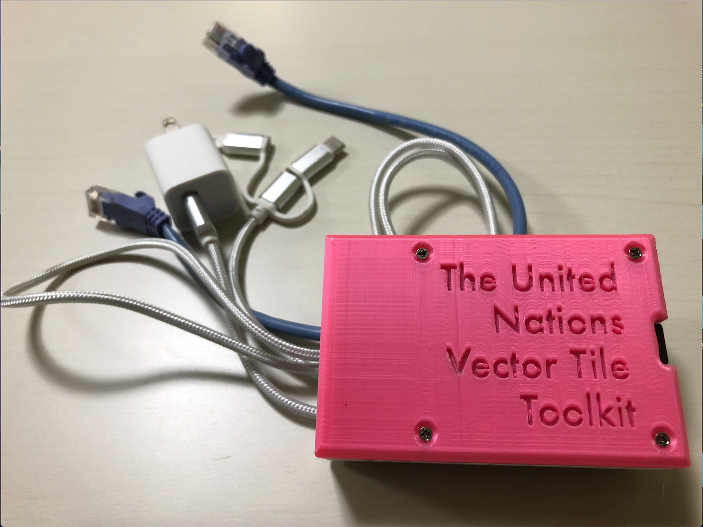
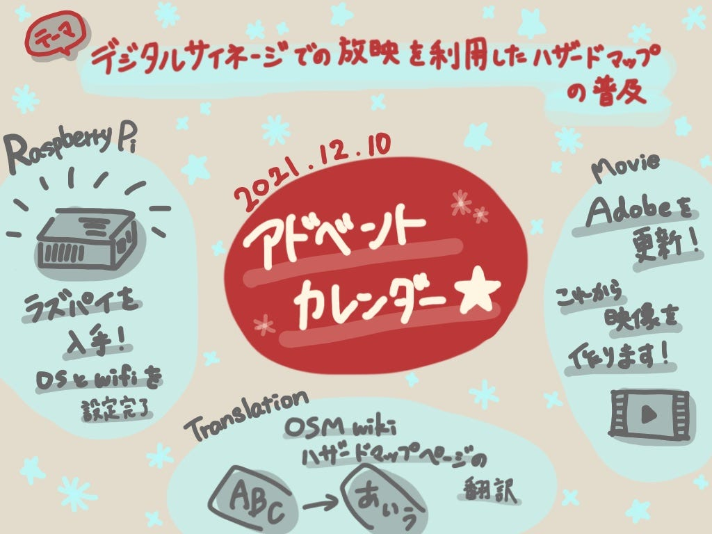

### 2021/12/10 Advent Calendar

こんにちは、3年の葉賀です。

今年のアドベントカレンダー４番手です。ゼミ論の中間報告時からの進捗について書いていこうと思います。

私のゼミ論のテーマは、

> 「デジタルサイネージでの放映を利用したハザードマップの普及」

ハザードマップが身近にあっても十分に活用されていないことから、人々の防災意識を喚起する映像を作成し、デジタルサイネージにを通して発信していくことを目的としています。

まず11月16日に行った中間発表時の課題１つとして、

コンテンツを発信する際にデジタルサイネージの場所に依存するという点があり、その位置情報を設定した地域内でOSMにマッピングしようと考えていましたが、それについては進捗はありません。

今回進捗として報告するのは次の３つです。

> ・OpenStreetMap wiki 内のハザードマップページの和訳

> ・Raspberry Pi の使用

> ・映像制作

#### _**１._ 和訳**

テーマに含まれているハザードマップというものについて知識を得たりアップデートする必要があると考え、

OpenStreetMap wiki 内のハザードマップのページが一部未翻訳なため、和訳に挑戦しました。専門用語もあり難しいので、少しずつ進めています。

OpenStreetMap wiki 『JA:OpenHazardMap』 [https://wiki.openstreetmap.org/wiki/JA:OpenHazardMap](https://wiki.openstreetmap.org/wiki/JA:OpenHazardMap)

和訳作業自体はこのままやっていけば終わりが見えてきますが、OpenStreetMap wiki にアップする作業手順が一見したところ少し複雑で、かつ私が初めてなので手間取りそうな予感がします。

今後の課題になりそうです。

#### _**２._** Raspberry Pi

UNVTテスト用 Raspberry Pi が手元にきました。(写真下)

ピンク色なのが可愛いですよね。

OS と wifi の設定をなんとか完了することができました。Raspberry Pi については、まだ完全に初心者なのでこれだけの作業でもかなり大変に感じました。。。

Raspberry Pi を勉強しつつ、

最終的には Raspberry Pi を利用し、デジタルサイネージを模したスクリーンを作成しようと考えています。

#### _**３. _**映像制作

スクリーン等を揃える前に流す映像を制作しなければということですが、

実は最近まで Adobe の更新に失敗していて、作業ができない状態でした。

契約更新期間内に手続きしなかったために自動解約されていたようで、サポートデスクに連絡して、改めて新規購入という形で解決しました。

これからは気を付けないと、と教訓にします。

今後は、これまでなんとなくイメージしていたプロットを実際に映像化する作業に順次移っていこうと思います。

以上、ゼミ論の進捗報告でした。

> ＜スライド＞

> ＜グラレコ＞

> ＜GitHub＞

[GitHub - furuhashilab/2021gsc_NatsumiHaga: 2021年度古橋ゼミ論用レポジトリ
2021年度古橋ゼミ論用レポジトリ 青山学院大学 地球社会共生学部 地球社会共生学科 葉賀なつみ / NATSUMI HAGA 学生番号 1A119128 指導教員 古橋大地 教授 ©︎Furuhashi…github.com](https://github.com/furuhashilab/2021gsc_NatsumiHaga)

この投稿は 以下のアドベントカレンダー2021として登録されています。
* [https://qiita.com/advent-calendar/2021/furuhashilab](https://qiita.com/advent-calendar/2021/furuhashilab)
