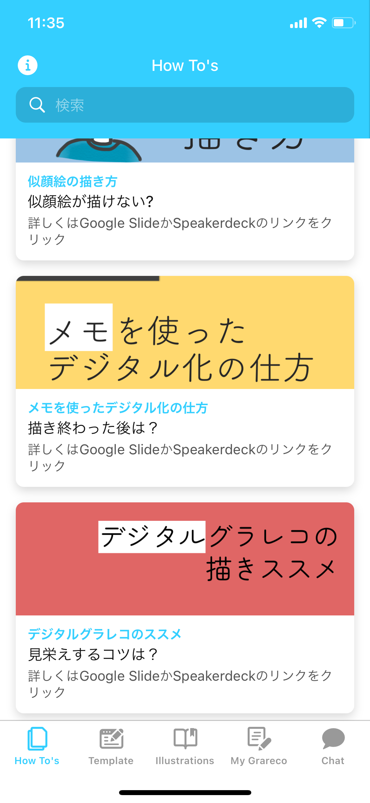
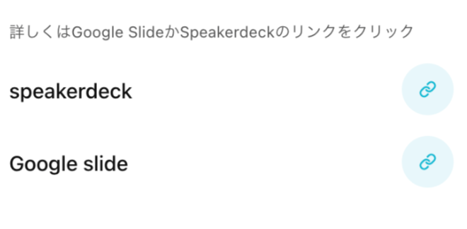
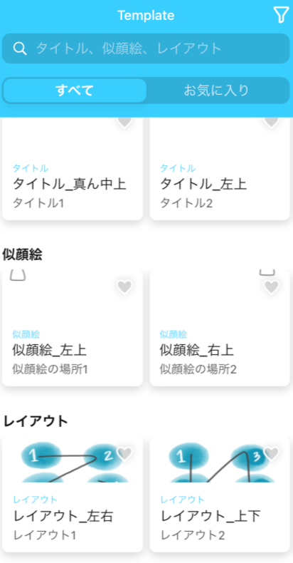

### 2021/12/11 Advent Calendar

こんにちは！4年の佐藤です。今日は**私の番**ですね😀

ということで、ゼミ論の進捗について報告させていただきます!

私の今年度のゼミ論のテーマは

#### _『**おたすけグラレコ（Glideを使用したゼミ生向けグラレコ補助アプリ）のアップデート**』_

です。

中間発表から大きく進展したのは以下の3点！

> _**1. 開発者川嶋とのMTG（12/4）_**

> _**2. 具体的なアップデート箇所の再考_**

> _**3. Glideをいじってみた。_**

まず、川嶋の声を久々に聞けてよかったです笑笑
Glideについても諸々教えてもらいました😭

MTGでは、以下のことを共有しました。

・アプリ『おたすけグラレコ』に関するスプレッドシートは古橋先生のGoogleアカウントにも管理者権限が付与されていること。

・Glideを使うにあたって参考にしたYoutubeと文献

・アップデートしてほしいところ
 →レイアウト例の種類を増やす
 →リンクに飛ぶ仕様から、スクロールで見れるような仕様にすること

→イラスト集の検索機能を充実させること

などなど、今後の研究の助け舟となりました！

以上を踏まえたアップデートをする箇所と、現時点での課題を書き出します。

### **【How to’s】**

#### ①デジタルグラレコ欄追加、それに伴う既存タイトルの変更

**課題・・・**タイトル画像の文字のフォントがわからない。😭
川嶋はSpeaker Deckを使っているが、私的にはGoogleスライドで完結させたいので全体的に画像を差し替えることを検討中。

項目追加してみた。。

アプリで見るとこんな感じです。。。

② →リンクに飛ぶ仕様から、スクロールで見れるような仕様にすること

（【How to’s 】のDetails部分）

**課題**・・・画像の差し込み方法を模索中

### 【Template】

③レイアウト例を増やす

### 【illustration】

④イラスト量を増やす

以上の4つを今の所考えています。

### 課題

また、もう一つの課題である、アプリ普及のためのイベントについては未だ取り組めていません😭

以上です😀

スライド

グラレコ

作成中。。。

Github

[GitHub - furuhashilab/2021gsc_Kahoru-Sato: 2021年度 ゼミ論用レポジトリ
2021年度 ゼミ論用レポジトリ 地球社会共生学部 地球社会共生学科 4年 学籍番号：1A118082 氏名：佐藤かほる 指導教員：古橋 大地教授 © Furuhashi Laboratory/kahoru sato, CC BY…github.com](https://github.com/furuhashilab/2021gsc_Kahoru-Sato)
