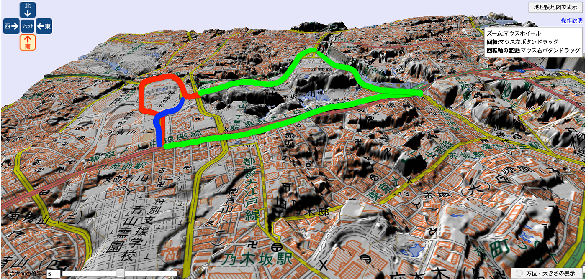
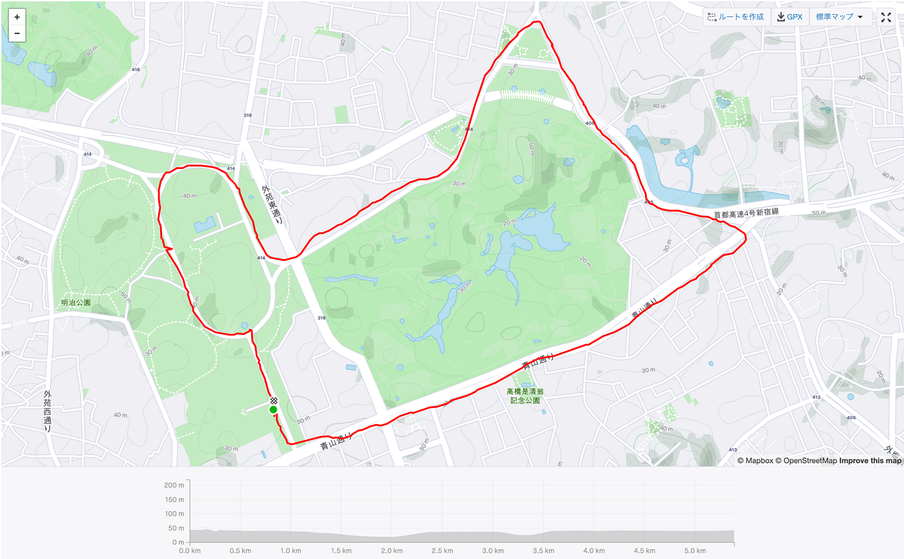
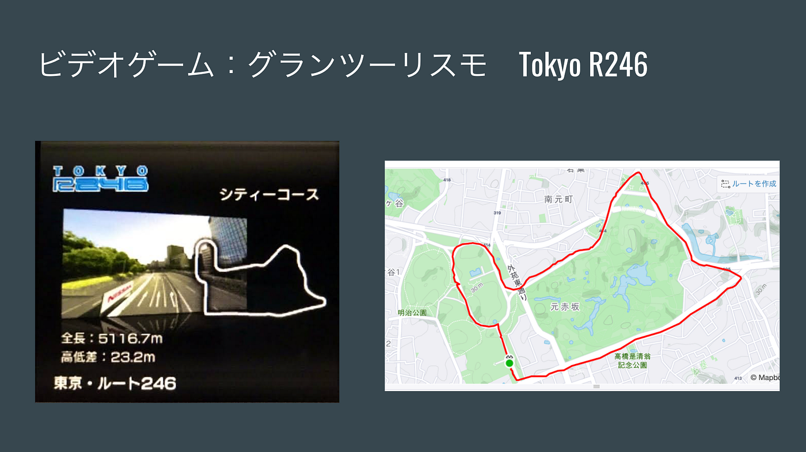
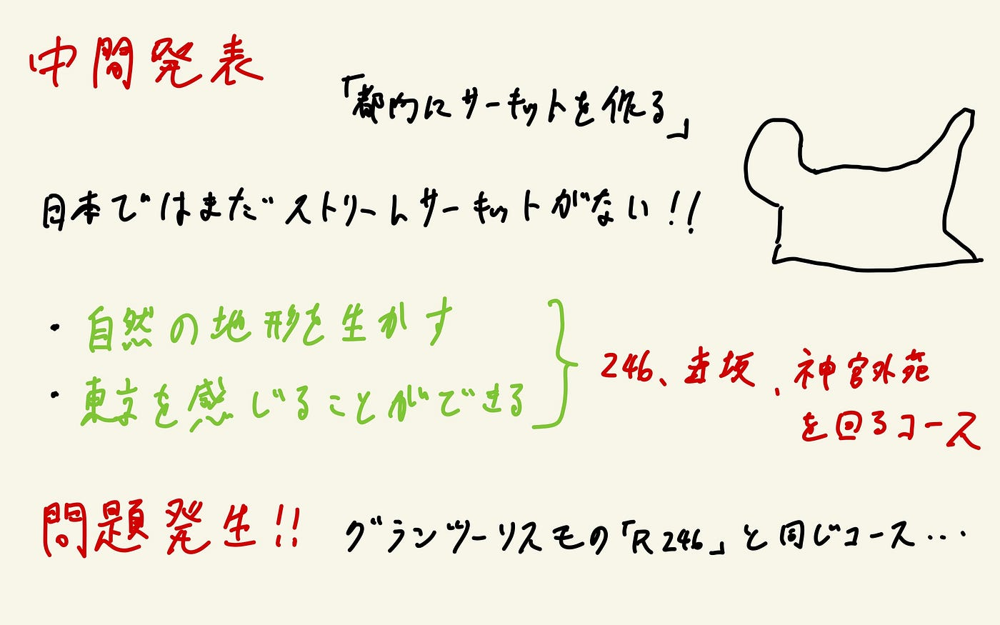

### 東京にストリートサーキットを

四年の木多です。

私のゼミ論は、東京都内にストリートサーキットを建設するとしたらどこにどのようなサーキットを作るかを検討するというものです。そして、実際にその仮想サーキットを走行することによって、地図上で見たものと、現実とではどれほどの差異があるのかを認識するという事が最終的な目標となります。

### Introduction

「ストリートサーキットとは」

ストリートサーキットとは、常設のサーキットとは異なり一般道を封鎖して作られた特設のサーキットのことを指します。日本ではタイムトライアル形式のラリーにおいては一般道が封鎖されコースが設定されたことはありますが、複数台がコース上で競い合うレースでは、島根県江津（ごうつ）市で行われた「A1市街地グランプリ」というカートレースのみ開催されました。

> **日本でのストリートサーキット構想**

過去に日本でもストリートサーキットの構想があり、横浜みなとみらい・皇居周辺で計画された過去があります。

#### メリット・デメリット

**メリット**

- ランドマークの前などを通ることで、都市の雰囲気を感じる事ができる

- エスケープゾーンがあまり無いため、壁が近く迫力が増す

- 都心部で開催することができる

**デメリット**

- 既にある道を使用するため、直角コーナーが多くなりやすい

- 自然の地形を利用した高低差が少ない

- 道幅が狭い

- 追い抜きが難しいコースになりやすい

> **自分が目指すストリートサーキットの定義**

1. 都市の雰囲気を感じる事ができる

1. できるだけ自然の地形を利用する（直角コーナーを減らす）

1. 道幅があり、追い抜きができるだけのストレートを設ける

### Method

- 既に封鎖してイベントを行った実績のある神宮外苑いちょう並木をベースに考えていく。

- 以前のハッカソンで使用したblenderGISや、地理院地図に神宮外苑いちょう並木を反映させ道幅が広く高低差があるルートを探す。

- 既に封鎖してイベントを行った実績のある神宮外苑いちょう並木をベースに考えていく。

- 以前のハッカソンで使用したblenderGISや、地理院地図に神宮外苑いちょう並木を反映させ道幅が広く高低差があるルートを探す。

### Result

私が選んだコースは、

スタート・ゴール：外苑いちょう並木

ストレート：246（青山〜赤坂見附）

ヘアピン：赤坂見附交差点

第２ストレート：（赤坂見附〜迎賓館前）

第２ヘアピン：迎賓館前交差点

第３ストレート：赤坂御所裏

オーバルエリア：神宮外苑（国立競技場〜神宮球場）

### Discussion

実際に歩いて回ってみると、なぜかコースに見覚えが

なぜ？？？？

グランツーリスモの「ルート246」と全く同じコースだった…

今後の方向性をまたじっくり考えます。

[GitHub - furuhashilab/2021gsc_YutaKita
Contribute to furuhashilab/2021gsc_YutaKita development by creating an account on GitHub.github.com](https://github.com/furuhashilab/2021gsc_YutaKita)

