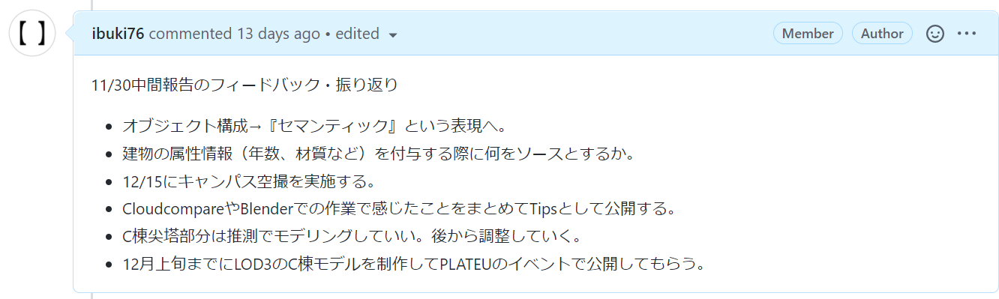
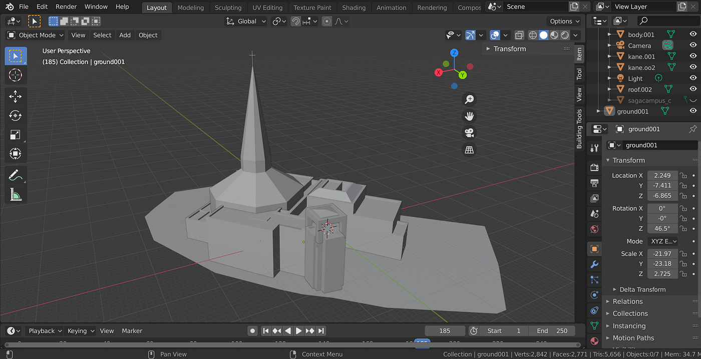
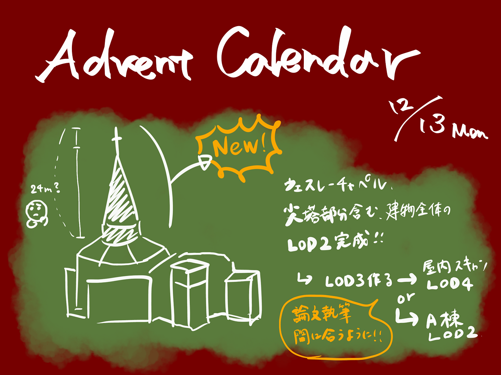

### 2021/12/13 Advent Calendar

ゼミ論進捗状況

こんにちは、3年の柴山です。

11/30日の中間発表のまとめと、そこからの進捗を報告していきます！

> 中間発表のまとめ

私のゼミ論テーマは、相模原キャンパスの3Dモデルを作成してオープンデータ化することです。

3D都市モデルのPLATEAUの整備フローを参考に、市民が3Dモデルの整備にいかに貢献できるか、キャンパスモデルをオープン化することでどんな応用ができるかについて検証していきます。

[3Dチャペル作ってみました。（尖塔なしver.）
柴山息吹 ゼミ論研究の中間発表medium.com](https://medium.com/furuhashilab/3d%E3%83%81%E3%83%A3%E3%83%9A%E3%83%AB%E4%BD%9C%E3%81%A3%E3%81%A6%E3%81%BF%E3%81%BE%E3%81%97%E3%81%9F-%E5%B0%96%E5%A1%94%E3%81%AA%E3%81%97ver-4e685e015e5f)

中間発表までには、C棟 ウェスレーチャペルのLOD1~2のモデルができていましたが、尖塔部分は点群データがとれていなかったため、手を付けていませんでした。

古橋先生のフィードバックを受けて、点群データがない部分も形状や大きさやをある程度推測して作っていく方針に決め、目視や航空写真による観察、Google Earthのメジャーツールの測定結果を参考に作成・調整を進めました。

> 進捗状況

チャペルの建物全体のモデリングが完成し、LOD2~LOD3の間のレベルに相当するものができました。

OBJ形式でGitHubにアップロードしてあります。

[2021gsc_IbukiShibayama/sagacampus_c2.obj at main · furuhashilab/2021gsc_IbukiShibayama
2021年度古橋ゼミ論用レポジトリ. Contribute to furuhashilab/2021gsc_IbukiShibayama development by creating an account on GitHub.github.com](https://github.com/furuhashilab/2021gsc_IbukiShibayama/blob/main/sagacampus_c2.obj)

前述の通り、点群データがないところも複数の情報から推測して調整しながら作成しました。引きで見てみてもバランスは悪くないのでC棟LOD2のモデリングはひとまず完成とし、次はLOD3(窓、ドア)のモデリングに取り組んでいきます。

> 今後のスケジュール

C棟のLOD3モデルが完成した次には屋内3DスキャンとLOD4モデル作成が残っていますが、2月初週までに論文を執筆することを踏まえると、作業に割ける時間は多くはないようです。

ゼミ論の構想を立てていた時は相模原キャンパスの全ての棟のモデリングをする予定でしたが、事前調査や作業に想像以上に時間がかかり、**C棟がLOD2完成、A棟がLOD2で60%ほどできている**、というのが現状です。

他の棟はC棟やA棟よりは簡単な構造であるためそこまで時間がかからなそうですが、今年のゼミ論はC棟にターゲットを絞る方針です。ただし、チャペルの屋内スキャンの許可が出るまで時間がかかりそうな場合はA棟LOD2を完成させる方針に切り替えようと思います。

また、CloudcompareやBlenderなどのツールについて、どう使ったか、どのような問題に苦戦したかなどをまとめてTipsにする作業にも取りかかっていきます。

> 発表資料

> グラレコ

> ゼミ論レポジトリ

[GitHub - furuhashilab/2021gsc_IbukiShibayama: 2021年度古橋ゼミ論用レポジトリ
2021年度古橋ゼミ論用レポジトリ. Contribute to furuhashilab/2021gsc_IbukiShibayama development by creating an account on GitHub.github.com](https://github.com/furuhashilab/2021gsc_IbukiShibayama)
