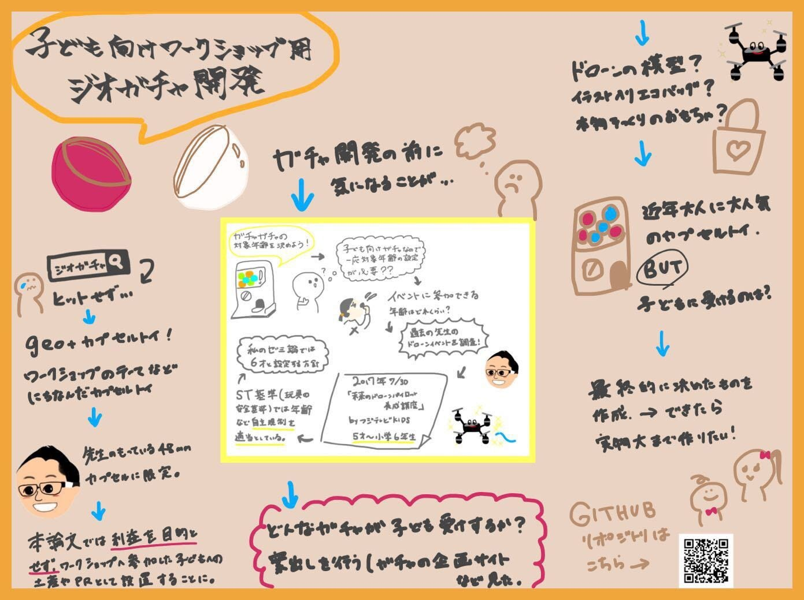
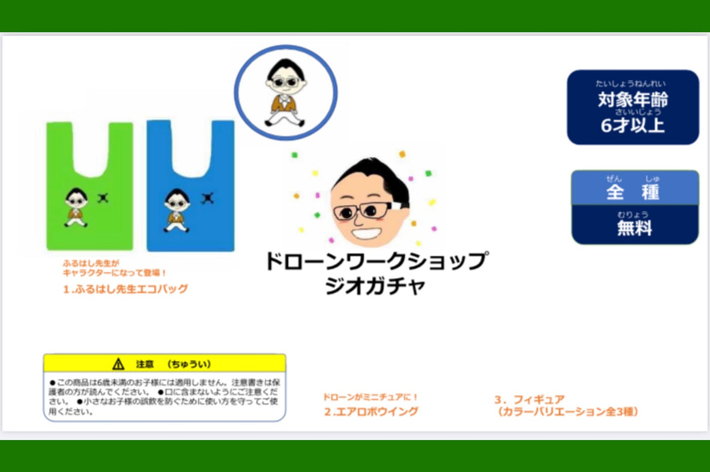
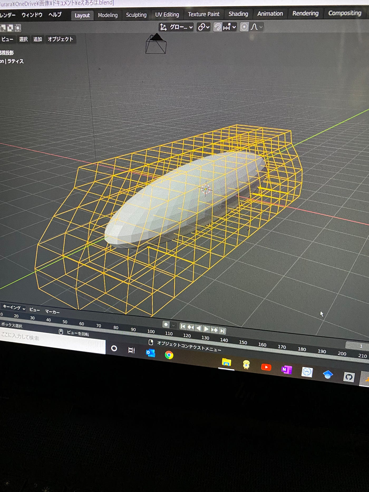
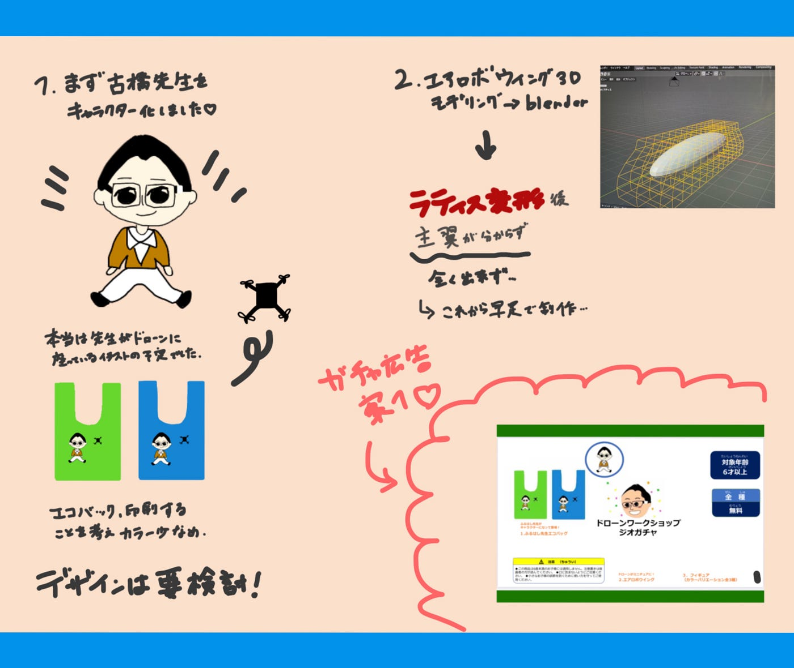

### 2021/12/14 Advent Calendar

こんにちは！

ゼミ論の進捗状況を発表させていただきます！本日担当の3年長島うららです。

私のゼミ論のテーマは「子供向けワークショップ用ジオガチャ開発」です。

前回の授業で発表した内容は主にこちらでした。(グラレコの参照をお願いいたします。)

前回の中間発表にて、先生がアドバイスを下さり、エコバッグデザインやエアロボウイングの3Dモデリングを行うことが決定しました。

そこでイラストでエコバッグの制作に取り掛かりました。

古橋先生を可愛らしくキャラクター化し、ワークショップが子供の思い出になるようなエコバッグを考えてみました。

ガチャガチャは無料とする為、エコバッグは製作に比較的お金がかかると思いますのでカラーや個数などは要検討です。

また今blenderでエアロボウイングの3Dモデリングを行っていますが、blender初心者の私には本当に難しく非常に時間がかかってしまっています。

ラティス変形を使用していますが、主翼の部分のやり方が全く分からずという状況です…

ラティスから動画を見ながら…と進めましたが、所々で分からないところがあり柴山、芳賀に相談。(ありがとうございました。)

基礎から分からない状況のため、毎日blenderの動画を見てやり方を模索中、、

近々、基礎力の付く本も買えたらと思います。

エアロボウイングの方に承諾のメールなど送らないといけない為なるべく早くできるよう善処します。

今後モデリングを進め、また、他の案も出しつつガチャ開発ができたらと考えています。

まとめのグラレコです。

スライド

[https://docs.google.com/presentation/d/1CeT95OQQ0rSVMoWOCovdYJH2JPSZwgsIFCIzYXf4Om0/mobilepresent?slide=id.g107b39c87ac_0_1](https://docs.google.com/presentation/d/1CeT95OQQ0rSVMoWOCovdYJH2JPSZwgsIFCIzYXf4Om0/mobilepresent?slide=id.g107b39c87ac_0_1)

Github

[GitHub - furuhashilab/2021gsc_UraraNagashima: 2021年度ゼミ論
青山学院大学 地球社会共生学部 地球社会共生学科 長島うらら / NAGASHIMA URARA 学生番号 1A119115 指導教員 古橋大地 教授 ©︎Furuhashi Laboratory/Nagashima Urara, CC…github.com](https://github.com/furuhashilab/2021gsc_UraraNagashima)
