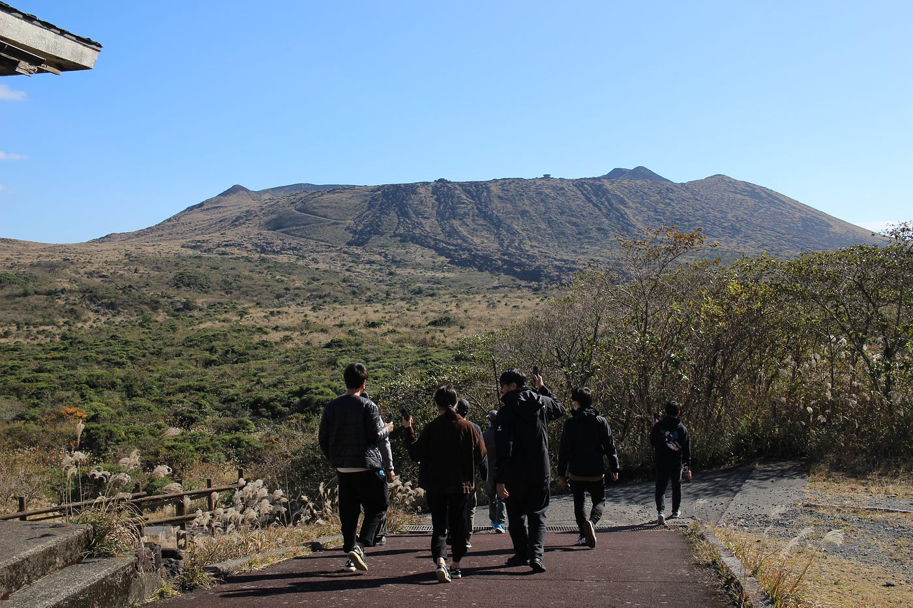
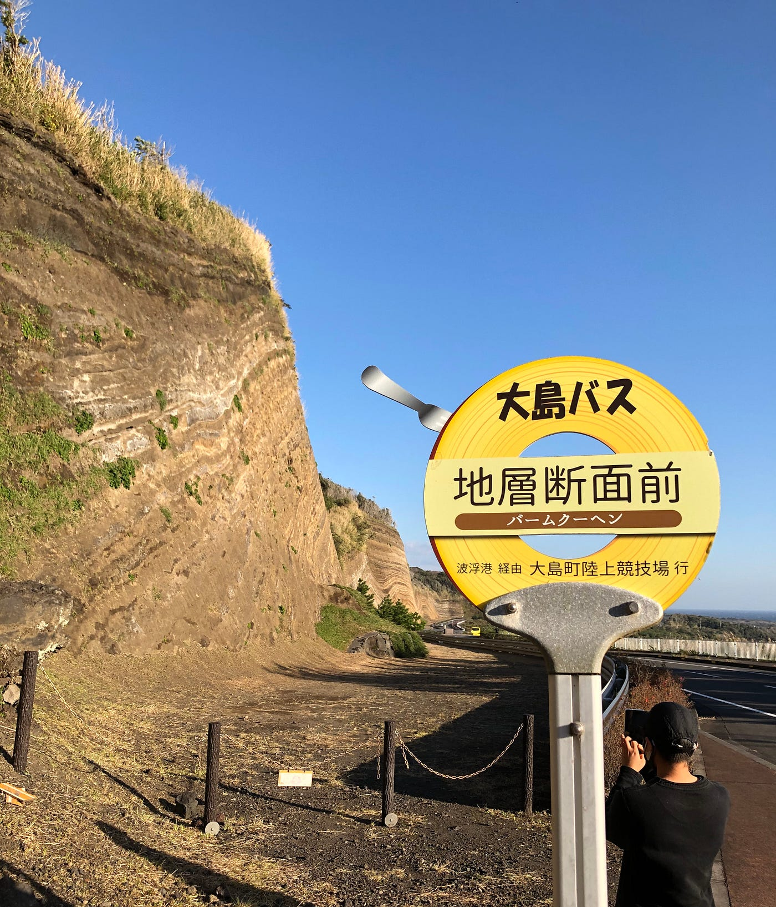
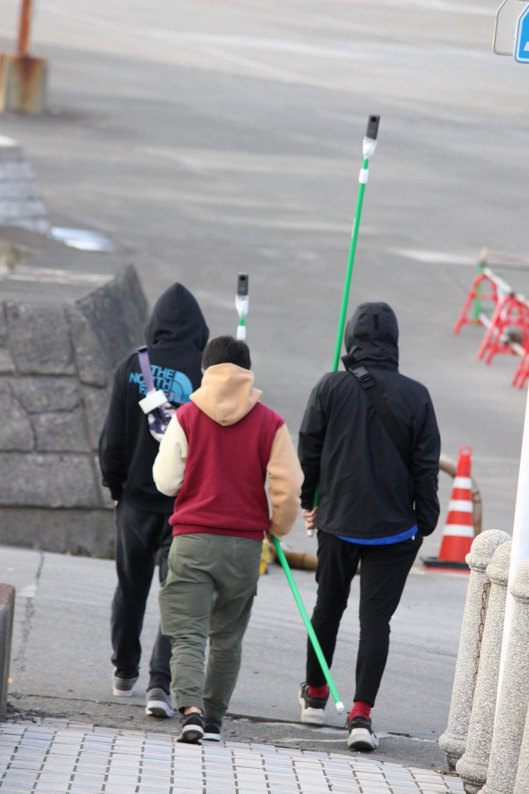
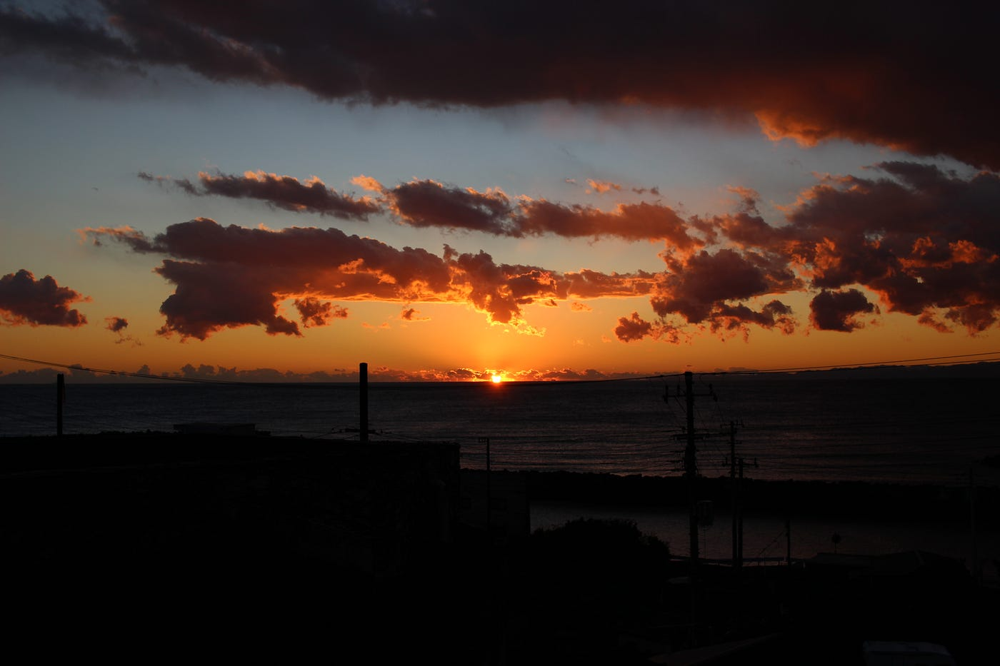
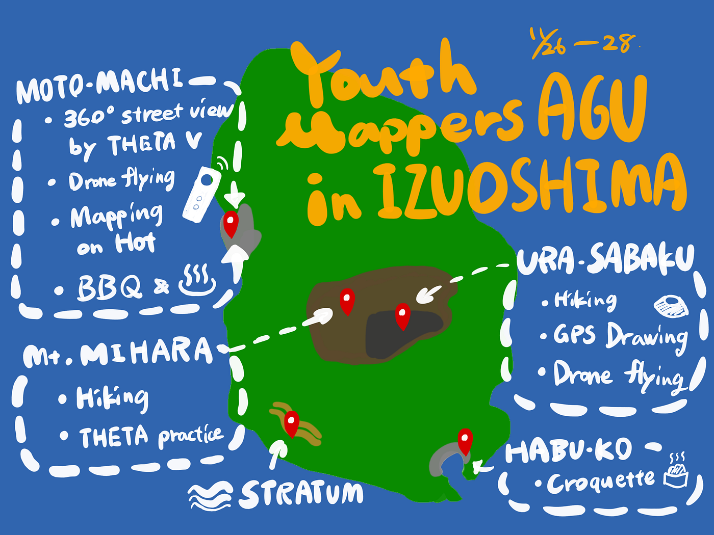

### Youth Mappers 週報

**今年のユース合宿は伊豆大島へ！**

こんにちは、今週の週報担当の3年の葉賀です。

週報とはいいますが、実は今回レポートするのは主に11月末に行った合宿についてです。

これまで他のイベントや発表などが忙しく、すぐにお伝えできなかった合宿の様子を、満を辞して書いていこうと思います。

合宿は11月26日から28日の2泊3日で行いました。

場所は伊豆大島。

少し寒かったですが、良い天気に恵まれました。

#### １日目は、

各々がフェリーやジェット船で島に向かい昼頃に合流すると、観光協会の岡田さんのガイドで、三原山の展望台に登りました(下写真)。

山の裾に自生する植物や岩の種類などの話を聞きながら、斜面を歩くこと約1時間30分。なかなかのハードさに、普段の運動不足が悔やまれます。

頂上付近の景観は壮大で、火口は近づくほどにその大きさを実感することができました。

その後、地層断面を見に行きました(下写真)。

この場所は隆起してこの様相なのではなく、字の如く積み上がったできたのだそうです。

バームクーヘンとも呼ばれるため、バスストップもバームクーヘン型でフォークまでついていて面白かったです。

この日は、他にも筆島や波浮港を観光し、宿に向かいました。

宿は Hale 海([https://halekai-gh-oshima.com](https://halekai-gh-oshima.com))。屋根裏部屋もある素敵なペンションで、夕飯はここの庭でBBQを楽しみました。

#### ２日目は、

メンバーそれぞれのやることに沿って別れて行動しました。

日向野は、黒い砂利が広がる裏砂漠で GPS Drowing を行い、卒論のプロジェクトを進めました。木多・八尋がサポートし、ドローンを飛ばしながら活動しました。

柴山・鈴木・高橋は、元町港周辺を THETA V を使って360°撮影しました。

手に直接持たないための手段として、棒の先端に THETA V をくくり付け、それを手に町を練り歩きました(下写真)。

周囲からは、不思議がる視線を注がれたそうです。

葉賀は、モザイク画を作るための素材を撮影をするべく島をぶらぶら散策しました。途中で立ち寄った食事処で食べた「べっこう丼」がピリ辛で美味しかったです。

２日目の夕飯は焼肉屋に行って、夜はBookTeaBed IZUOSHIMA([https://bookteabed.com/ja/izuoshima/](https://bookteabed.com/ja/izuoshima/))に宿泊しました。

ちなみに、夕日がとても綺麗でした(下写真)。

#### 最終日の３日目は、

帰りの船便までほぼ自由行動ということで温泉に入りゆっくりした後、互いに合宿の成果を簡単に報告し合い、帰りの船に乗り込みました。

全員無事に帰宅し、合宿は終了しました。お疲れ様でした！

#### マッピング課題

今回の合宿で古橋先生が空撮・オルソ化したものを基にHOTでタスクを作ってくださったため、Youthメンバーは1週間以内に2タスク以上マッピングするという課題が出ました。

[HOT Tasking Manager
Tasking Manager is a the tool for coordination of volunteers and organization of groups to map on OpenStreetMap.tasks.hotosm.org](https://tasks.hotosm.org/projects/11856/)

元町一帯に加え、被災地跡に設置された公園の最新の空撮画像が得られたため、地図データの更新に大きく貢献できそうです。

過去に登録された建物が最新の画像ではなくなっていた点や、敷地内道路など細かい道路の調整が必要な点に注意が必要でした。今後もマッピングと検証を続けてさらに精度の高い地図を作っていきます。

＜グラレコ＞

