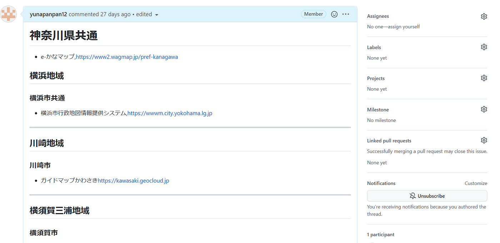
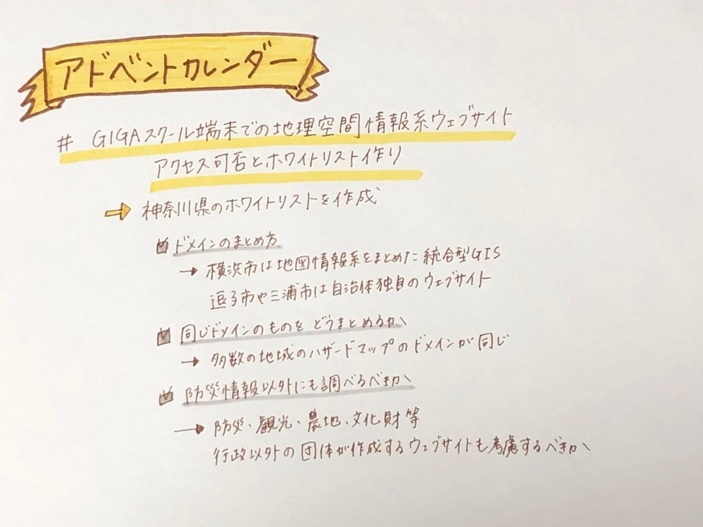

### アドベントカレンダー

本日2021年12月12日のアドベントカレンダーを担当させて頂きます。

私のゼミ論のテーマはGIGAスクール端末での地理空間情報系ウェブサイトアクセス可否とホワイトリスト作りです。

今回のアドベントカレンダーでの進捗報告としては、全国共通・神奈川県のホワイトリスト作りを途中まで作成していることです。

[Issues · furuhashilab/2021gsc_YunaHomma
New issue Have a question about this project? Sign up for a free GitHub account to open an issue and contact its…github.com](https://github.com/furuhashilab/2021gsc_YunaHomma/issues)

今回作成して感じた問題点としては

・ドメインのまとめ方

中間発表の課題を解決するため、ドメインまで同じリンクの表示であれば、分けてまとめる必要はないので横浜市は一つにまとめました。

ですが、横浜市は地図情報だけまとめられたウェブサイトがあるので、ドメインまでの情報で良いのですが、逗子市や三浦市の中の各地区のハザードマップをドメインだけでまとめると、地理系ウェブサイトではなく、自治体自体の公式ウェブサイトにとんでしまいます。

この場合地理系ウェブサイトに限定したホワイトリスト作りにならなくなってしまうので、ドメインまでのリンクだけにするべきか否かを今後考える必要がありました。

また、ハザードマップが地域ごとに分かれている場合、同じドメインの場合が多いため、どの情報までをまとめるべきかも検討する必要があると思いました。

・防災情報以外も調べるべきか

行政の公式で発信している地図が防災関連に限られる場合、観光、農地、文化財などに関する地図で行政以外の他の団体が作成しているウェブサイトを調べるべきかも考慮に入れる必要があるか否か。

今後これらを考え直しながら作業を進めたいです。

