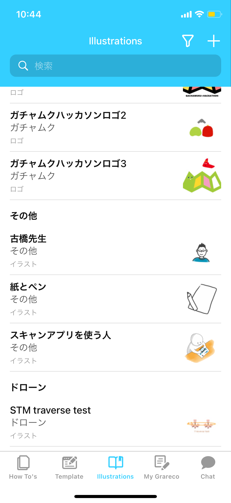
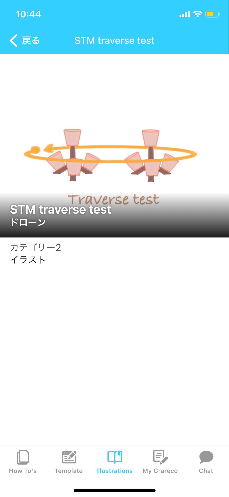
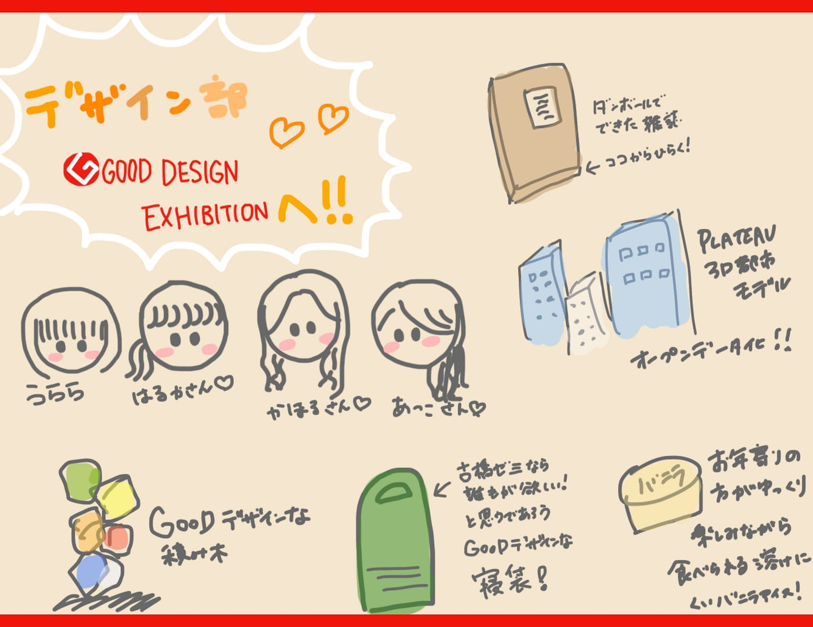

### デザイン部遠征

こんにちは！4年の佐藤です！！

今週は、

> 11月18日に行ったデザイン部遠征について
おたすけグラレコのillustrations

の二本立てで報告させていただきます！

### ①デザイン部遠征

初めて対面でメンバーに会い、嬉しかったです😭

遠征したのは、

### 「GOOD DESIGN SHOW 2021」

_（公益財団法人日本デザイン振興会が10月20日に今年度のグッドデザイン賞を発表。それらの作品を紹介するイベント。10月20日から11月21日まで、特設ウェブサイトと実会場（東京ミッドタウン・デザインハブ東京都港区赤坂9–7–1 ミッドタウン・タワー5F）での展示を中心に開催。）_

古橋先生発見！

[3D都市モデル [PLATEAU[プラトー]]
グッドデザイン賞の仕組みや、過去のすべての受賞対象が検索できる「グッドデザインファインダー」など、グッドデザイン賞に関する情報をご紹介するサイトです。毎年1回（4～6月頃）募集する、グッドデザイン賞への応募もこのサイトから行うことができます…www.g-mark.org](https://www.g-mark.org/award/describe/52864)

金賞です✨✨

おめでとうございます！！！

個人的にグッときたのはこちら！

クッションにも寝袋にもなる優れもの。頭もとには枕のような凹凸もあり、旅行や古橋研の合宿にもピッタリ。
なんと￥12,800(tax in)で買えちゃうし、防災グッズとしても人気です。

[寝袋 [SONAENO クッション型多機能寝袋]
グッドデザイン賞の仕組みや、過去のすべての受賞対象が検索できる「グッドデザインファインダー」など、グッドデザイン賞に関する情報をご紹介するサイトです。毎年1回（4～6月頃）募集する、グッドデザイン賞への応募もこのサイトから行うことができます…www.g-mark.org](https://www.g-mark.org/award/describe/51676)

その他メンバーお気にの受賞デザインをいくつかご紹介！

[官民連携の滞在拠点を中心とした地域活性化 [ETOWA KASAMA]
グッドデザイン賞の仕組みや、過去のすべての受賞対象が検索できる「グッドデザインファインダー」など、グッドデザイン賞に関する情報をご紹介するサイトです。毎年1回（4～6月頃）募集する、グッドデザイン賞への応募もこのサイトから行うことができます…www.g-mark.org](https://www.g-mark.org/award/describe/52904)

↑こちらは私の地元である茨城県の、笠間市の公共施設利活用を中心にした官民連携の地域活性化プロジェクト。

[建売注文住宅 [ニセカイジュウタク]
グッドデザイン賞の仕組みや、過去のすべての受賞対象が検索できる「グッドデザインファインダー」など、グッドデザイン賞に関する情報をご紹介するサイトです。毎年1回（4～6月頃）募集する、グッドデザイン賞への応募もこのサイトから行うことができます…www.g-mark.org](https://www.g-mark.org/award/describe/52440)

[Restaurant [50% Cloud Artists Lounge]
概要 The restaurant is located in a minority ethnic cultural village of China, which was built by local workers and…www.g-mark.org](https://www.g-mark.org/award/describe/52612)

[積み木 [tumi-isi]
グッドデザイン賞の仕組みや、過去のすべての受賞対象が検索できる「グッドデザインファインダー」など、グッドデザイン賞に関する情報をご紹介するサイトです。毎年1回（4～6月頃）募集する、グッドデザイン賞への応募もこのサイトから行うことができます…www.g-mark.org](https://www.g-mark.org/award/describe/51576)

↑こちらは、実際に遊んでみたのですが、とても積みやすい形にカットされていて、インテリアにもなってかわいい！

### ②おたすけグラレコillustrations

おたすけグラレコに続々と１０月ハッカソンで行った各サークルのイラストを追加しています。

個人的にとっても助かる！！！
と思ったのが、松山蘭ちゃん作？のSTMイラスト。。。

実物を見たことがないのと、イメージが湧きにくいSTMを
ドローン部の方が描いてくれたことによって

ゼミのグラレコも描きやすくなるな、、、、
と感激しています笑

もし、データはあるけどまだ公開していないイラストやロゴがあれば
各サークルのGithubリポジトリ等に載せていただけると幸いです！！

グラレコ(長島)

