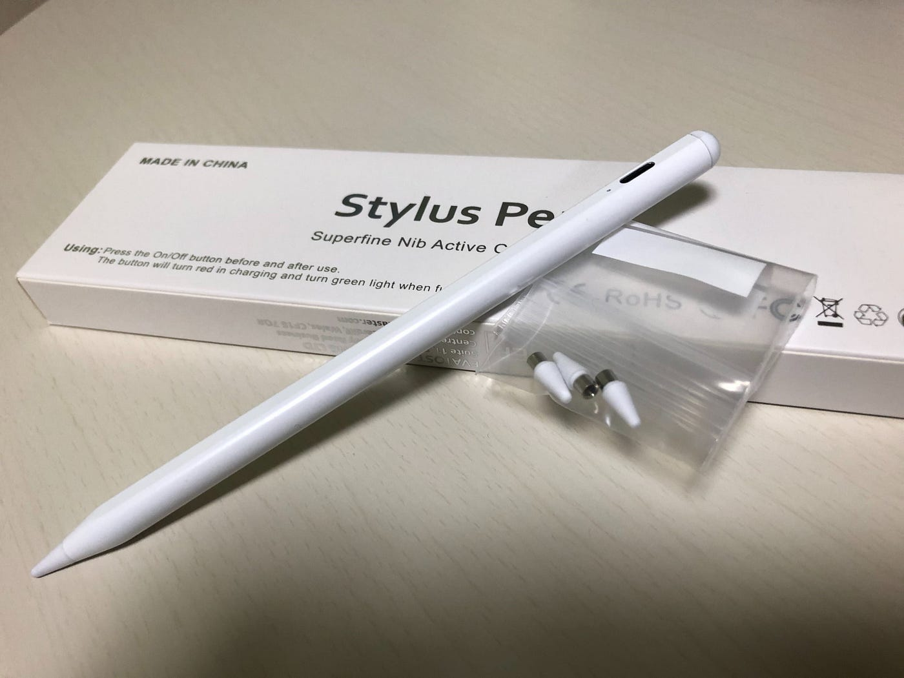

### V&F 週報

今週は先週と同様にあまりV＆Fとして活動できてないので、今後の目標とか参考動画を紹介します！

#### 青木の近況

まず、B棟内のスタジオを10月17日（金）にスタジオを使いたいので、予約するつもりです。

そして動画は関係ないですが、なんとポケモンGOレベル40なりました。

#### 葉賀の近況

今週は葉賀はアドベントカレンダーに勤しんでてやはりVFっぽい作業はあんまりしてないのですが、このstylus pen買いました。

また、江ノ島行って動画撮ったので

伊豆大島とかで撮った動画とかと合わせてなんか動画作ろうかなと考えています。

#### 動画の作り方を言語化してる動画

＜グラレコ＞

作成中
