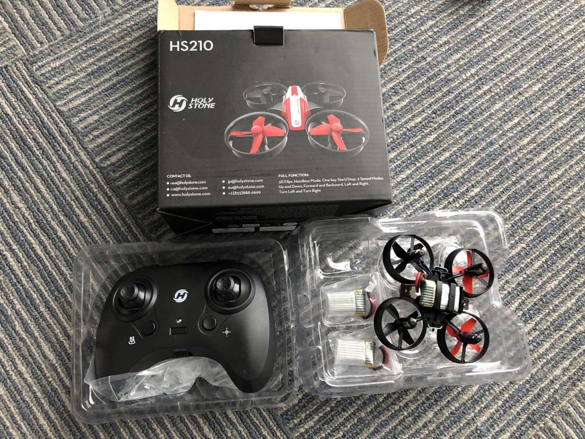

### ドローン部週報

ドローン部週報

今週もB棟９階でSTMの訓練をしました。
前回の週報でも課題としていた、spiral・traverseのタスクで円を描くように曲がることを主に練習しました。
以前よりも滑らかに進めるようになりましたが、奥の方のSTMの場合、奥行きがわからなくなり思った方向に進まないことが多かったです。

また、以前古橋先生がFacebookであげていたNEDO性能評価PJ NIST UAV STM評価会の動画を拝見すると、ドローンで対象の文字を撮影する際、文字を完全にカメラの画面の中央にしてから撮っていました。
私たちはまだそこまで厳密に撮影していなかったので、次回そこも意識しながら練習したいです。

前回の練習で東藤さんにHOLY STONEのHS210の機体を頂きました。今後の練習で使わせていただきたいです。
