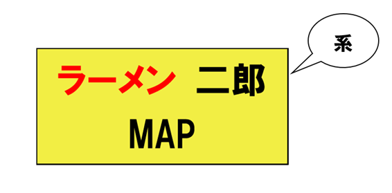
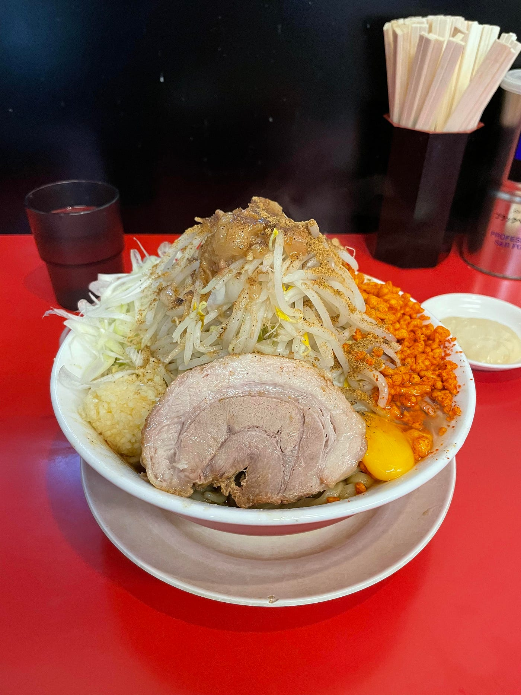
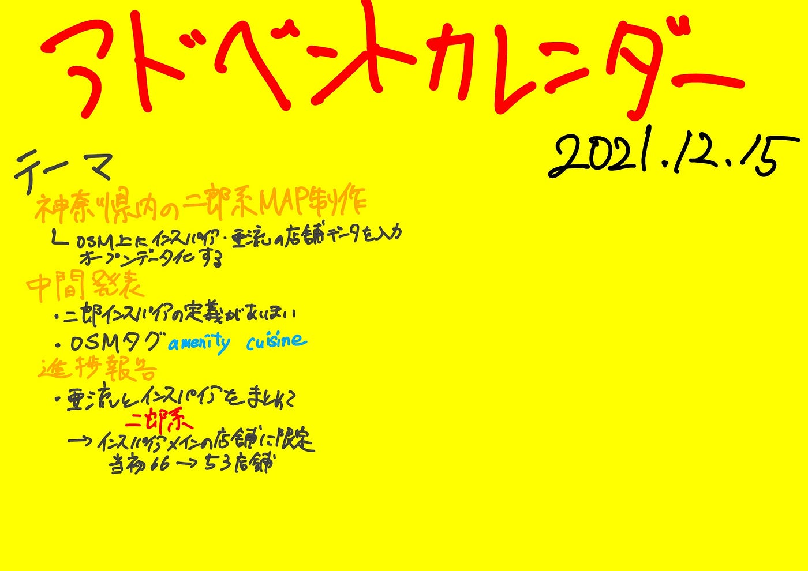

### 12/15アドベントカレンダー

こんにちは、2020年度12月15日のアドベントカレンダーを担当します、3年の鈴木です。

前回の中間発表を振り返りつつ、進捗を報告させていただきます。

> **テーマ**

私のゼミ論のテーマは「神奈川県内の二郎系マップを作る」ことです。詳細としては、

OSM上に二郎インスパイア系、および亜流店舗のデータ、及びそのメタデータを整理することで、誰もが自由にそのデータにアクセスし、閲覧、二次利用できる状況を作ることが目標です。

> **中間発表の振り返り**

中間発表時の進捗状況としては

・「二郎インスパイア」の定義付けがあいまいで、二郎系ラーメンを一部のメニューとして提供しているラーメン店の扱いをどうするか決まっていなかった。

・OSMでのタギングの表記としてamenity=fastfoodとcuisine=ramen;jiroを採用した。特にamenityに関してはあくまでラーメン店は回転率を優先すると考え、fastfoodを選択した。

> **進捗報告**

今回みなさまにお伝えする進捗としては

・「亜流」、および「二郎インスパイア」の定義を決定。

→「亜流」と「二郎インスパイア」をまとめて「二郎系」と呼称する。今回まとめる店舗に「ラーメン二郎」（直系）、と自らを別種のラーメン店であると名乗っているものは含めない。

・定義付けの決定により、別種のラーメン店を名乗っている、もしくは「二郎系ラーメン」をほんの一部のメニューとしているラーメン店を除くことにしました。それにより当初66店舗としていましたが、選定の結果53店舗（チェーン店を含む）に決めました。

↓店舗一覧

[県内の二郎インスパイアの店舗をまとめる · Issue #24 · furuhashilab/sotsuron2021
卒論/ゼミ論 プロジェクト管理用リポジトリ. Contribute to furuhashilab/sotsuron2021 development by creating an account on GitHub.github.com](https://github.com/furuhashilab/sotsuron2021/issues/24)

> スライド

> グラレコ

> GitHub

[https://github.com/furuhashilab/2021gsc_SotaSuzuki](https://github.com/furuhashilab/2021gsc_SotaSuzuki)
