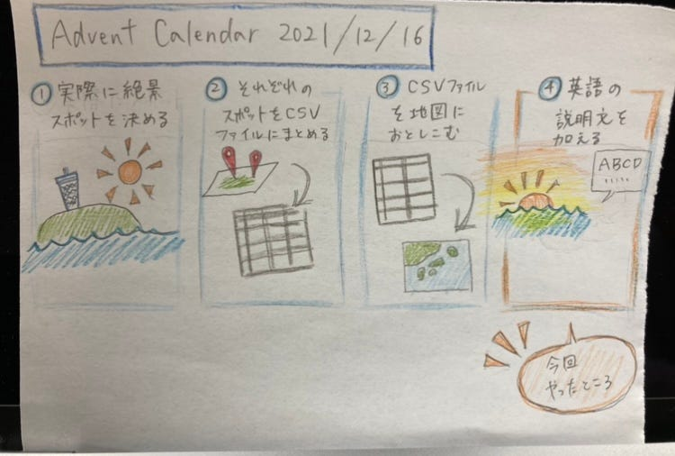

### 2021/12/16 Advent Calendar

こんにちは本日担当する4年の八尋舞美です。ゼミ論の進捗報告させていただきます。

私の今年のゼミ論のテーマは「江の島の絶景スポットを海外の方向けにまとめること」です。

今回の進捗としては主に2つです。

・どのようなまとめ方にするのかの定義付け

・各絶景スポットの英語の説明文作成

まず今回のテーマに至った背景としては、江ノ島の有名な観光スポットが多く紹介されている中で、自分が去年のゼミ論を通じて見つけたような穴場な絶景はあまり紹介されていないことに気が付きました。またそれらの場所の英語での説明は載っていませんでした。

そこで今回これらの穴場の絶景スポットを海外の方向けにまとめ、今後コロナが収まり、海外の方が江ノ島を訪れる際に役に立ててもらいたいと考えています。

江ノ島の公式ホームページの観光地紹介ページの現状

・有名な観光スポット（江島神社やサムエル・コッキング苑など）は紹介されているが、穴場な絶景スポットに関してはあまり載っていない。

・英語の観光マップはPDF版でイラストの地図でのみ掲載されている。（内容は神社などの観光スポット、駐車場やトイレの案内など）

どのようにまとめるのか

一つの地図に各スポットの情報をまとめることで、一覧性のあるものにする。実際の距離や周辺情報が正確に分かるようにイラストなどのマップではなく、WEB地図にまとめる。今回は絶景スポットにテーマを絞ってまとめる。

今回何を載せるのか

各スポットの説明文（英語）、緯度経度、写真

参考資料１）

[みなとみらい駅周辺の観光スポットマップ
みなとみらい駅周辺にある観光スポットを地図で紹介します。周辺のお店、施設、観光スポット、イベント情報、天気予報、防災情報も検索できます。主な情報提供元はタウンページ、ぐるなび、ホットペッパー、ゼンリン、日本気象協会、国土交通省、ウィキペディ…map.goo.ne.jp](https://map.goo.ne.jp/map/search/station/140298/genre/05002/zoom/8/?order=1)

規模：みなとみらい駅周辺

言語：日本語

掲載情報（地図上）：名前、説明文（日本語）

掲載情報（別ページ）：TV番組紹介、最寄りからのアクセス、住所、ジャンル

２）[http://www.yamasita.jp/osm/seminar/150221_OpenDataDay/umap.pdf](http://www.yamasita.jp/osm/seminar/150221_OpenDataDay/umap.pdf)

一つの地図に各スポットの位置をまとめ、クリックすると詳細の情報をみることができる。これを参考にuMapに各スポットの情報を英語でまとめていく。

今後は残りの説明文の作成と写真の取り直しを行っていく予定です。

[GitHub - furuhashilab/2021gsc_MamiYahiro
2021年度古橋ゼミ論用リポジトリ 八尋舞美 青山学院大学 地球社会共生学部 地球社会共生学科 八尋舞美/Mami Yahiro 学籍番号 1A118170 指導教員 古橋 大地 教授 © Furuhashi…github.com](https://github.com/furuhashilab/2021gsc_MamiYahiro)
