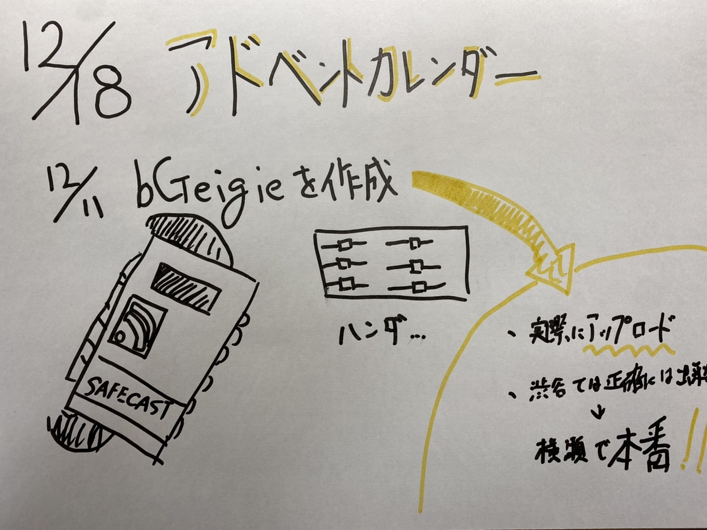

### 12月18日アドベントカレンダー

＃＃前回の中間発表からの進歩

私は「横瀬町の放射線量マッピング」をすることにしました。

中間発表終了後古橋先生とSafecastの講師の先生が開講する授業を履修し、放射線量について学びました。

そして実際に放射線量を測定するための機械「bGeigie」を作成しました。中学生以来ハンダを使用したことがなかったので、とても作業をするのが怖かったですが無事完成することが出来たのでひとまずよかったです。

完成した後には、「bGeigie」をどのように使用するかを学びました。使用方法からマップのアップロードの方法までを理解しました。

本社である渋谷では高い建物が多く、GPSを3本以上取得することが出来ませんでした。そのため正確な位置情報を持っていなかったので、次回では正確に計測してみたいと思います。

そして明日12月19日に放射線の処理場である三菱マテリアル 横瀬工場へ行き、実際に測定をしてみたいと思います。

12月18日時点での進歩はこれまでになります。

グラレコはこちら。

