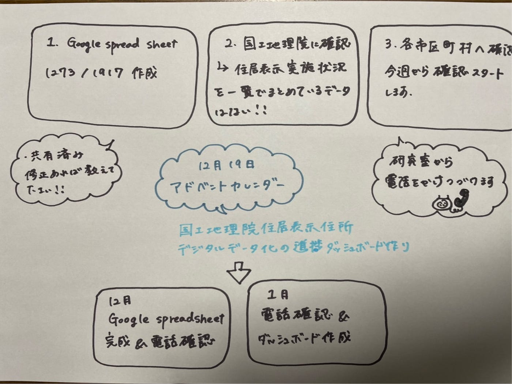

### アドベントカレンダー12/19

国土地理院住居表示住所デジタルデータ化の進捗ダッシュボード作りを卒論のテーマとし、現在はGoogle spreadsheetのデータ作成を進めるとともに、国土地理院、各市区町村へ電話確認を行っています。

Google spreadsheetは、現在１２７３/１９１７市区町村のデータを作成しました。また、国土地理院へ問い合わせたところ、各市区町村の具体の住居表示住所実施状況について一覧でまとめているデータはないことが判明しました。

さらに、住居表示住所を採用しているが国土地理院住居表示住所デジタルデータがない市区町村、また国土地理院デジタルデータがあるが市区町村のウェブサイトに実施状況が掲載されていない市区町村については電話確認をデータ作成と並行して順次行っていきたいと思います。

[電子国土基本図「住居表示住所」を盛り上げる勝手連グループ 作業用スプレッドシート（仮）
シート1 WIP・作業者,pid,cid,pref,city,url,住居表示実施状況(entire/partial/not yet),調査年月日,実施状況公開情報,公開フォーマット…docs.google.com](https://docs.google.com/spreadsheets/d/1z-ZelNSlpZsrrxN2g_3PEJYqpvVKHxuZv5GKSrsQxyE/edit?usp=sharing)

今後の見通しとして、年内にgoogle spreadsheetを完成させること、また、電話確認とダッシュボードづくりを１月中旬までに完成させる予定です。

＜グラレコ＞

