### 12月ラストハッカソン

こんにちは！4年の佐藤です！12月のハッカソンテーマは

### 【UNVT Hackathon/Meetup 2022 Online】

今年度最後のハッカソンでした(^ ^)
みなさまお疲れさまです！

さて、デザイン部ですが、

#### UNVT ….etc…….

#### 『すみません、、よく分からないです』

の代表と言って良いほど正直よくわかっていなくて。。。

でも、そんな存在だからこそ

### UNVTをわからない人、知らない人に伝わる

### デザインが作れる！

とポジティブ変換して、取り組みました😂

デザイン部のタスクはこちら

> ❶[西川さんのプレゼン](https://youtu.be/q08aawADcl4?t=4426) グラレコ

> ❷Produce, Style, Host, Optimize, Storytelling のアイコンデザイン（グラレコ風）

> ❸UNVTロゴ グラレコ風デザイン

> ❹その他、UNVT関連ドキュメントの再デザインとグラレコ化

### 成果物

> ❶[西川さんのプレゼン](https://youtu.be/q08aawADcl4?t=4426) グラレコ （byはるかさん）

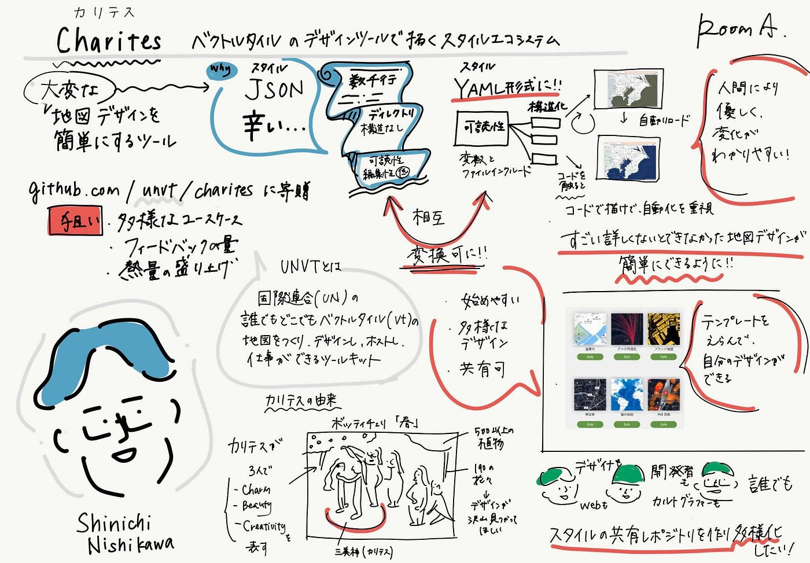

> ❷Produce, Style, Host, Optimize, Storytelling のアイコンデザイン（グラレコ風）（by佐藤）

参考にしたのは 2021–05–12 UNVTワークショップ 藤村さんプレゼン

と、同ワークショップのグラレコ

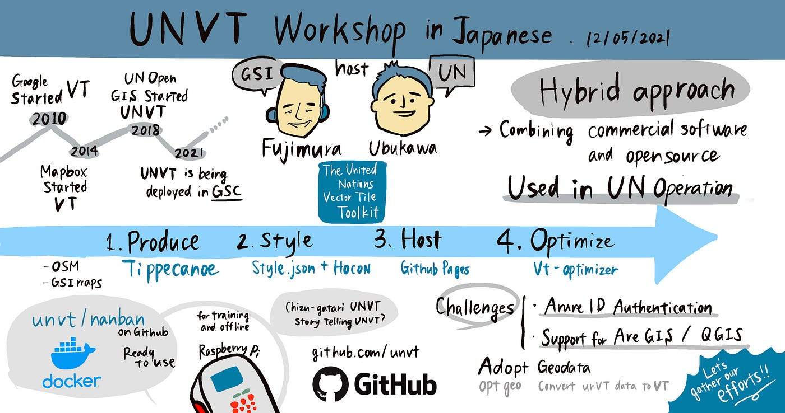

そして、菊池こうきにも助けてもらい。。。

ようやく少し理解しました、、、（その時のメモ↓）

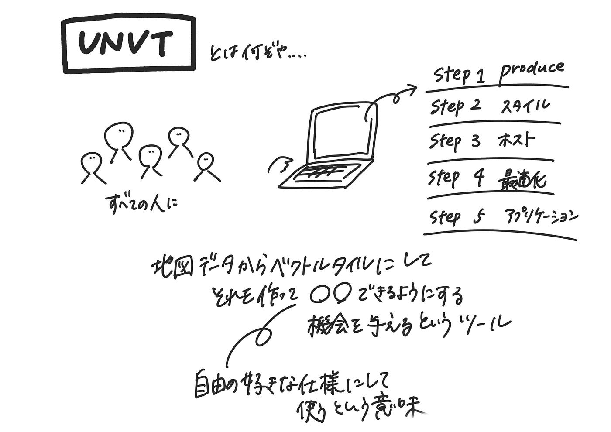

**成果物**

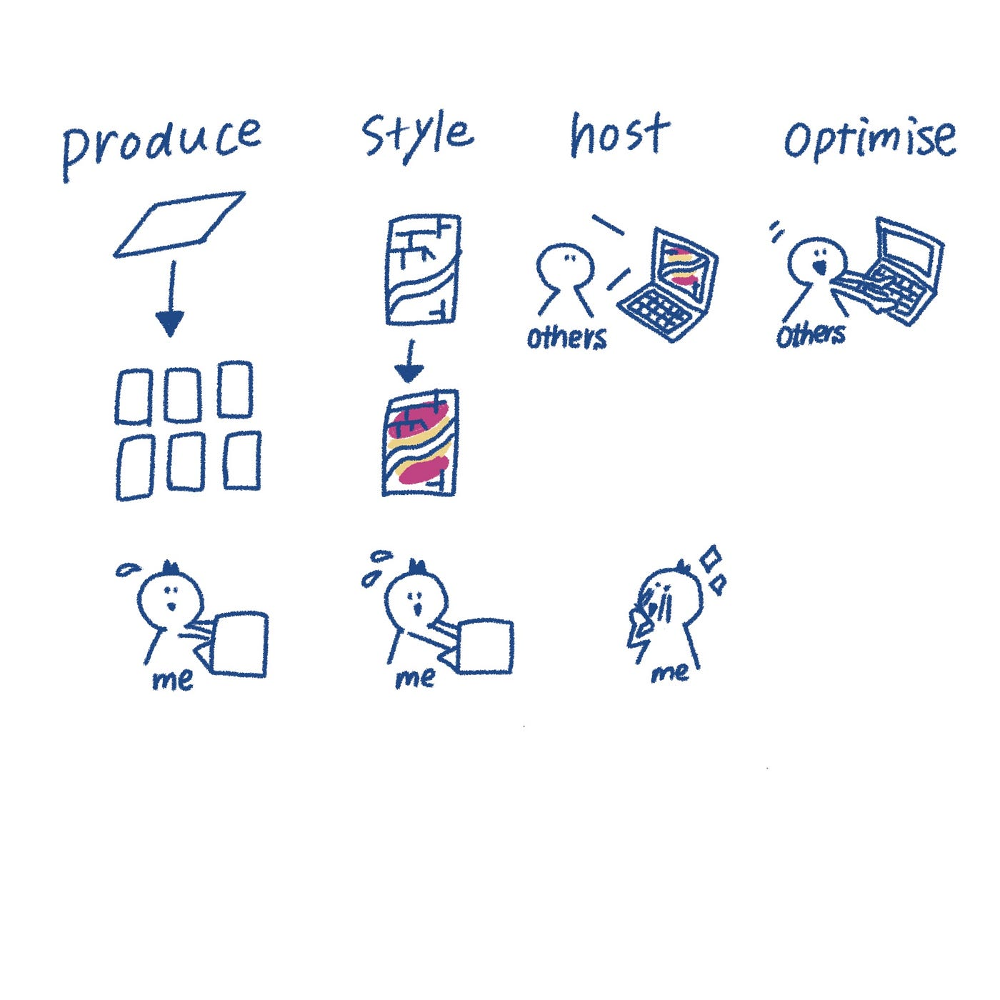

①produce （生産）

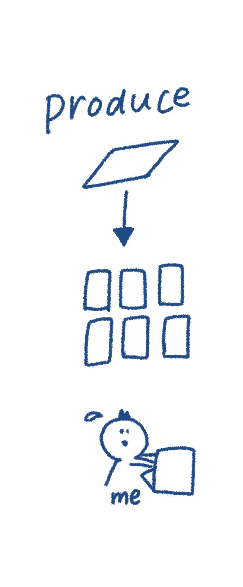

②style （スタイル）

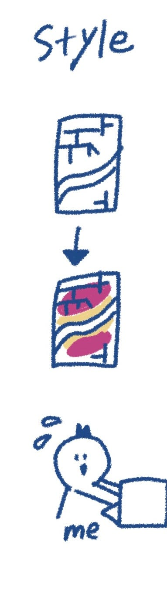

③host （ホスト）

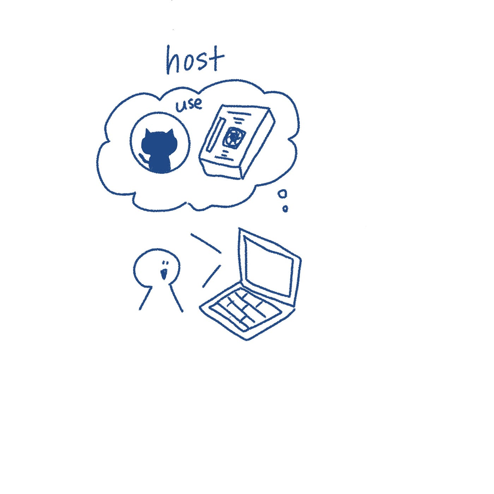

④optimize （最適化）

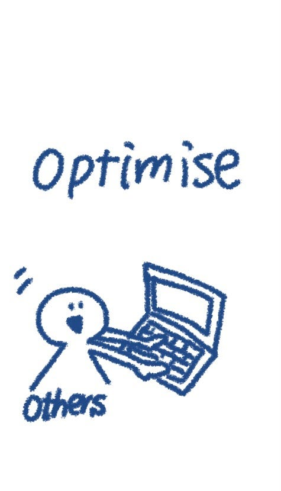

⑤storytelling

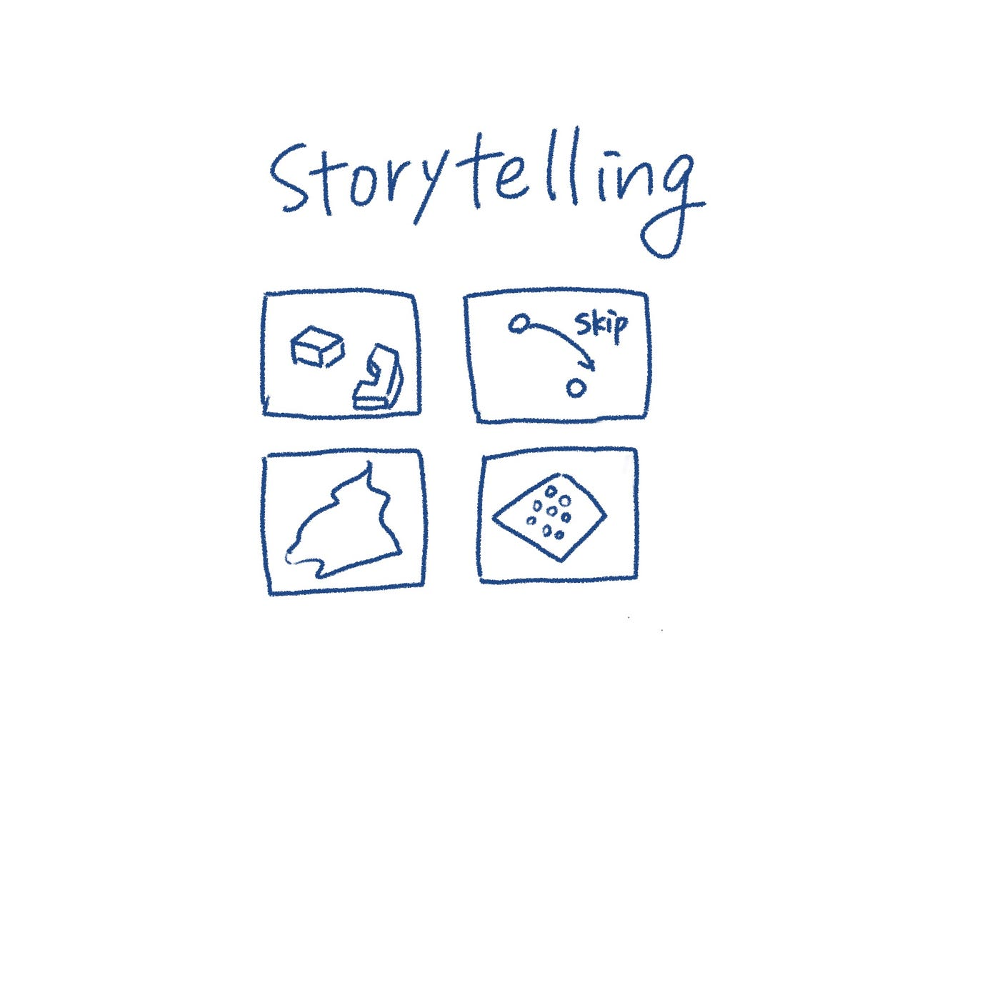

> ❸UNVTロゴ グラレコ風デザイン (by、若松、齋藤)

斎藤作

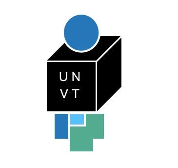

**上の球体は地球をイメージ。箱はUNVTをツールボックスの様に🧰
そしてそこから出た下の四角達がベクトルタイル。**

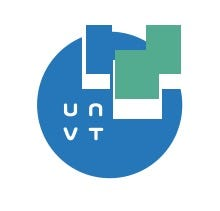

**地球上の地図データがベクトルタイルになっている様子。
且つ、VT自体が地球の地形？はたまた地球社会を作る一部であること。**

若松作

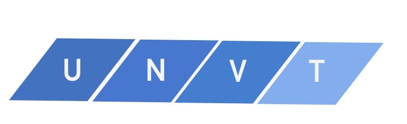

**タイル感とUNVTの流れが表現できるようにしてみました。**

> ❹その他、UNVT関連ドキュメントの再デザインとグラレコ化

### **・charitesデザイン**

斎藤作

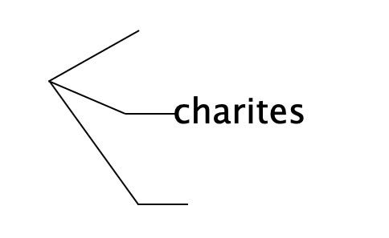

**樹形図をイメージ。構造化という点が印象に残った為。**

若松作

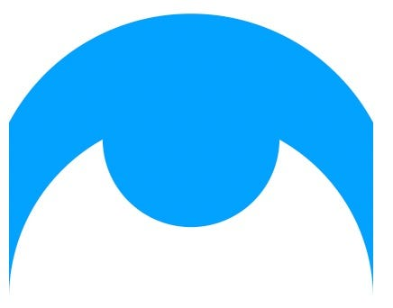

**行政感が出てしまったのでボツ。
誰でも自由に地図デザインに参画できると言うフリーさを曲線で表現してみた。**

グラレコ　長島

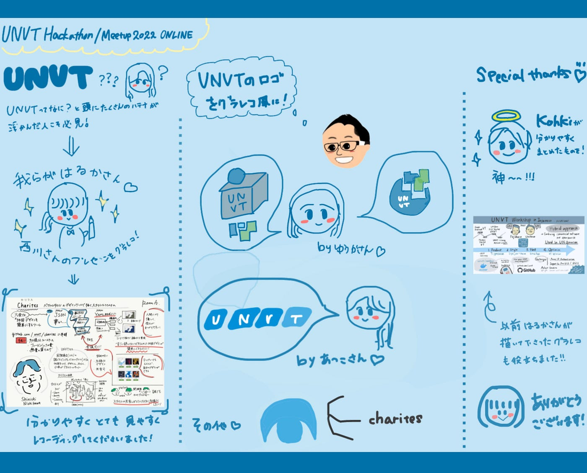

発表スライド

GIthubプロジェクト

[GitHub - furuhashilab/UNVT_Hackathon_Meetup2022_Design
You can't perform that action at this time. You signed in with another tab or window. You signed out in another tab or…github.com](https://github.com/furuhashilab/UNVT_Hackathon_Meetup2022_Design)
