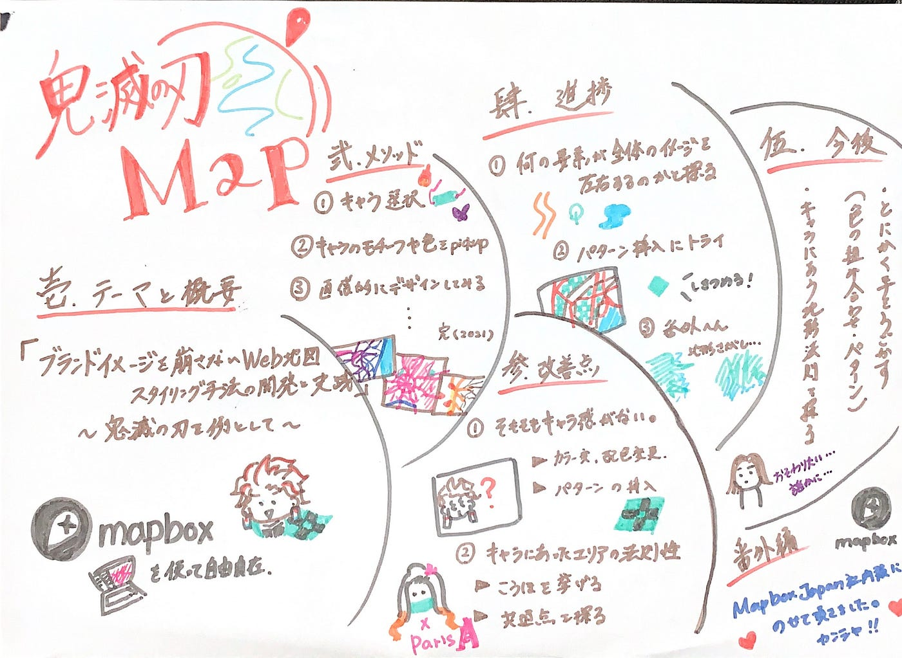
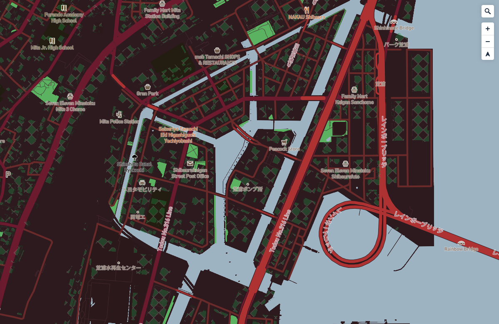
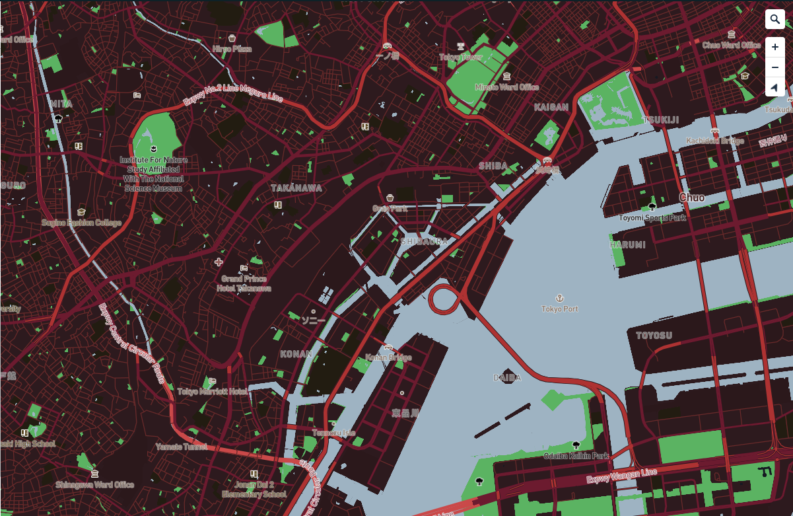

Advent Calendar Day20

鬼滅の刃風MAP 前回までのおさらいと今後

こんにちは本日担当する３年の斎藤祐花です。
毎年恒例アドベントカレンダー企画にて私のゼミ論の進捗報告をします！

まずゼミ論のテーマですが、
「ブランドイメージを崩さないWeb地図スタイリング手法の開発と実践 
 〜鬼滅の刃を例として〜」

簡単にいうと、みんなが知っている鬼滅（遊郭編放送されてますね！）を通して、ブランドイメージが伝わるWeb地図デザインの方法を模索しよう。といった内容です。Mapbox studioを使用しています。

▼こちらが前回の内容をまとめたグラレコ

以前と現在までの進捗をざっくり下記にてまとめてみます。

１：どんな要素が全体のデザインイメージを大きく作用するのかを検証

２：パターンの導入

３：上記２つを意識しながらとにかく手を動かす

**１**に関して、
これは昨年度から継続してブラッシュアップしている項目となります。
昨年まではやはりBaseの色とRoadの色選択が重要だというところで終わっていました。
ですがキャラによっては安直に一番のキャラのメインカラーを使用面積の広いBaseやRoadにつかってもそのイメージにはたどり着かず他の方法で手っ取り早くイメージ確立が出来ないかと模索したところ ….

・Text Transformation テキストの大文字/小文字表示の設定
・Symbol Placement ラベルやシンボルの配置
・3D buildings mode (Layers)ビルを３D表示にしそこにパターンを挿入

上記３点がかなり要になりそうだというところまで来ました。

そこで**２**にも関わってくるのですが、
中でも3D buildings mode Insert Pattern が模様やモチーフがあるようなキャラ（ブランド）にはかなり相性が良いです。

以前試してみたのが炭次郎。
▼Tanjiro Kamado パターン挿入後

▼ちなみにパターン挿入前はコチラ

やはりそもそも羽織の柄が特徴的なキャラなのでパターンの挿入で
何を表しているのかの核心により迫れるような気がします。
現在は他にもパターンが有効そうな善逸（黄色地に白の三角模様）を試すなどをしています。
また、もう完成形にだいぶ近づいている禰豆子もパターンを入れてみたのですがコチラは失敗。要因としては兄のように模様がシンプルではないこと、模様なスケールが大きいこと、があげられると思います。
パターンの挿入が難しい場合はやはりそのキャラを連想させるような地形を探しそこでうまくイメージを作っていく必要なありそうです。

３に関してと今後

ずばり今後は３にも挙げたように引き続きどんどん手を動かしていく予定です。
はなから法則を探しそれに則ってやろうとするよりも、自由にいろいろいじっていきそれを他キャラに試した時に比較検証すると法則がぼやっとみえてくることが今まで断然多かったからです！

今の目標としてゼミ論の最終提出のときには
禰豆子の完成、炭次郎の完成、＋柱の誰か一人（簡単なのは煉獄だけど今のアニメの流れで言うと天元？）を考えています。

▼2021年度 ゼミ論 レポジトリ
[https://github.com/furuhashilab/2021gsc_Yuka-Saito](https://github.com/furuhashilab/2021gsc_Yuka-Saito)

2021年度れぽじとり
