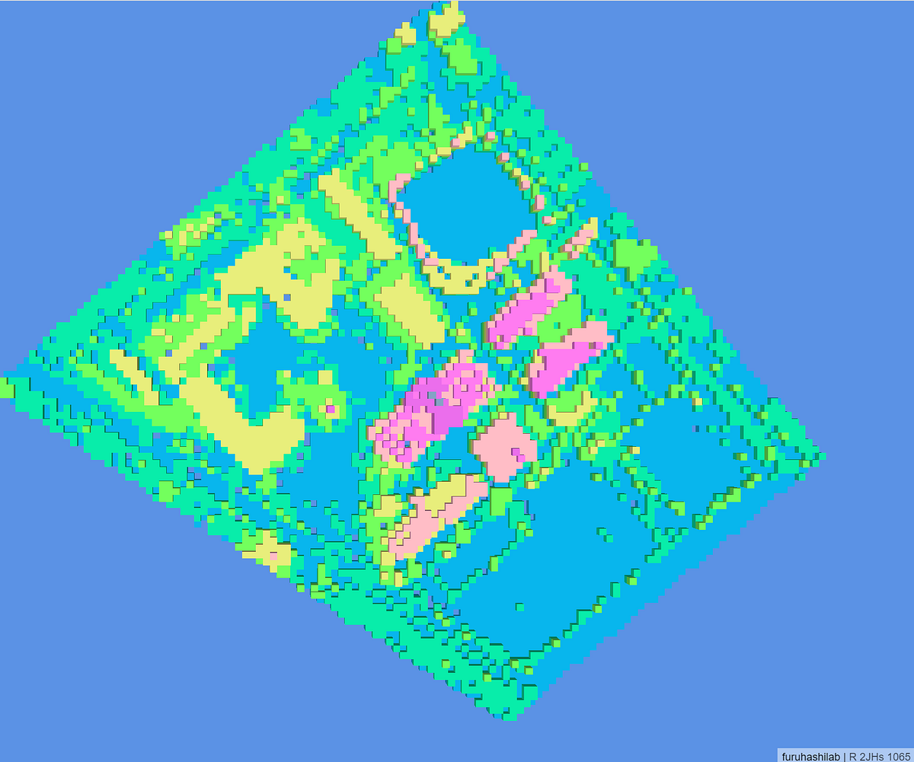
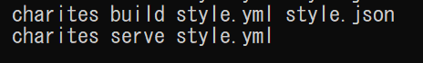
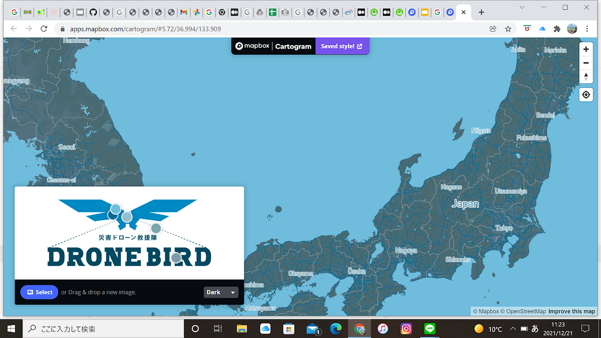
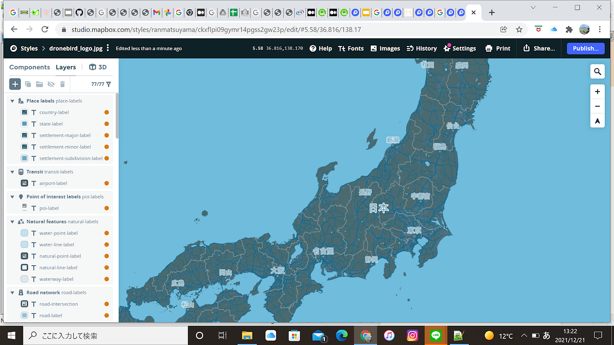
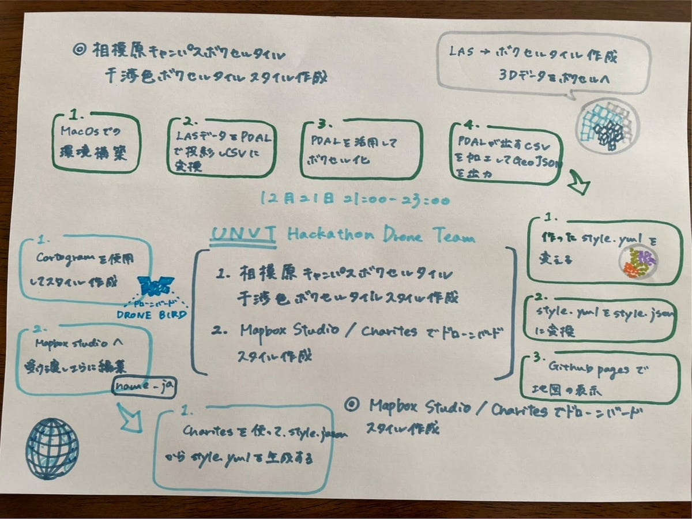

### UNVT Hackathon Drone Team

＃＃今回行ったこと

今回は相模原キャンパスボクセルタイルの生成。そして干渉色ボクセルタイルスタイルの適用を行いました。

またMapbox Studio/CharitesでDrone Birdスタイルを行いました。

＃＃相模原ボクセルタイルの生成

大まかな一連の流れとして、

1. MacOSの環境構築

1. LASデータをPDALで投影してCSVに変換

1. PDALを活用してボクセル化

1. PDALが出すCSVを加工してGeoJSONで出力します。

この作業を部長の神田が行ったのですが、とても苦労していました。本当にありがとうございます！

特に苦労した点として、パスを通してすべて利用できる状態にしないといけないので、そこに時間がかかりました。

実際に相模原キャンパスのボクセル化をする前にkid-cという藤村さんにコード規模を3割減くらいのシンプルなものに書き換えていただいたものから実行していきました。

[GitHub web editor
Edit descriptiongithub.dev](https://github.dev/optgeo/kid-c)

そしてこちらの相模原キャンパスのLASデータを使って変換しました。

[点群データ 切り出し済 50cm間引きLAS形式 61MB](https://drive.google.com/file/d/1wqZYy09-jMXzTM7KaYeq73Q9238tVIq6/view)

＃＃干渉色ボクセルタイルスタイル作成

大まかな流れとして、

1. style.ymlの置き換え

1. style.ymlをstyle.jsonに再度変換

1. GitHub Pagesで地図の表示

そして作り上げたボクセルタイルを干渉色のスタイル変更をします。

主に参考にしたのはこちらを参考にしました。

[GitHub - optgeo/cudi: kid-c template
kid-c template このテンプレートは、UNVT のコマンドラインツールを使います。 Raspberry Pi OS では equinox で UNVT を導入できます。 Docker 上では nanban で UNVT…github.com](https://github.com/optgeo/cudi)

こちらをCloneして先ほど作ったstyle.ymlの中にあるvoxel.ymlのファイルをこちらのvoxel.ymlに置き換えました。

そしてcharitesのコマンドの「charites serve style.yml」を用いて確認しました。

正しく表示されてひとまず安心です。

次にGitHubのレポジトリを開いたときに地図のURLが表示して、確認できるようにしたかったのでGitHub Pagesの設定をしました。

その際に、style.ymlのファイルをstyle.jsonにしなければいけなかったので変更しました。

そしてGitHub Pagesの設定を行い、Cusutom Domainで以下を記載します。

[cudi/docs at main · optgeo/cudi
kid-c template. Contribute to optgeo/cudi development by creating an account on GitHub.github.com](https://github.com/optgeo/cudi/tree/main/docs)

そして追加をしたらGitHub Pagesに記載されているURLを確認してみます。

[https://furuhashilab.github.io/UNVT_Hackathon_Drone/](https://furuhashilab.github.io/UNVT_Hackathon_Drone/)

こちらのURLをクリックすると今回作成した成果物を確認することが出来ます。

＃＃Mapbox Studio/Charites でドローンバードスタイル作成

最初にCartogramを用いて地図の作成を行いました。

・Colorful

・Light

・Dark

・Custom

⇒Customで色を調整

⇒Saved style

このように設定を行うことが出来ます。

今回はDRONEBIRDの色を再現するのでこちらの画像を使用しました。

そしてMapbox Studioで詳細な編集を行いました。

・全てのレイヤーを

日本語に変換

・細かい配色

[dronebird_logo.jpg
A map made by ranmatsuyamaapi.mapbox.com](https://api.mapbox.com/styles/v1/ranmatsuyama/ckxfh7mx4gvlp15lug6ioeb41.html?title=copy&access_token=pk.eyJ1IjoicmFubWF0c3V5YW1hIiwiYSI6ImNreGRkenp0bjByZHoyb3B6azE0YW1lb3IifQ.iYGVmEEmfwIKoqnBDK1Bng&zoomwheel=true&fresh=true#5.58/36.816/138.17)

そして最後に編集しやすいようにstyle.jsonのデータをcharitesを用いてstyle.ymlに変換しました。

＃＃GitHubレポジトリ

[https://github.com/furuhashilab/UNVT_Hackathon_Meetup2022_Drone](https://github.com/furuhashilab/UNVT_Hackathon_Meetup2022_Drone)

干渉色ボクセルタイル用Githubレポジトリ

[https://github.com/furuhashilab/UNVT_Hackathon_Drone](https://github.com/furuhashilab/UNVT_Hackathon_Drone)

＃＃グラレコ

＃＃スライド
