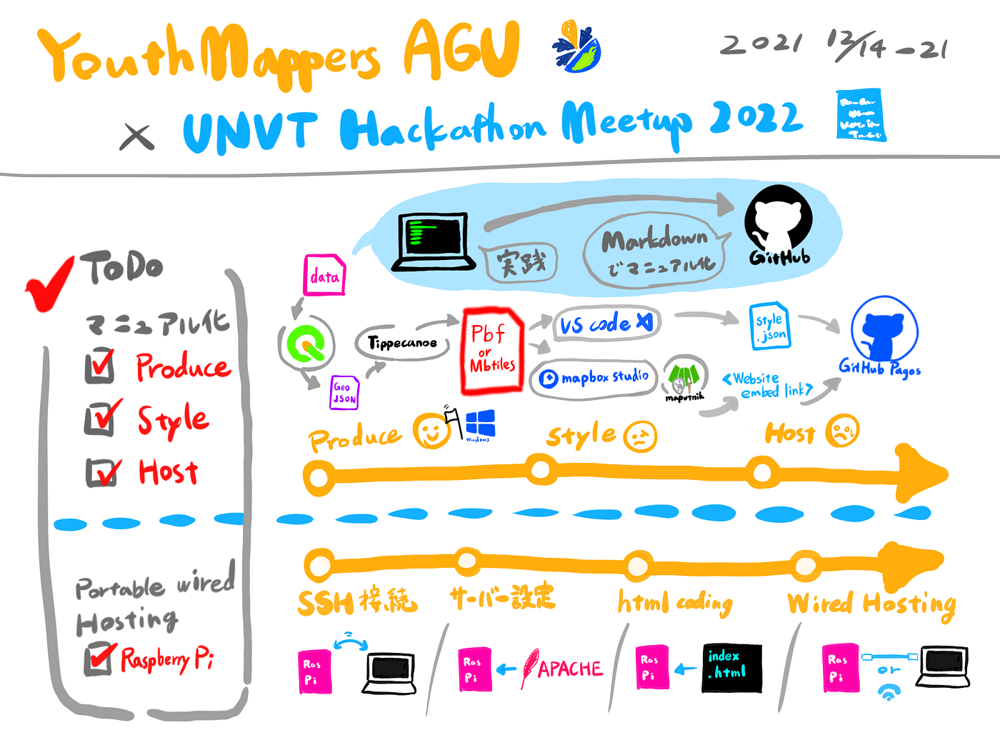

### UNVT Hackathon/Meetup 2022 YouthMappers AGU

YouthMappers AGU ハッカソンレポート

UNVTに関連したハッカソンが 2021/12/14~21 に開催され、最終日のMeetupで成果発表をすることになりました！

我々YouthMappers AGUの課題は、

① Produce, Style, Host の一連の作業のマニュアル化

② UNVT Portable Wired Hosting (with Raspberry Pi) の実践

です。

国土地理院の藤村さんのUNVTワークショップの資料スライドやGithubを見ながら一連の作業を行い、その手順をマニュアルとして[レポジトリ](https://github.com/furuhashilab/UNVT-Hackathon-Meetup-2022_YouthMappers_AGU)にMarkdownで記述していきました。

> 作業レポート

#### Produce

Produceの作業のために必要なアプリやプログラムをインストールしながら、データをMbtiles/Pbfにしていく道筋を辿り、マニュアル化していきました。

※Windowsで作業を試みたメンバーもいましたが、Ubuntuを使う以外の方法では[うまくいかなかった](https://github.com/furuhashilab/UNVT-Hackathon-Meetup-2022_YouthMappers_AGU/issues/9)ので、ハッカソンのスケジュールも踏まえてここで諦めてMacをメインにしました。

#### Style

MbtilesはMapbox studioでGUIでスタイリングし、そのWebsite embed Linkを取得しました。

PbfはVisual Studio CodeでCUI (style.json) でスタイリングしました。

#### Host

GitHub Pagesを使ってスタイリングした地図をホスティングしました。

> 成果①：マニュアル

1. Produce

[UNVT-Hackathon-Meetup-2022_YouthMappers_AGU/Produce.md at main ·…
Tippecanoe ↓このコマンドをそのままターミナルで入力(入力する前に cd と入力してホームディレクトリにあることを確認) ↓type this command into terminal (before you type the…github.com](https://github.com/furuhashilab/UNVT-Hackathon-Meetup-2022_YouthMappers_AGU/blob/main/Produce.md)

2. Style (Mbtiles/Pbf)

[UNVT-Hackathon-Meetup-2022_YouthMappers_AGU/Style.md at main ·…
Mapbox Studioを開き、"New Style"を選択 Open the Mapbox Studio and select "New style" 任意のテンプレートを選択し、"Customize {テンプレート名}" をクリック…github.com](https://github.com/furuhashilab/UNVT-Hackathon-Meetup-2022_YouthMappers_AGU/blob/main/Style.md)

3. Host

[UNVT-Hackathon-Meetup-2022_YouthMappers_AGU/Host.md at main ·…
Permalink You can't perform that action at this time. You signed in with another tab or window. You signed out in…github.com](https://github.com/furuhashilab/UNVT-Hackathon-Meetup-2022_YouthMappers_AGU/blob/main/Host.md)

> 成果②：UNVT Portable Wired Hosting

Raspberry PiとPCを有線で接続し、地図を閲覧できるようにする段階までには至りませんでした…。

> 発表用スライド

> グラレコ

