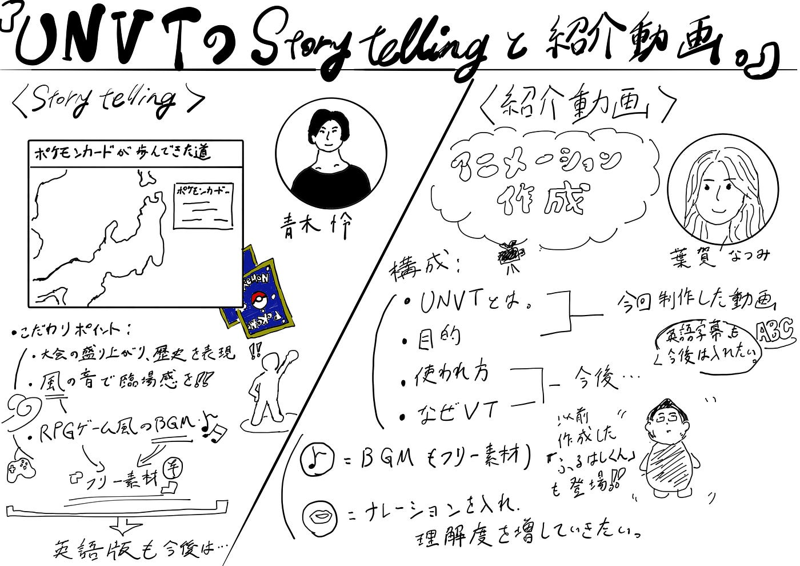

### UNVTのストーリーテリングと紹介動画。

今回のハッカソンで我々V＆Fは、そもそも「UNVTとは何なのか。」を初心者にも分かりやすいように紹介する動画を制作すると共に、UNVTのストーリーテリングを好きなテーマで制作させて頂き、それを共有していきたいと考えている。

まず、青木が担当したストーリーテリングに関して述べたいと思う。

内容としては、担当した青木が選んだポケモンカード大会の歴史に関して記述し、画面キャプチャして軽く編集したものをYouTubeにアップした。今回こだわったポイントとして以下のものがある。

- ポケモンカードの大会の盛り上がり、歴史を表現することを意識

- 動画は「風」の音で臨場感をつける。

- ポケモンの世界観の雰囲気に寄せるため、RPGゲーム風のbgmを採用。

（※BGM、効果音はフリー素材に統一させていただいている。）

また、今回の改善点として以下のものが挙げられた。

- 後半、内容が薄いのでより説明を増やす。

- pvの演出も考えて作成してみたい。

- 英語版も作る。

UNVTは、日本だけでなく世界規模での認知理解をしていかなければいけないので動画等の言語は日本語だけでなく英語など他言語版も制作する必要があった。今回は時間が足りず出来なかったが今後機会があればそこの作業も行いたいと思っている。

そして、次に「UNVT紹介動画の制作」についてである。こちらは、葉賀が担当し作成した。

まず最初にアニメーションの作成を行い、視聴者の方々の興味と目を引き付けることを意識した。また動画を制作する上で意識したポイントとして他に、「動画の時間を長くても2分以内に収める」という事がある。これは、長すぎてしまうと視聴者が途中で飽きてしまうという傾向があると考えているので、その線引きとして最長でも2分！と設定したのだ。

今回は時間の都合上、一部しか出来上がらなかったのだが、構成としては以下のようになっている。

- UNVTとは

- 目的

- 使われ方

- なぜVT

また、BGM / ナレーションの挿入も計画しており、

より短時間で分かりやすいものに仕上げたいと考えると同時に英語字幕等の他言語仕様にも挑戦し世界的にUNVTの認知理解を広めていければと考えているのである。

#### ＜スライド＞

#### ＜グラレコ＞

#### ＜GitHub＞

[GitHub - furuhashilab/UNVT-Hackathon-Meetup-2022_V-F
国連の業務要件を満たしているオープンソースGISツール開発を目的とする枠組み OpenGIS Initiative として Working Group 4.6 "The United Nations Vector Tile Toolkit…github.com](https://github.com/furuhashilab/UNVT-Hackathon-Meetup-2022_V-F)
