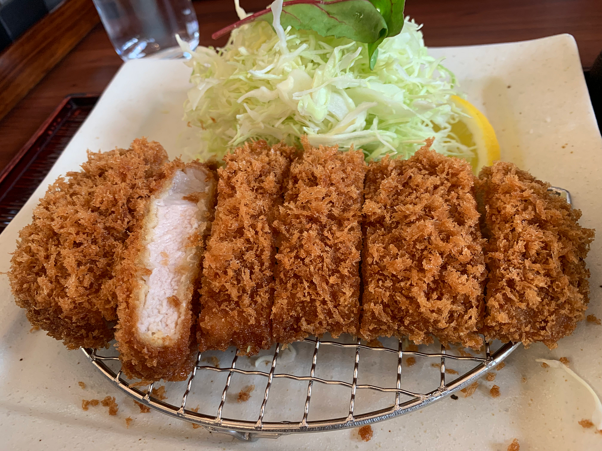
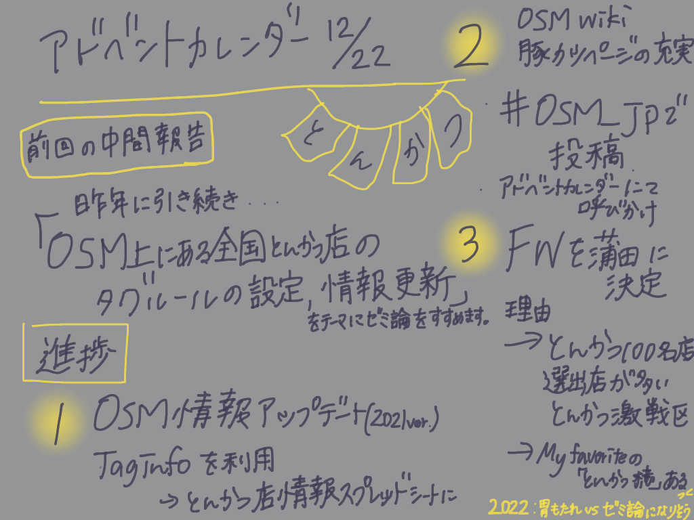

### アドベントカレンダー 12/22

本日12/22のアドベントカレンダーを担当する4年の若松です！
今年も残り10日しかないですね！！ハッカソンも終わり、2021年残りわずかとなりましたが、ゼミ論の進捗報告を終えて今年を締め括りたいと思います！笑

#### #テーマ

OSM上にある全国の豚カツ店のタギングルールの設定、情報更新

#### ＃中間報告後からの進捗

進捗としては大きく３つあります。

**1 OSM情報の更新**

OSM上にある全国の豚カツ店を[スプレッドシート](https://docs.google.com/spreadsheets/d/1xnWAmlLVDLfa12DDGjNbNfGhFdzVgP8gkxIkSMBPE1U/edit?usp=sharing)にまとめました。
新たに情報を加えアップデートを行いました。

**２豚カツ屋ページを盛り上げる！**

OSM Wiki上の豚カツ屋ページの編集、更新が自分のみであったことを前回確認したので今年はもっと多くの人に意見を求めていきたいと思います！

→[OSM Wiki 豚カツページ](https://wiki.openstreetmap.org/wiki/%E3%81%A8%E3%82%93%E3%81%8B%E3%81%A4%E5%B1%8B)

OSM有識者の方へこの場を借りて質問したいです。

#### 質問：OSM Wikiにも記載がありますが、豚カツ店はamenity_restaurantとamenity_fastfoodどちらで表記すべきでしょうか。。。

TWITTERにも同様の質問を＃OSM_JPをつけて投稿しますので、よろしくお願いいたします。

**３ FWエリアの決定**

#### とんかつ激戦区「蒲田」 に決定しました！

決定した理由としては私の一押しの店「とんかつ 檍 」をはじめ、食べログとんかつ100名店に選出されているお店が多くあることです！
「蒲田」周辺のとんかつ屋さんの情報を中心にフィールドワークをしたいと思います。

**＃最終発表に向けて**

来年はとんかつ 屋さん巡り…！！！！
最近、青山のとんかつまい泉本店に行って限定10食の「甘い誘惑」ロースかつを食べてきました！美味しかったですが２１歳、胃もたれが始まりました。がんばります。

**#グラレコ**

