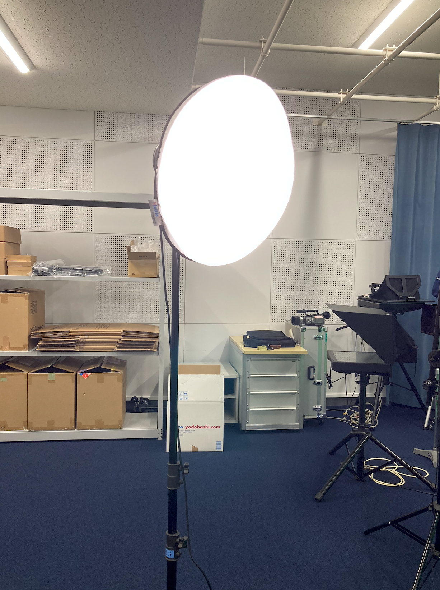
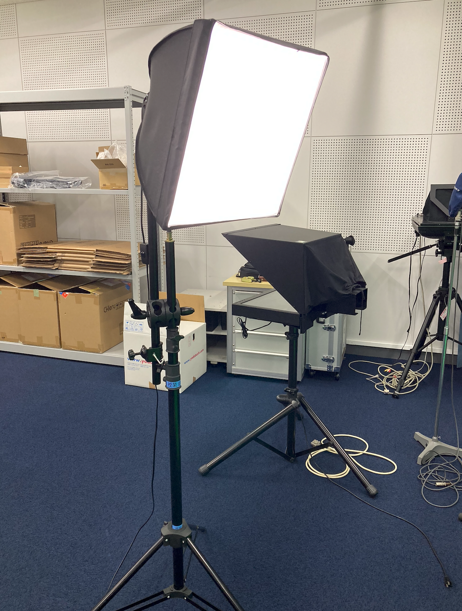
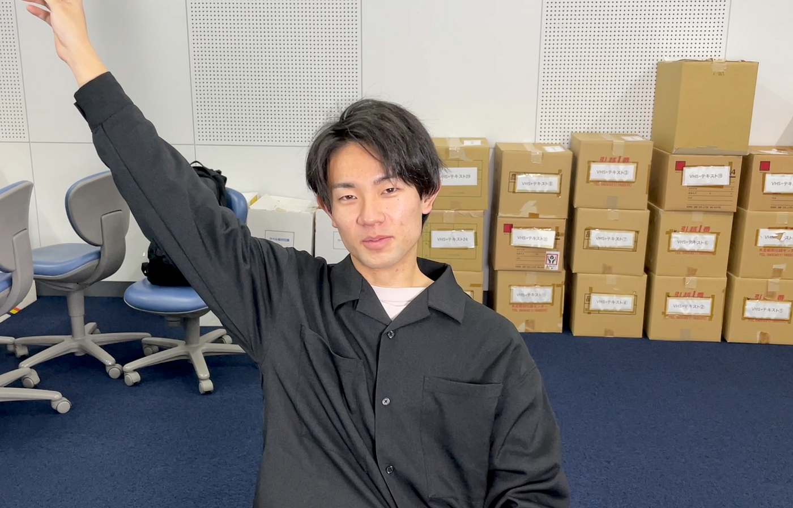
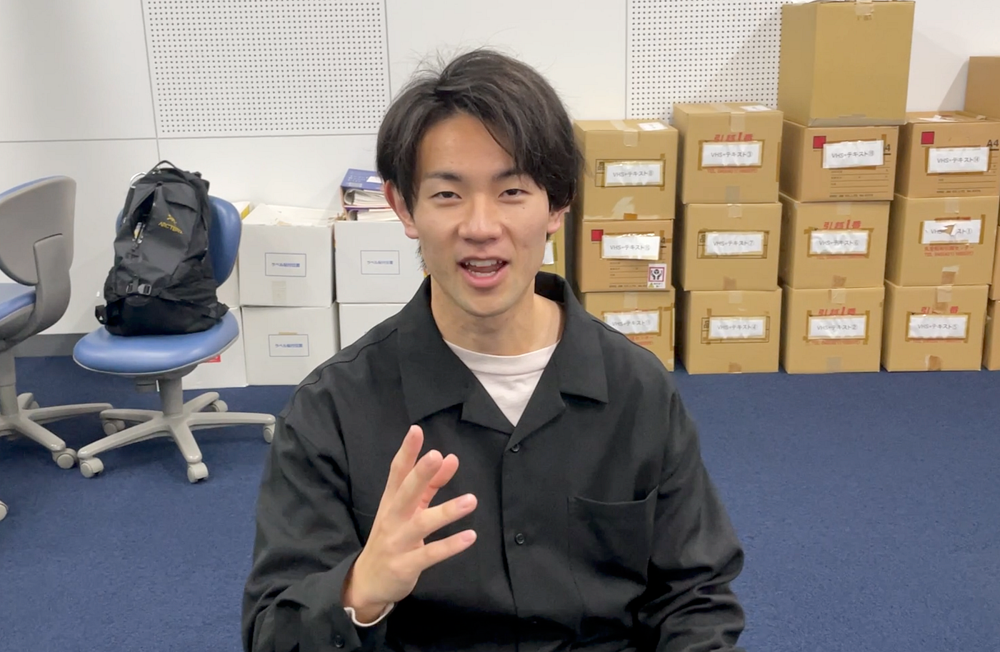
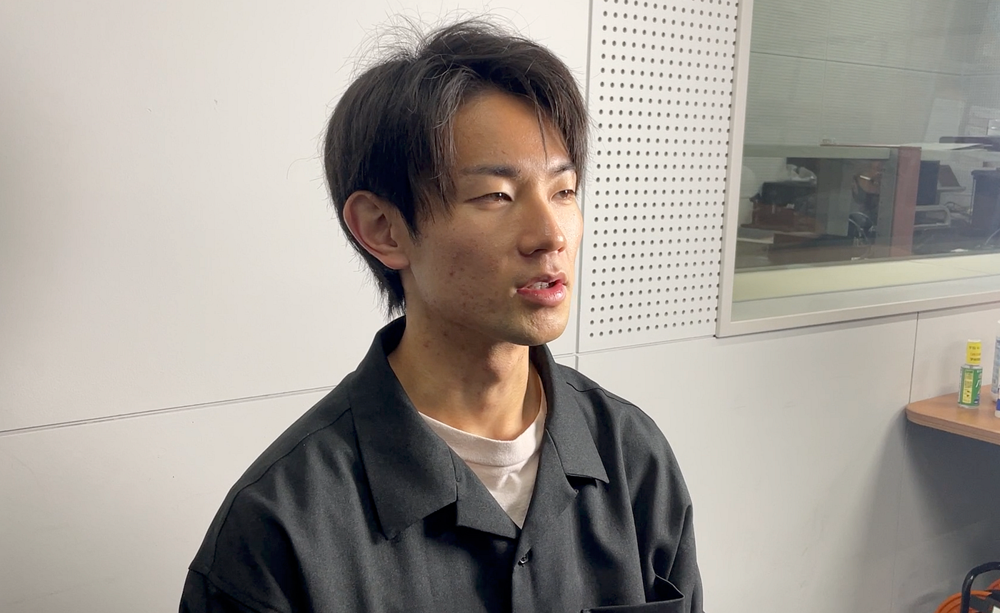
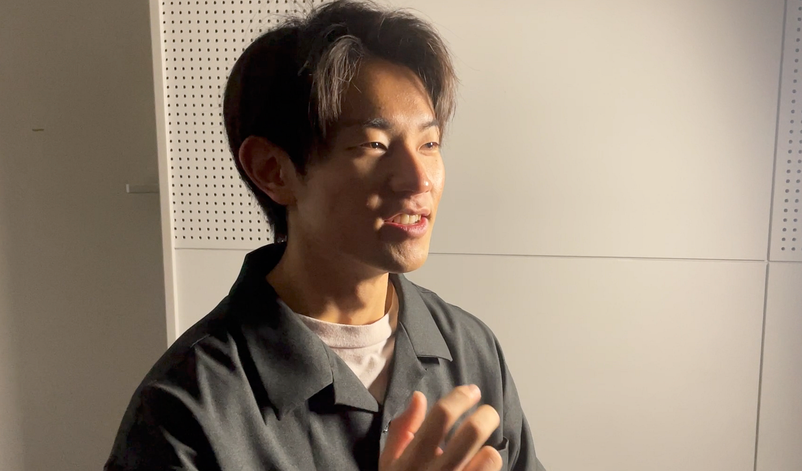
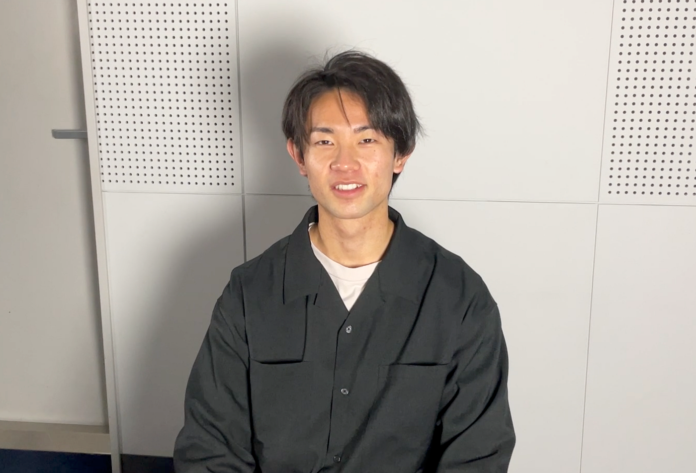
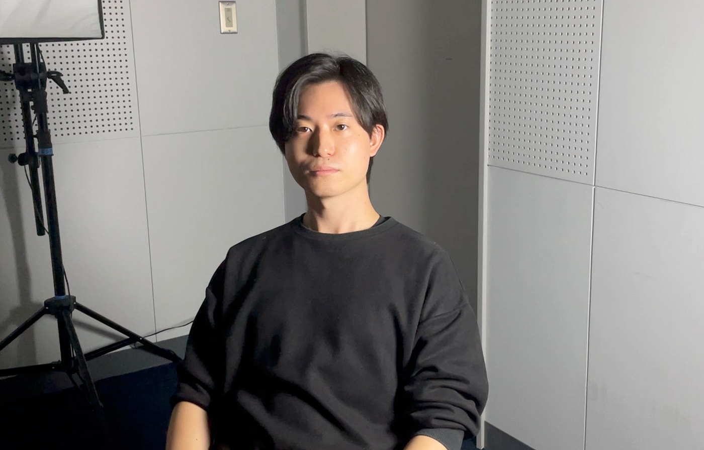
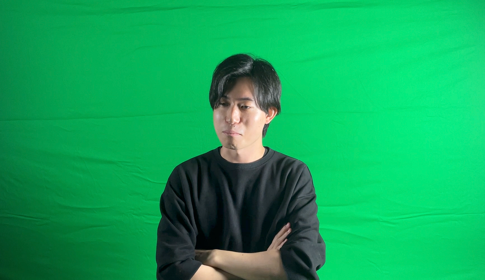
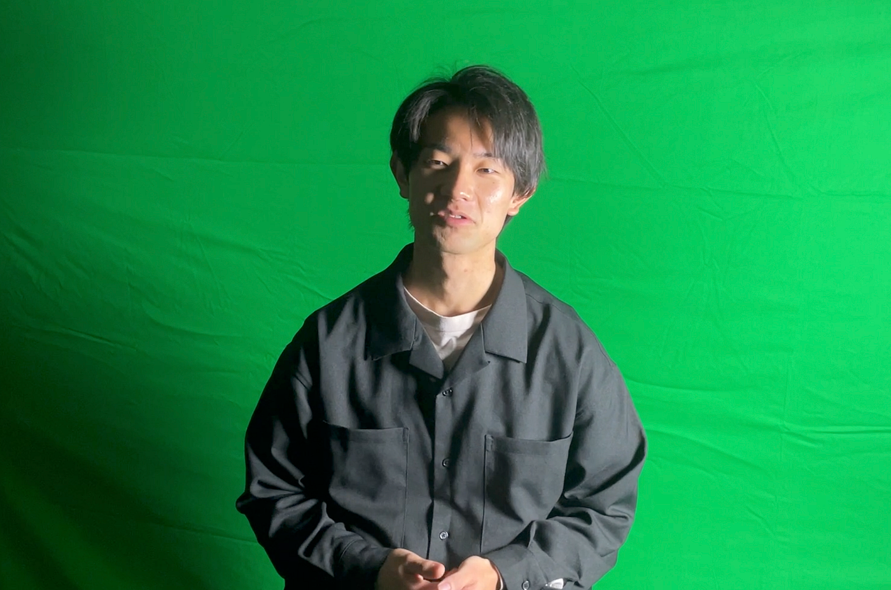

### ゼミ論2021 アドベントカレンダー報告

本日12/23日のアドベントカレンダー担当はV&Fで動画やりつつ謎にポケモンカードばかりやっている青木です。

クリスマス目前ですがしっかりと報告していきます！

### テーマ

今年のテーマは中間発表の際に「いかに、プロっぽい動画を作れるか?照明の使い方を工夫して検証する」というざっくりとしたモノでしたが、そこからブラッシュアップして以下のようなテーマになりました。

### 「B棟4階のスタジオにある照明とiPhoneの照明のみでプロっぽい映像を撮影する方法を検証」

これから、B棟４階の部屋はスタジオとして使えるようになるということで、これから古橋ゼミに参加したり、その他団体がスタジオを使って撮影を行うことも増えると思います。

その際に、最低限の機材で素人でもかっこいい、プロっぽい撮影をできるようにしたいと考えています。

TEDxAoyamaGakuinU2020のチームでB棟4階スタジオを使ったことがある人は分かると思いますが、このスタジオにある照明は2つでどちらも型が古く「撮影時に照明をつける意味がないのでは?」という感想を持っていると思います。

しかし、TEDx開催時に照明の使い方が上手い人や照明について熟知している人は誰一人いませんでした。使い方を工夫すれば最低限の機材でも良い動画が取れるのではないか？と考えています。

完成動画は「ドキュメンタリー」や「プレゼン」のような学校で行うことが多そうな動画をメインに考えて作ります。

### 照明の使い方調査

#### 参考文献

[古橋ゼミ卒論2021参考文献_青木怜
Templete ID,大分類,中分類,小分類,著者,発行年,最終更新日,タイトル,雑誌名,雑誌号数,該当ページ,出版社,ISBN,URL,URL4archives,閲覧日,MEMO1,MEMO2 論文,査読つき 論文,査読なし 書籍…docs.google.com](https://docs.google.com/spreadsheets/d/1aTm66UNxFB5cAVl1_44wyT1jAr8qmjzAisON0W4mXs0/edit?usp=sharing)

プロが作っているPVのような動画から撮影についての研究等の中でこの3つのTips動画を参考にしながら実際に撮影を試みました。

### スタジオで撮影

一年ぶりにスタジオを借りて、撮影をしました。撮影した順番にどのようなやり方で撮影して、どのように映ったかを説明していきます。

最初はこちらの動画文献の3点の照明を使った配置を参考に動画を撮影してみました。具体的には

1. 正面は顔をメインに照らす

1. 左横から被写体全体を照らす

1. 上から頭部分を照らす

この3構造です。

スタジオには現状２つの照明しかないのでもう一つはiPhone SE第二世代のライトで代用しました。スタジオにある照明は以下のものです。

左の画像の方(丸い照明)は「Mettle Tricolour Lamp Holder Kit LH-4128」
右の画像の方(四角い照明)の型番は現在不明であり、学務課の方に聞こうと思っています。また、撮影に使用しているカメラはiPhone 11 proの純正カメラです。

さて、最初の配置ではこのような動画が撮れました。

[IMG_3533.MOV
Edit descriptiondrive.google.com](https://drive.google.com/file/d/12BR1LyaCQFp-956ZGdROYnlNToneHt5V/view?usp=sharing)

これだけだと分かりづらいので、照明なしのものと比較していきます。

照明がありとなしとでは明るさがかなり違い、印象も変わっていると思います。ですが、プロが撮影したような映像には見えないですね。

まず動画全体として、背景の綺麗さも意識したいところとまた、その他２つ参考動画の照明の使い方も含めて考えると「うまく影を使うこと」が大事なポイントだと考えました。

少し壁がある場所に変え、影を作りやすい角度で照明を置いてみました。顔半分に影を作り、もう半分が光る形です。

[IMG_3538.MOV
Edit descriptiondrive.google.com](https://drive.google.com/file/d/11gWMkwrhXeRis3pGYDj0zFacc0DVB_mg/view?usp=sharing)

少し、映像としてかっこいい雰囲気にはなりました。やはり、影ができるように照明を扱うことがプロっぽさへの第一歩ですね。

### 影をはっきりさせたいなら、部屋を暗くしてみる。

B棟スタジオの照明の光は強いわけではなく、また部屋全体に蛍光灯がついているので照明の光が目立たないという問題に気づきました。一度、部屋の電気を消して、照明の光のみで撮影をしてみます。

こんな感じで考えた通り、光と影のコントラストをうまく出せて、少し良くなりました。ドキュメンタリーなどをスタジオで撮るならこの方法がいいかもしれません。

[IMG_3545.MOV
Edit descriptiondrive.google.com](https://drive.google.com/file/d/12dBwp4AXWCQPnjobzesXRtuuBzz_5ELp/view?usp=sharing)

また、影をあまりださない場合はもう1つの照明で調節できる点や照明の距離感やカメラの画角の変化でかなり雰囲気が変わります。

[IMG_3549.MOV
Edit descriptiondrive.google.com](https://drive.google.com/file/d/112AJpJWkPTRwZdhg1wmJro0cGQVNNN6B/view?usp=sharing)

最終的な成果物は、被写体と照明の位置関係、距離感覚、カメラの角度などを再現できるように図にしてみやすくしようと思っています。また、今回撮った映像を編集し、どれくらいのクオリティの映像ができるかも検証します。

また、グリーンバックでも試してみました。

これでも影を作るバージョンとそうでないバージョンの両方を試してみました。現状よく見えていますが、背景を変えてみて、どのような背景にしたらプロっぽくみえるのか追求してみようと思います。

電気を暗くして照明のみのグリーンバック撮影で気づいたのは、去年のゼミ論での課題であった、被写体に緑色が反射してしまう問題が全く気にならないという所です。部屋の蛍光灯は部屋全体に光をあらゆるところから反射させてしまうので、その点今回は照明一つしか使っていないので無駄な光の反射がなくなったのだと考えています。

今回の中間報告は以上です。

### 最終発表に向けて

最終発表に向けてやることは以下のことです。

- 今回撮影した素材を使ってプロっぽい映像にする。

- グリーンバックの背景を試して、クロマキー合成時の完成系も作る。

- 照明の距離や当て方を図化する。

#### <グラレコ>

後ほど記載
