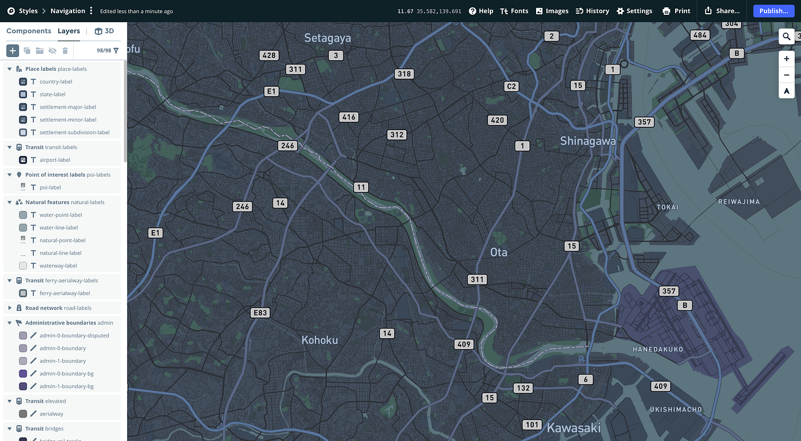
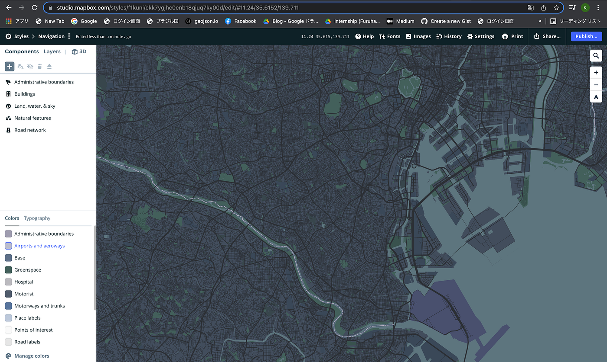
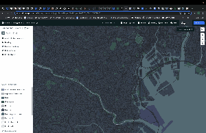
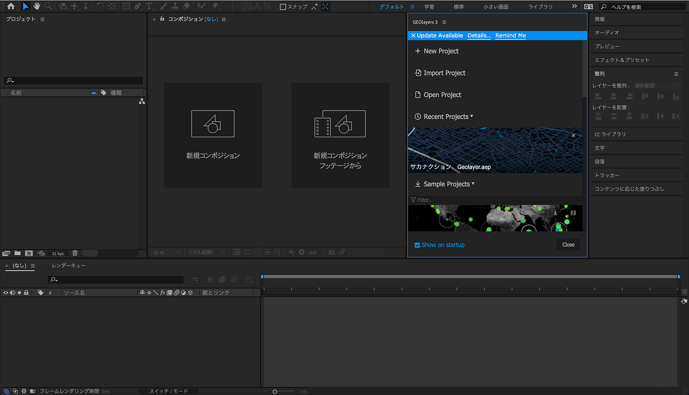
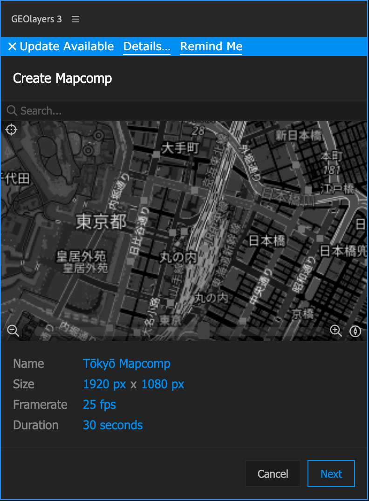
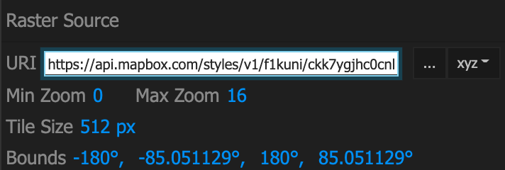
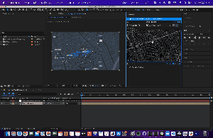
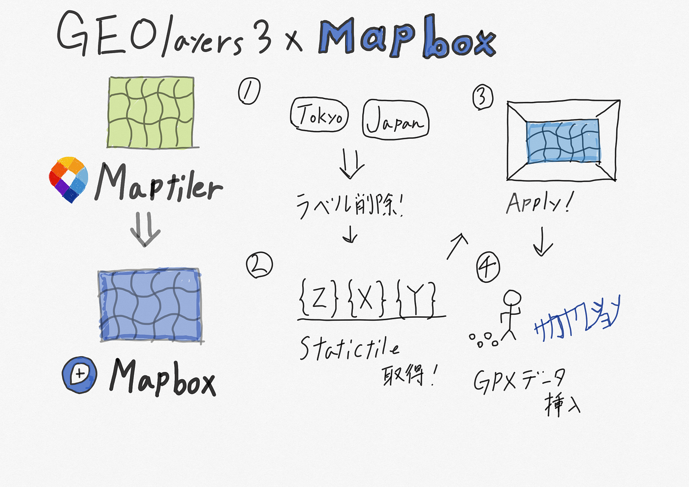

### Geolayers3にMapboxの地図を導入

こんにちは、日向野邦春です。

現在、ゼミ論でサカナクションの名曲「新宝島」をGPSDrawingで描き、AfterEffectsのプラグイン「Geolayers3」で映像化するという研究を行っています。

通常だとGeolayers3にはMaptilerの地図が使われています。これだけでも十分に見栄えのある動画は作れますが、どうせならMapboxの地図も使いたくないですか？ということで、今回は、ゼミ論で仕様しているAfterEffectsのプラグイン「[Geolayers3](https://aescripts.com/geolayers/)」にMapboxの地図を導入する方法をご紹介します。

**まずはMapbox Studioを開きます。**

今回は、Navigationをベースに作りました。

ここから、文字を際立たせるためにロケーションのタグなどを取り除いていきます。

道路や地名のタグを全て外したのでNavigation要素は無くなってしまいました。

次にShareを押します。下にDeveloper resourcesの欄があるのでThird Partyを選びます。ここでWMTSやArc GIS Online用のリンクが発行出来るのでCARTOを選びリンクをコピーします。

これでMapbox Studioで編集した地図のタイルURLが取得できました。

**次にGeoLayers3にMapboxタイルを読み込ませていきます。**

AfterEffectsを起動させてGeolayers3をプラグインするとこのような画面になります。

右側のNew projectを押すと動画作成で使う地図を作ることができます。ここでは動画の秒数や画角、フレームレートを決めることができます。またSearchで地名を入力するとその場所までジャンプアップしてくれます。

Nextを押すとタイルのURLを入力する欄があるのでここに先ほどMapbox Studioで取得したタイルURLを入力します。最後にApplyを押してcreateボタンを押せば

右側の地図で範囲を指定してFinalizeを押せば左側にMapbox Studioで読み込んだGPXデータも表示されるようになりました。GPXデータですがMapbox Studioでは取り込まずにGeoLayers3で読み込んだ方が編集がしやすいです。

これだけの作業でMapbox Studioで色合いを自分で調整した地図をGeoLayers3で使うことができます。Geolayers3ではGPXデータを使ったトラッキング動画やモータースポーツのアクセルとブレーキのデータを利用した動画も作ることができます。

完成版はStorytellingとどちらがいいか悩んでいますがGeolayers3でも作れればと思っています。

[GitHub - furuhashilab/2021gsc_KuniharuHigano: 2021年度ゼミ論
2021年度 卒業論文/ゼミ論文 ２０２１年１月２５日 青山学院大学 地球社会共生学部 地球社会共生学科 日向野邦春/KUNIHARU HIGANO 学生番号 1A118128 指導教員 古橋 大地 教授 © Furuhashi…github.com](https://github.com/furuhashilab/2021gsc_KuniharuHigano)
