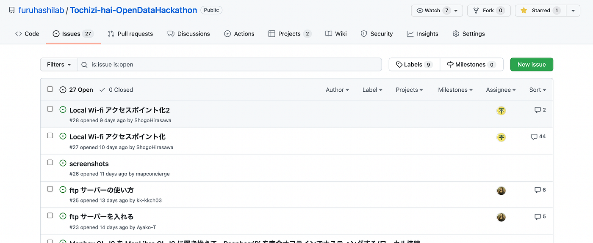
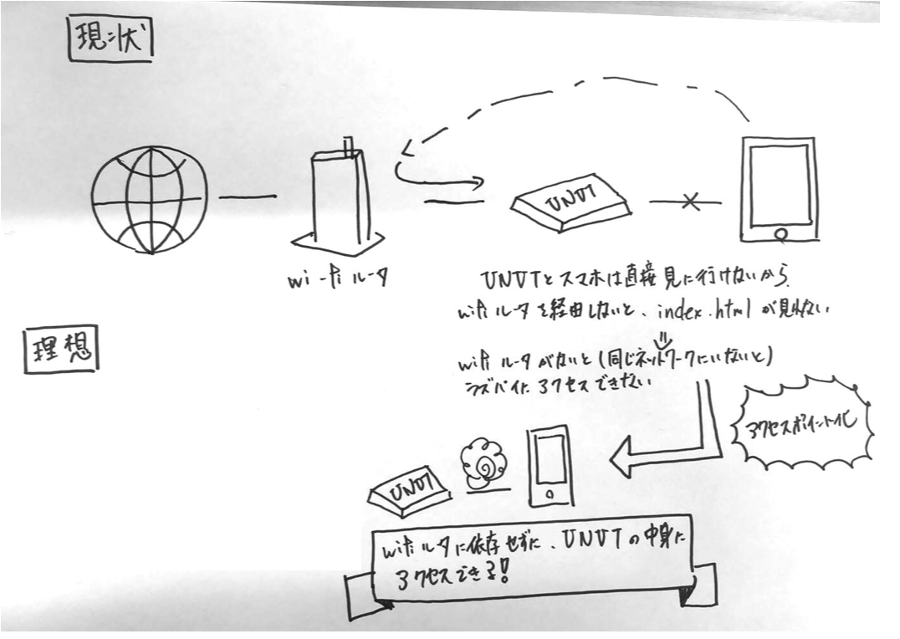
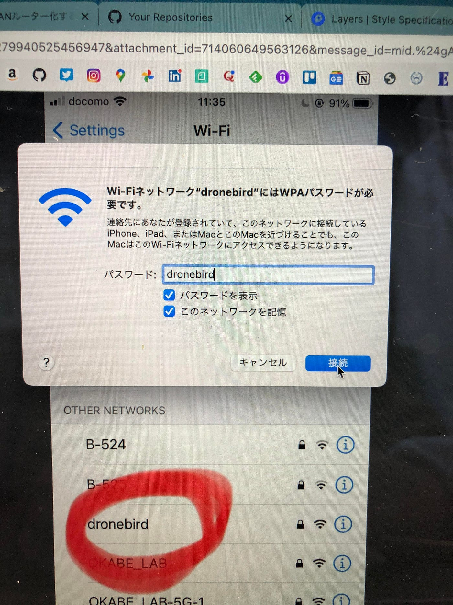

### メンターチーム UNVTハッカソン

今回、メンターチームとしては以下の2点に注力してハッカソンに取り組みました。

1. 他チームの支援

1. UNVT Portable （Raspberry Pi）のアクセスポイント化

各項目で、良かった部分、至らなかった部分がありました。反省を踏まえて、次このチームとしてどうしていくべきかを項目ごとに書いていきたいと思います。

### **## 他チームの支援**

私達メンターチームは “メンター”と付いているように、他のチームのお助け係としてハッカソンに参加していました。

#### - 良かった点

他チームに対して、GitHubの活用を促せた部分は良かった点だと思っています。UNVTについてほぼ0スタートの人が多い中で、分からない部分をIssueにしてパーマリンクを送ってもらう。これを徹底できたのはメンターチームとして、誇れる点ではないかと思います。

誰かがわからない部分は、他の人も分からない。
Issueにまとめておけば、２人目のわからない人が出てきたときに、Isuueのリンクを渡すだけで解決できる（こともある）。

古橋先生があれだけ、Isuueを立てろ！！と口酸っぱくいっていた理由が教えるという立場になってよくわかりました。

#### - 反省点

ツールの使い方の知識はあるが、技術そのもののバックグラウンドを理解していなかった点は反省ポイントでした。

Charites, tippicanue など今回のハッカソンでは様々なツールを使用する必要がありました。その使用方法は説明できるが、なぜそのツールを使わなくてはいけないのか、なぜこういったツールがUNVTのツールキットの中に含まれているのか。などなど、HowがわかっていてもWhyの部分がまったく詰めれていませんでした。

#### - 今後に活かす

技術的背景がわからず、小手先だけで進めていると必ずどこかで壁にぶつかる。一見遠回りかもしれないけど、根っこの部分を理解するのは本当に大切であるということをこのハッカソンから学びました。

根っこの部分まで説明できれば、人に説得力ある説明ができるし、なにより、自分自身が納得感もってその技術を使うことができる。

古橋研にいると、しばしば専門用語が飛び交い、頭が混乱します。

こういうときにこそ、その技術の背景はどのようなものなのか、どういう経緯があって、その技術が生まれたのか等を意識する必要があるかもしれません。

この意識を常に持っておけば、わからなかった技術や用語がいつか、点と点になってつながり、空間情報や地図への理解が深まるのではないかと感じました。

### ## UNVT Portable （Raspberry Pi）のアクセスポイント化

インターネット経由の通信ではなく、UNVT Portableとスマホを直接Wi-Fiでつなぐため、UNVT Portableをアクセスポイント化する取り組みをしました。

結果は、スマホのWi-Fi一覧の表示まではされるが、パスワード入力で弾かれてしまい、アクセスできず…。という結果に終わりました。

今回のハッカソンでは完成までは至らなかったですが、必ずアクセスポイント化までさせます！

#### - 良かった点

わからないことを認めて、素直に人に聞くことができた部分はよかった点だと思います。

概念の理解不足や慣れないコマンド操作など、できない所を挙げれば切りがありませんでした。そんな中で、古橋先生をはじめ多くの方々が学生のメンターとして参加してくださいました。

この分野のエキスパートばかりで、こんな初歩的なこと聞いていいのかなと不安にもなりましたが、悩んでいる時間がもったいないと思いバシバシ質問をしました。

みなさん本当にお優しい人ばかりで、学生の稚拙な質問でも丁寧に答えていただき、わからないことが次々解明されて僕自身すごく勉強させていただきました。

#### - 反省点

質問の仕方が下手くそ。これに尽きました。メンターの方にせっかく時間を取ってもらっているのに、質問が具体的ではない。しっかり言語化できていない。結果、何も解決せず時間だけが過ぎていく…。

わからないことがあることは悪いことではないが、しっかりと準備してから、質問をする。答えに行き着きたい焦る気持ちを抑えて、現状の課題は何なのか、どこまでできてどこまでができないのか、最終的にどういったことをしたいのか。この部分を整理して質問をすべきでした。

#### - 今後に活かす

結城浩さんの[技術系メーリングリストで質問するときのパターン・ランゲージ](https://www.hyuki.com/writing/techask.html) がすごく参考になったので、これを意識していきたいと思います。

これは、技術系の質問をするときにどういう点を注意して、聞けばよいのかということが書かれた仕様書、ノウハウ的なものです。

こちらの記事にわかりやすくまとめていたので、気になる人はまず、ここから読むことをおすすめします。

[質問は恥ではないし役に立つ - Qiita
一年半SEとして働いてきた中で、私自身が苦手だと思っており、他人からもそのように評価されていたのが「質問の仕方」でした。…qiita.com](https://qiita.com/seki_uk/items/4001423b3cd3db0dada7)

自身が行った手順、予想していた結果とどう違ったのか、どういう記事をググってやってみたのか等々、人に聞くときにどのような点を気をつけたら良いのか懇切丁寧に説明してくださっています。

質問することは悪いことではない。質問の仕方が雑なのは悪いこと。

今後は “質問の仕方” に気を配り学生生活を送っていこうと思います。

### ## 最後に

このハッカソンは日頃の何倍も学ぶものが多く、ワクワクした反面、思うような結果が出なかったり、自分の未熟さに悔しい思いもしました。

こういった機会を設けてくれた古橋先生を始めとする講師陣に感謝しつつ、次こそは自分の思い描くゴールにたどり着けるように、これから古橋研で精進していこうと思います！

### **## グラレコ**
