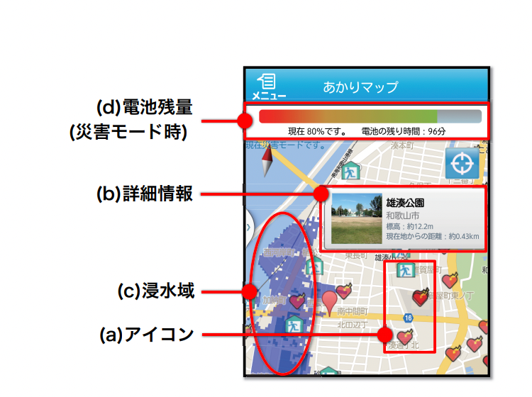
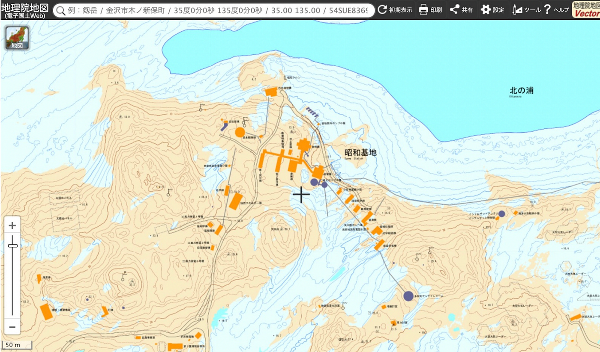

### 2021/12/4 アドベントカレンダー

古橋研究室 4年 平澤彰悟です

私は[The United Nations Vector Tile Toolkit ](https://www.mlit.go.jp/hakusyo/mlit/r02/hakusho/r03/html/n2a13c01.html)(**UNVT**)で採用されているオープンソースのツールキットを用いて、オフライン環境下で使えるWebマップ制作を卒論のテーマとしています。

> ↓以下のリポジトリに卒論の進捗や成果物をまとめています。

[GitHub - furuhashilab/2021gsc_ShogoHirasawa: 古橋研究室 4年 平澤彰悟の卒論リポジトリ
You can't perform that action at this time. You signed in with another tab or window. You signed out in another tab or…github.com](https://github.com/furuhashilab/2021gsc_ShogoHirasawa)

今回のアドベントカレンダーでは大きく3つのテーマに分けて書いていこうと思います。

1. 平澤が行ってきたオフライン地図に関する先行研究のリサーチについて

1. UNVTはどのような場所・ときに活用されてきたかについて

1. 現状の課題と今後の予定

### ## オフライン地図に関する先行研究のリサーチについて

雑多ではありますが、先行研究については以下のnotionにまとめています。

[先行研究 (論文漁り)
「あかりマップ：日常利用可能なオフライン対応型災害時避難支援システム」tangy-hygienic-d01.notion.site](https://tangy-hygienic-d01.notion.site/730dfb2e4dd74fccaf30b44f6b571d65)

今回は先行研究から見えたもの、そして自分の卒論にこれをどう活かしていくかという点で書いていきます。

オフライン地図に関する先行研究リサーチしていてまず思ったことは、先行研究が少ない…。ということでした。

> まだ海外の論文まで手が出せていないので、あくまで国内の研究のみを調べただけという状況です。（海外論文のリサーチはこれからがんばります…泣）

オフライン地図に関して最も盛んに研究が行われていたのが、濵村 朱里らによる **[日常利用可能なオフライン対応型災害時避難支援システム”あかりマップ”](https://ipsj.ixsq.nii.ac.jp/ej/?action=repository_action_common_download&item_id=105166&item_no=1&attribute_id=1&file_no=1) **でした。

“あかりまっぷ” というのは端的に言うと、災害時に使えるオフラインマップアプリです。

これは、オンライン時に地図データやユーザーの位置情報、近くの避難場所等をキャッシュとしてためておいて、災害時のオフライン環境でも使えるようにするものでした。

このアプリはAndroidのネイティブアプリのみでの配信となっており、ここに自身の研究の付け入る隙間があるのではないかと考えています。

UNVTで地図をホスティングさせ、ユーザーがこれを見るときにデバイスに依存はされません。いざというときに、iPhoneユーザーはオフラインで地図が見れない。なんてことがUNVTでは起きない。ここが大きな違いだと思っています。

デバイスやOSに左右されず、ブラウザアプリさへあれば、オフラインで地図が見れる。先行研究を調べた結果、ここが自身の研究が他の研究と差別化できる部分であると現在は考えています。

### ## UNVTはどのような場所・ときに活用されてきたか

UNVTは国連の活動、また他の活動でどのように用いられてきたかリサーチした結果をこの章では書いていきたいと思います。

> 国連でのユースケース

**[国土交通白書 2021**](https://www.mlit.go.jp/hakusyo/mlit/r02/hakusho/r03/html/n2a13c01.html)では以下の通りに述べられていました。

UNVTは、国連平和維持活動や人道支援を後方支援する国連グローバルサービスセンターへの配備が進められているほか、国土地理院の「地理院地図Vector」にも採用されています。

いままで、古橋先生や藤村さんから口頭で国連平和維持活動（PKO)でUNVTの配備が進んでいると伺っていましたが、公的な文章でこのように記述されているものを見つけられたのは、大きいと考えています。

> 上記以外でのユースケース

UNVTのユースケースについては[このサイト](https://unvt.github.io/#:~:text=%E2%84%B9%EF%B8%8F-,Projects,-We%20have%20various)の “Projects”の部分にまとめられていました。

また、2021/12/8 に行われた 第13回地理院地図パートナーネットワーク会議 の藤村さんの発表ではUNVTが南極で使われていることも述べられていました。

### ## 現状の課題と今後の予定

現在の課題は、UNVTの技術をどのように活用させるかという点です。

オフライン地図の先行研究、国連等の活用事例など見ていく中で、まだやられていない部分は何なのか。これを見極めることが現在ぶつかっている課題です。

“オフライン地図が必要とされる場所”を因数分解してみると、僻地・災害などのキーワードを上げることができます。

これに加え、最近思うのは **“僻地でも災害でもない場所で強制的にオフラインにしなくてはならない場所があるのでは？” **という点です。

たとえば、飛行機の中など、オフライン環境にならざるを得ない場所は身近に意外とあるのかもしれません。

まだ具体的にどういったユースケースを作れるかは思いついていませんが、アンテナをびんびんに立て、なんとか卒論を終わらせたいと思います…笑。

>>このブログ記事は、 [Furuhashi Lab. Advent Calendar 2021](https://qiita.com/advent-calendar/2021/furuhashilab) として投稿しました。
