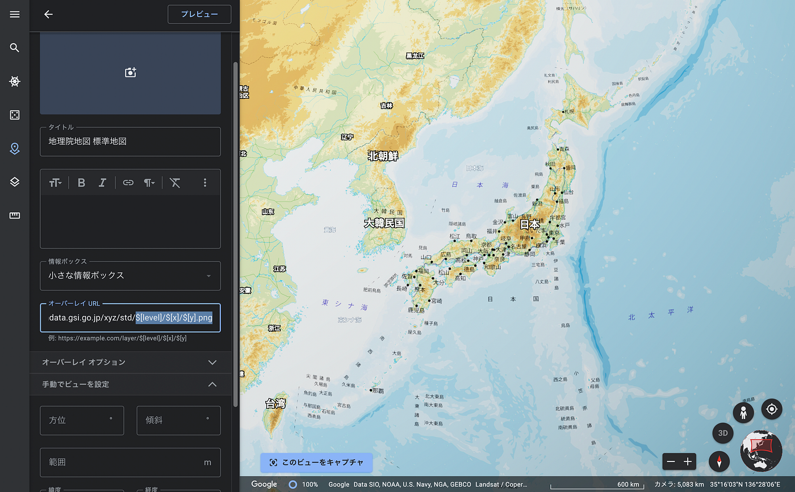
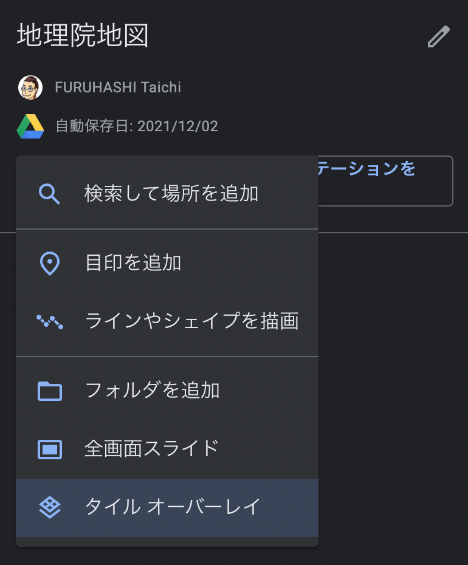
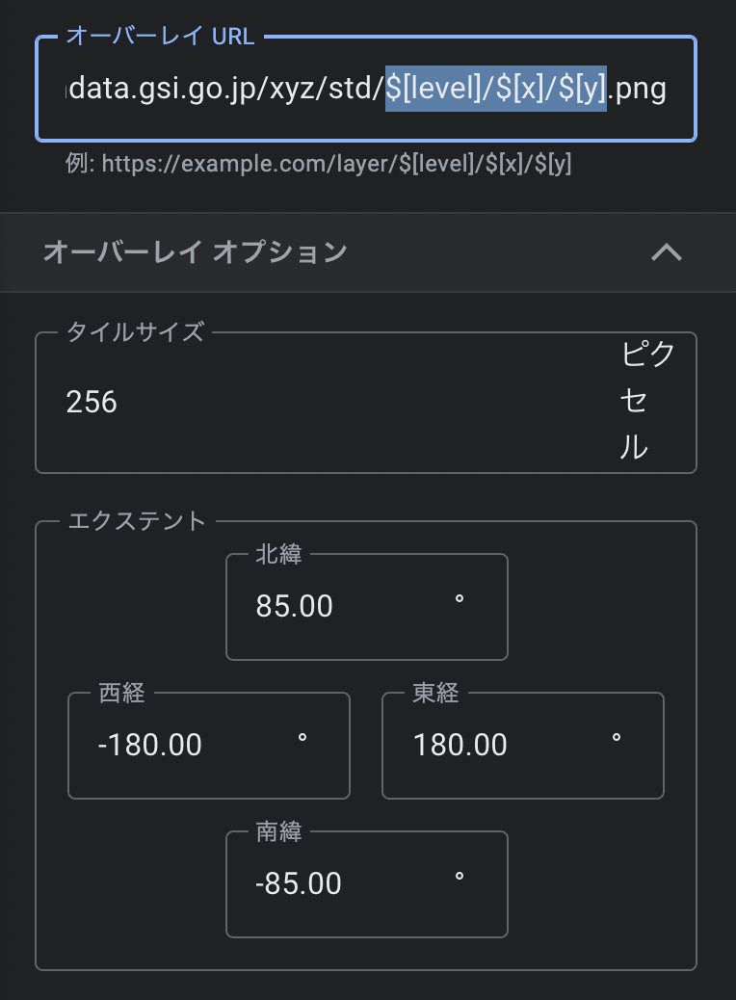
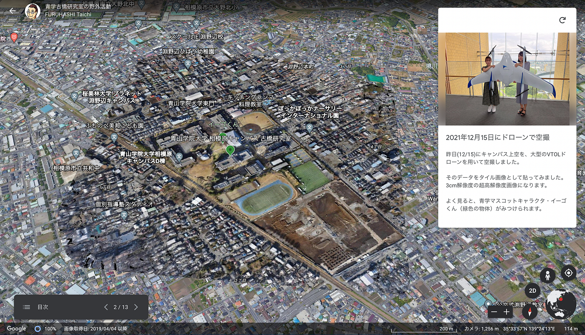

### Google Earthがタイル技術を逆輸入！

[Google Maps](https://ja.wikipedia.org/wiki/Google_%E3%83%9E%E3%83%83%E3%83%97) のプロトタイプを作成し、その後 Google に買収された [Where 2 Technologies](https://en.wikipedia.org/wiki/Where2) の [Rasmussen兄)弟](https://en.wikipedia.org/wiki/Jens_Eilstrup_Rasmussen)を中心に、2005年2月にこの世に登場したのがウェブブラウザで快適に表示範囲・縮尺を変更できる [Google Maps](https://ja.wikipedia.org/wiki/Google_%E3%83%9E%E3%83%83%E3%83%97) でした。当時は [AJAX](https://ja.wikipedia.org/wiki/Ajax) の代表格としても扱われ、同時期にGoogleに買収された [Keyhole](https://en.wikipedia.org/wiki/Keyhole,_Inc) チームと合流してその後の Google Maps/[Earth](https://ja.wikipedia.org/wiki/Google_Earth) の発展に寄与したことは知られていますが、その過程の中で生み出されたのが ウェブメルカトル([EPSG:3857](https://epsg.io/3857), [EPSG:900913](https://epsg.io/900913))と呼ばれるGoogleオリジナルの投影法(単位はm)と、全球画像をピラミッド構造化したXYZタイルと呼ばれるタイルシステムです。高速にデータ配信と地図閲覧が行える Google Maps XYZタイルシステムの普及後、ウェブ地図業界ではデファクトスタンダードとなり、OpenStreetMap や Bing Maps、Mapbox、Apple Maps そして地理院地図など主要なウェブ地図サービスではほぼほぼ Google XYZ タイルが採用されている状況です。その後、XYZタイルは画像(ラスタ)だけではなく、ベクタデータも扱えるように Mapbox が [MVT(Mapbox Vector Tile)](https://docs.mapbox.com/vector-tiles/specification/)として拡張し、地理情報系オープンソース(FOSS4G)の世界ではベクトルタイル技術が日々進化を続けている、そんな2021年の状況でした。

### **# Google Earth はXYZタイルではなかった**

一方で、Keyhole Earth Viewer を源とする Google Earth は [EPSG:4326 の緯度経度座標系](https://epsg.io/4326)を前提に構成されたデータであり、タイル技術は使われていたものの、厳密には Google Maps のタイルとの互換性がないため、 EPSG:4326 座標系 に合わせたレンダリングを行って Google Earth 用タイルサーバーを別に運用しているのです。

とはいえ、Google Maps/Earth が世に出て15年が過ぎ、世の中の殆どのウェブ地図コンテンツが Google Maps の XYZタイルを採用している中で、同じ Google のジオ・プロダクトである Google Earth は XYZタイルの読み込みができない状況が続いていました。

### # そして2021年、Google Earth にタイルオーバーレイ機能実装！

とは言いつつも、Google Earthも地道に進化は続いており、スタンドアロンツールとしてインストールが必要な [Google Earth Pro](https://www.google.co.jp/intl/ja/earth/versions/#earth-pro) で GeoJSON ファイルのインポートが一部可能（2021年現在ラインフィーチャのみ）となるなど、近年のFOSS4Gツールとの相互連携が意識され始めているなかで、[Google Earth（ウェブ用）](https://www.google.co.jp/intl/ja/earth/)の プロジェクト機能についにXYZ画像タイルの読み込みが標準機能として搭載されました！

使い方は簡単で、[Google Earth（ウェブ用）](https://www.google.co.jp/intl/ja/earth/)を用いてストーリーテリングを行うプロジェクト(Projects)機能から「**新しいプロジェクト**」を作成し、「**アイテムを追加**」ボタンから「**タイルオーバーレイ**」を選ぶと、細かなXYZ画像タイルURL等の設定が行なえます。

オーバーレイURLにはXYZタイルのURLを書きますが、例えば[地理院地図の標準地図タイルURL](https://maps.gsi.go.jp/development/ichiran.html#std2) である**[https://cyberjapandata.gsi.go.jp/xyz/std/{z}/{x}/{y}.png**](https://cyberjapandata.gsi.go.jp/xyz/std/{z}/{x}/{y}.png) をそのまま貼り付けても読み込まれません。

Google Earth では **[https://cyberjapandata.gsi.go.jp/xyz/std/$[level]/$[x]/$[y].png**](https://cyberjapandata.gsi.go.jp/xyz/std/{z}/{x}/{y}.png) のように、Zoomレベル、タイルX座標、タイルY座標の変数表記をそれぞれ **$[level]**、**$[x]**、**$[y]** と記す必要があります。

これで、地理院地図や OpenAerialMap などの外部XYZタイルデータを読み込むことができました。

以下は、青山学院大学の相模原キャンパス上空をドローン空撮して作成したオルソモザイク画像タイルです。[配信は OpenAerialMap プラットフォームを利用しています](https://map.openaerialmap.org/#/139.403176,35.56710014479181,16/latest/61b9dc7ab26de1000596d625?_k=3cz7ng)。

[OpenAerialMap
Browse the open collection of aerial imagery.map.openaerialmap.org](https://map.openaerialmap.org/#/139.403176,35.56710014479181,16/latest/61b9dc7ab26de1000596d625?_k=3cz7ng)

### # Googleへの要望（提出済）

まだ機能が実装されたばかりで、いろいろやりたいことを考えると、機能拡張の余地が十分あるとは思いますが、素直にGoogleが作り出した XYZ画像タイルの仕様を、Google自身が自社プロダクトに逆輸入したこの状況は、地理空間情報の相互運用性(Interoperability)を考える上で非常に重要であり、Googleの英断を評価したいと思います。

一方でより具体的な機能拡張の要望などもいちユーザーとしてリクエストしましたが、備忘録も兼ねてメモしておきます。

- {z}/{x}/{y}.png 表記でも読み込めるようになってほしい

- ストーリーテリングのシーンごとに、データの表示/非表示を制御させてほしい

- MVTベクトルタイルへの対応もしてほしい

流石に他社プロトコルであるMVTの採用は難しいと思いますが、仕様が Open なものであれば、企業の枠を超えてぜひ相互にデータを組み合わせることができるようにしてほしいのがユーザー側から言えるメッセージです。

### # Google Earth Pro でXYZタイルデータを読み込む方法

最後に、Google Earth Pro でもXYZ画像タイルを読めないのか？という方々に、ちょっとしたTIPSを紹介します。

昔から Google App Engine を用いた XYZ画像タイル → KML SuperOverlay 配信をする [Google Earth Map Overlays](https://ge-map-overlays.appspot.com/) というサービスがあります。このKMLファイルを読み込むと、簡単に OpenStreetMap などのウェブ地図タイル画像を Google Earth Pro に読み込むことができる便利なKMLとなっています。

[Google Earth Map Overlays
Here is a Google Earth KML network link that displays a big variety of tile based online maps (road maps, terrain and…ge-map-overlays.appspot.com](https://ge-map-overlays.appspot.com/)

Google Earth の背景地図を自分の好きなものに切り替えたい！そんな願いを叶えてくれる標準機能が Google Earth に搭載された 2021年、オープンソースの世界で一般化したGeoJSONファイルを読み込む機能が搭載された 2020年、Google が徐々に意識し始めてきたオープンソースな世界との連携が2022年に更に広がることを楽しみにしております。

_このブログは [ベクトルタイルアドベントカレンダー2021](https://qiita.com/advent-calendar/2021/vt)、[DRONEBIRDアドベントカレンダー2021](https://qiita.com/advent-calendar/2021/dronebird)、[古橋研究室アドベントカレンダー2021](https://qiita.com/advent-calendar/2021/furuhashilab) として執筆しました。_
