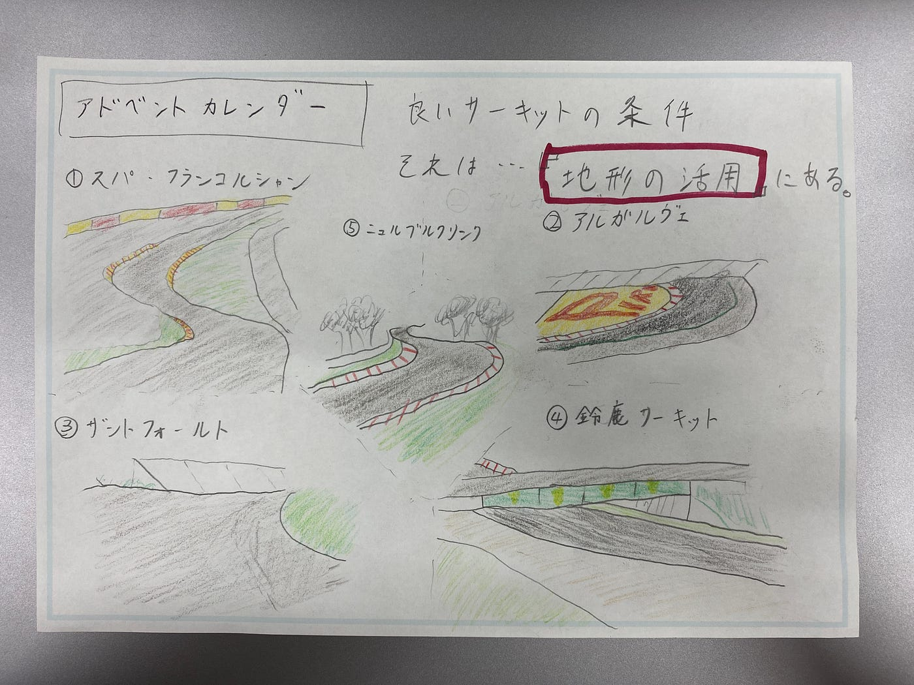

### アドベントカレンダー（2022年…）

こんにちは、古橋研究室4年の木多祐太です。

年末に少しバタついていため、完全にアドベントカレンダーの存在を忘れていました…申し訳ございません。

私はゼミ論のテーマは、東京都内にストリートサーキットを建設するとしたらどこにどのようなサーキットを作るかを検討するというものです。

今回、私が仮想のストリートサーキットを作成するにあたって最も重視したポイントが**「地形」**です。世界には数多くのサーキットがありますが、ドライバーやファンからの評価が高いサーキットは、自然の地形を利用した高低差があります。その理由としては、高低差やバンクがあるサーキットの方がより高速で走る事ができ、巨大なダウンフォースを発生させるレーシングカーの限界を見ることが出来るからだと考えます。

そこで今回は、自然の地形を利用した世界のサーキットを、オンボード映像と共に紹介していこうと思います。

1 スパ・フランコルシャン（ベルギー）

https://www.youtube.com/watch?v=4JiYOvCHwFY&list=WL&index=97

このスパ・フランコルシャンサーキットはモータースポーツファンなら誰もが知っている名サーキットです。このサーキットの一番の魅力は、オー・ルージュからラディオンの超高速上り坂セクションです。このセクションの最大勾配は約18％、高低差約80mを2秒ほどで駆け抜けることになるため縦方向に1G、横方向に5Gもの荷重がかかります。ドライ路面ならアクセル全開の一択ですが、ウェット路面だと非常に慎重なアクセル操作が求められ、少しでも限界を超えると容易にスピンしてしまいます。

2 アウトードロモ・インテルナシオナル・ド・アルガルヴェ（ポルトガル）

https://www.youtube.com/watch?v=mVCglH9kZos&list=WL&index=96

このサーキットの一番の特徴は、地形の起伏に沿ってアップダウンを繰り返すレイアウトで、実際に走行をしたドライバーからは、「まるでローラーコースターに乗っているようだ」といった感想がありました。先が見えない坂を登り終わるとすぐにコーナーがあるなど、リズミカルに走らないとなかなか良いタイムが出ないのもアルガルベの特徴です。

3 ザントフォールト（オランダ）

https://www.youtube.com/watch?v=xtTHFMo63k8&list=WL&index=98

このザントフォールトサーキットの特徴は、他に類を見ないバンク角度です。他のサーキットのバンク角度が10度前後なのに対して、このザントフォールトサーキットには18度以上のバンクが3箇所も設定されています。そのため、うまくバンク角を使ってコーナーを抜けていく必要があるのですが、少しでもオーバースピードでバンクに進入すると、リアが流れクラッシュに繋がってしまうという、非常に難易度の高いサーキットです。

４ 鈴鹿サーキット（日本）

https://www.youtube.com/watch?v=JUbHn7egKHs&list=WL&index=99

次に紹介するのは三重県にある鈴鹿サーキットです。日本国内では、この鈴鹿サーキットと静岡県にある富士スピードウェイの二つが、F1を開催することが出来るFIAグレード1ライセンスの認証を受けています。この鈴鹿サーキットの特徴は、立体交差によって前半は右回り、後半は左回りに変わる８の字型のサーキットであるという点です。このようなマシンの下をマシンが走るというレイアウトのサーキットは、世界でも非常に珍しいです。また、ヘアピンやシケインといった低速コーナーから、連続するS字やデグナーといった中速コーナー、130Rの高速コーナーまでバランスよく構成されており、4度のF1ワールドチャンピオンに輝いたセバスチャンベッテルは「まさに神が作ったコース」と褒めるなど、ドライバーからの評価が非常に高いサーキットの一つです。

５ ニュルブルクリンク（ドイツ）

https://www.youtube.com/watch?v=PQmSUHhP3ug&list=WL&index=100&t=124s

最後に紹介するこのニュルブルクリンクは、全てが規格外のサーキットです。一般的なサーキットは一周5キロ前後なのに対して、このニュルブルクリンク（北コース）は一周約21キロ、高低差約300メートル、コーナー数172となっており、このコースの愛称は**グリーン・ヘル**と呼ばれています。過去にはF1 も開催されていましたが、事故が多発しあまりにも危険なため、現在では開催されていません。

また、このニュルブルクリンクは自動車開発の聖地とされており、多くの自動車メーカーが開発段階の車を持ち込み、世界の過酷な環境に耐えうる車を開発しています。このニュルブルクリンクで速いタイムを出すことができれば、どのサーキットでも速い車であると考えられており、ニュルブルクリンクでのラップタイムが一つの指標とされています。余談ですが、私が購入したルノー・メガーヌRSはニュルブルクリンクにおいてFF車最速の称号を持っており、HONDA・シビックタイプRとしのぎを削っています。

グラレコ

