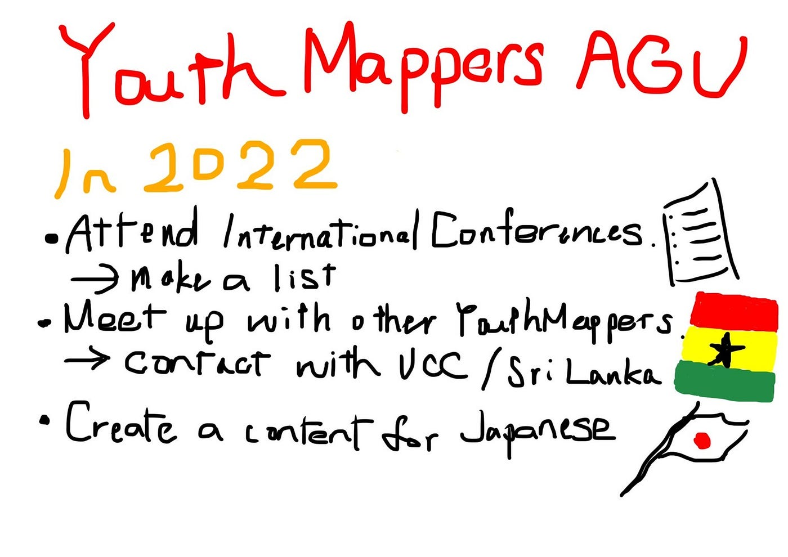

### YouthMappers AGU 2021 to 2022

3年の柴山です。今年もよろしくお願いします。

今回は新年初の週報ということで、昨年の振り返りと今年の方針について報告します！

> 2021年のハイライト

#### State of the Map 2021 へのポスター提出（June）

OSMの国際カンファレンスへ、YouthMappers AGUの2020年から2021年の活動をまとめたポスターを提出しました。トップ掲載は逃しましたが、ドイツの強豪校(?)チームのポスターに挟まれました！

#### 公式YouTubeチャンネル始動（June）

マッピングに関連した情報を広げていくことを目標にYouTube公式チャンネルを創設し、動画を作成・公開しました！しかし慣れない動画制作の時間を用意することが難しく、継続的な公開はできませんでした。。。

#### Wheelmap how to 動画制作・公開（Aug.）

東京オリンピック・パラリンピックの開催に合わせて、車いすユーザーのための市民によるマップアプリであるWheelmapの使い方を伝える動画を作成しました。オンラインでの分担作業も上手く行い、英語字幕も付いたわかりやすい動画を作ることができました。

#### Wheelmap Online Mapathon with Micron, LIVES でのレクチャー（Sept.）

Micron, LIVES 主催のWheelmapアプリを使った社会貢献イベントにレクチャーとして参加しました。共に作業しながら議論し、インクルーシブな社会のためにどんな地図サービスがあればいいのかを考えることができました。

#### HOT Summit 2021 登壇（Nov.）

HOTのオンライン国際会議にて、YouthMappers AGUの活動を発表しました。発表自体は録画を放送する形式で、その後に質疑応答で実際に英語で話しましたが、緊張や英会話不足から思うように受け答えができませんでした。。。

#### 伊豆大島合宿（Nov.）

伊豆大島での2泊3日の合宿を実施し、三原山や地層大切断面に訪れ、裏砂漠でのGPSドローイングや元町の360ストリートビュー撮影、モザイク画の素材撮影などを行いました。また、合宿後は古橋先生がドローン空撮してくださった元町の画像をベースにマッピングを行いました。

[HOT Tasking Manager
Tasking Manager is a the tool for coordination of volunteers and organization of groups to map on OpenStreetMap.tasks.hotosm.org](https://tasks.hotosm.org/projects/11856/)

#### UNVT Hackathon Meetup 2022（Dec.）

UNVTハッカソンでは、Produce, Style, Host の一連の作業のマニュアル化とPortable Wired Hosting (with Raspberry Pi) の実践、というお題が課され、わからないことや失敗だらけの中でしたが最終日まで粘ることができました。メンバーに円滑に情報共有しつつ作業分担できなかったことが反省点です。

> 2022年の方針

昨年は海外のコミュニティとの交流が少なく、HOT Summit でも外国語でのコミュニケーションスキルや経験の不足を実感させられました。

英会話だけでなく、情報共有や海外への社会貢献の目的も兼ねて、今年は国際カンファレンスへの登壇や海外のマッパーとの交流に力を入れていきたいです。

State of the Mapなどへの登壇、YouthMappers UCCやスリランカチームとのコラボを検討しています。

> グラレコ

