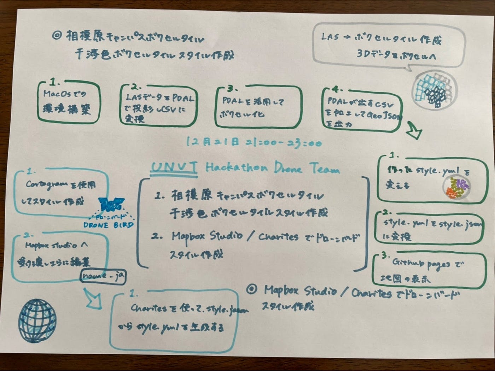

### ドローン部、今年の抱負

#### UNVT Hackathon Drone Teamの成果

先日行われたUNVTハッカソンではドローン部のメンバーが優勝をいただきました。

**相模原キャンパスボクセルタイル/干渉色ボクセルタイルスタイル作成Mapbox Studio/Charites でドローンバードスタイル作成**

これまでのハッカソンの中でも最も難易度が高く、さまざま困難ありましたが、Github上でのタスクの明確な割り振り、チーム内外で互いのヘルプ、メンバーの結束力などで乗り切り、2021年最後のハッカソンで有終の美を飾ることができました。景品としていただくラズパイでコマンドスキルも高めていきたいです！

#### 2022の抱負

2021年のドローン部は四年生四人で一年間回してきました。後輩がいなかったという点では少し寂しいところもありましたが、ドローン部合宿ではSTMを作成して操縦訓練を導入するなど、きたる後輩世代への良い遺産を残せたかなと思います。残りのゼミ活動内で、STMの効果的な活用方法などうまく後継できるようにドローン部の活動を整理していきたいと思います。

**来年度の後輩に向けて**

現３年生がいないため、基本的な操作手順は教える機会が少なくなると思います。

１月18日に行われる飛行訓練に参加してドローンの操作方法を引き継ぎたいと思います！

#### グラレコ

