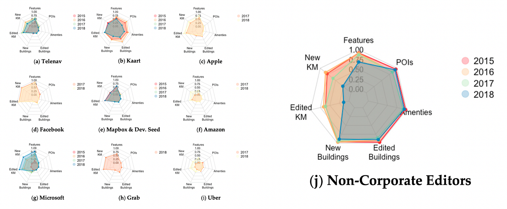
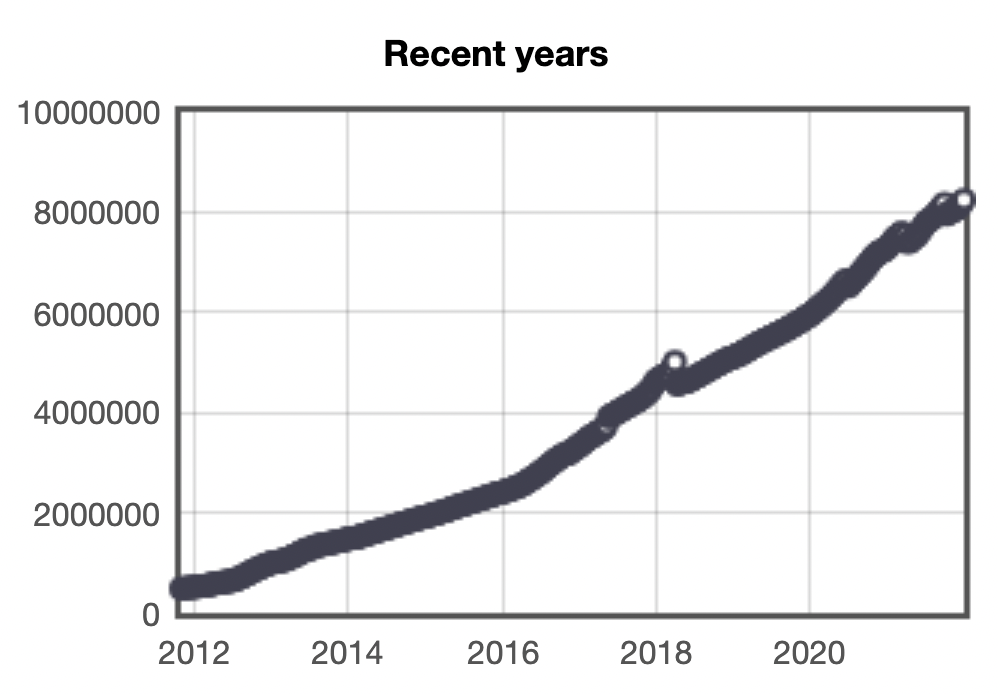
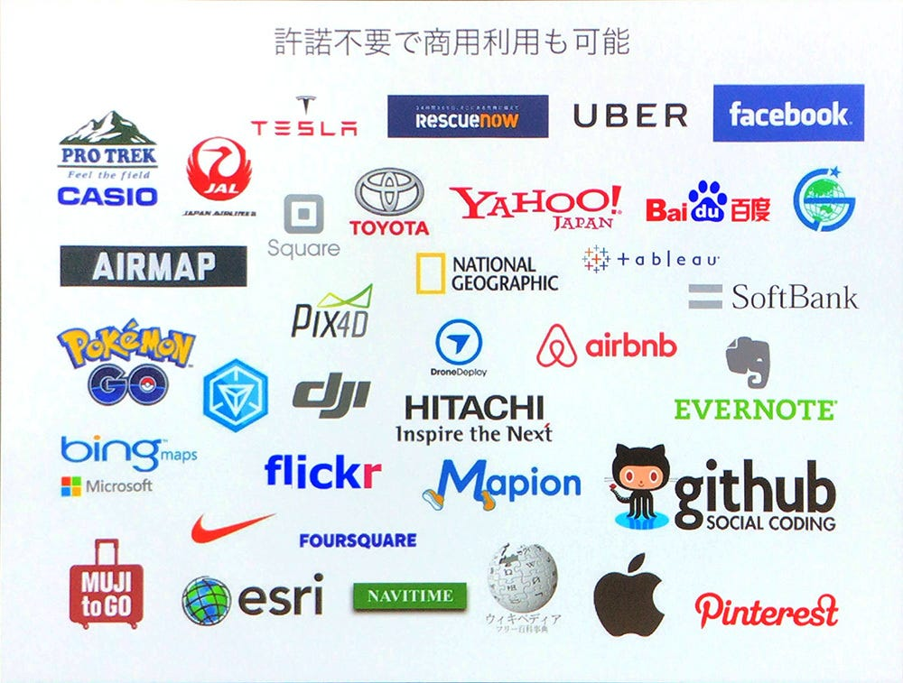
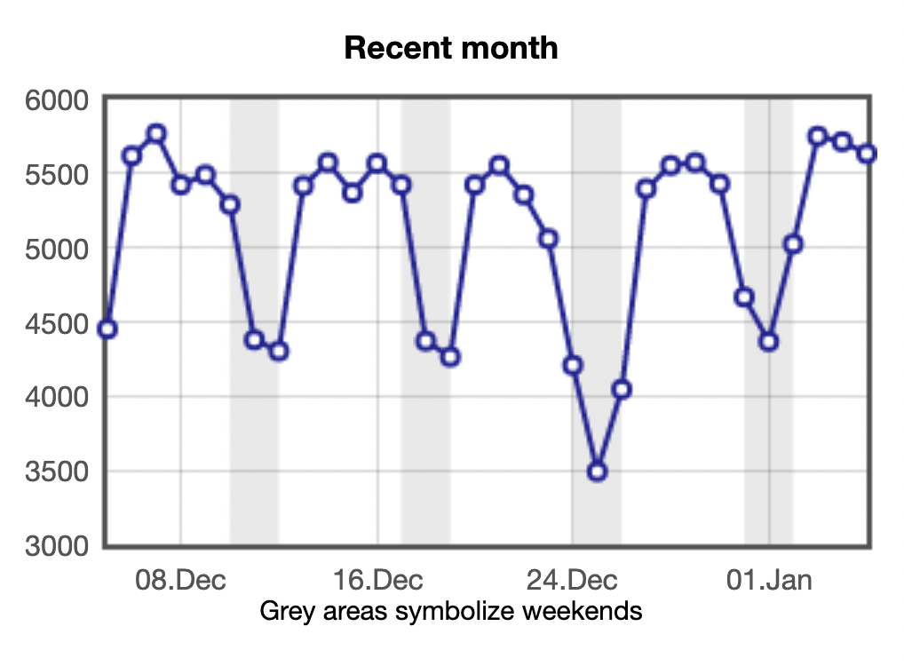
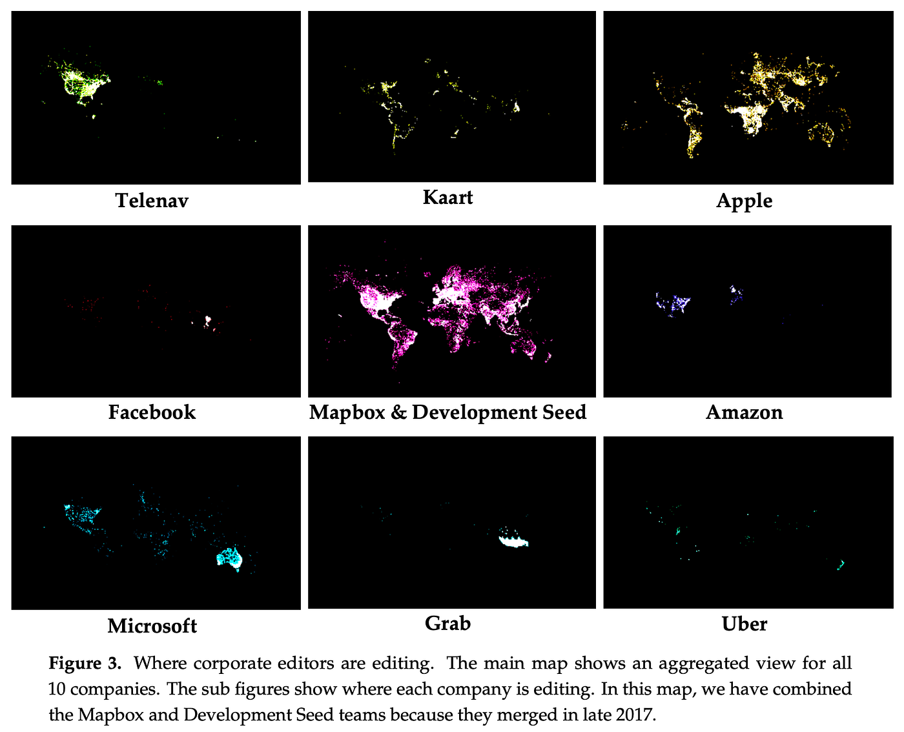
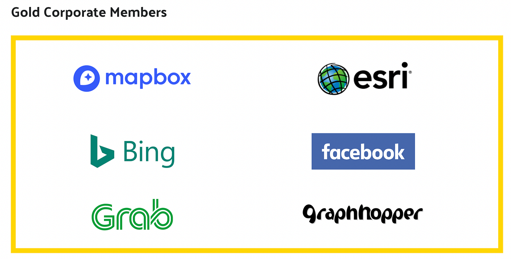
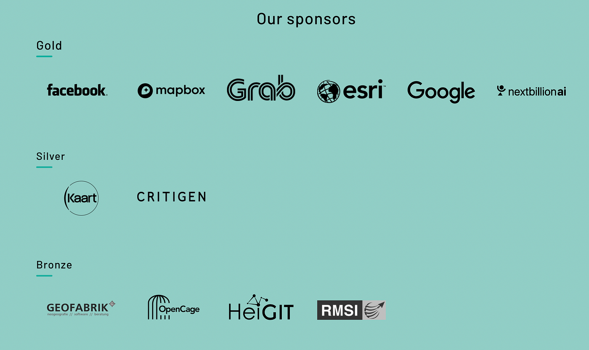
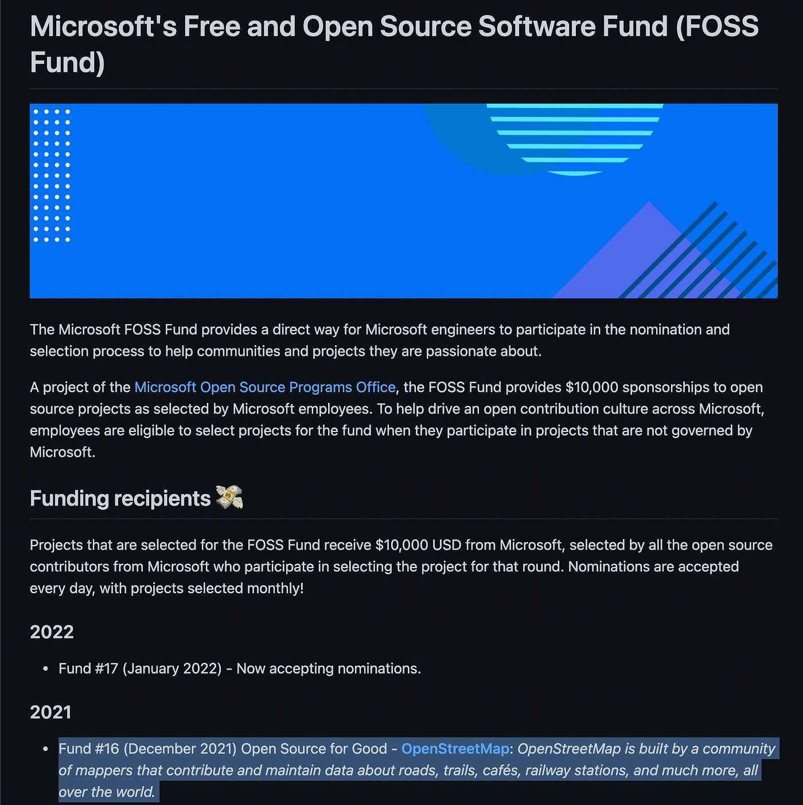
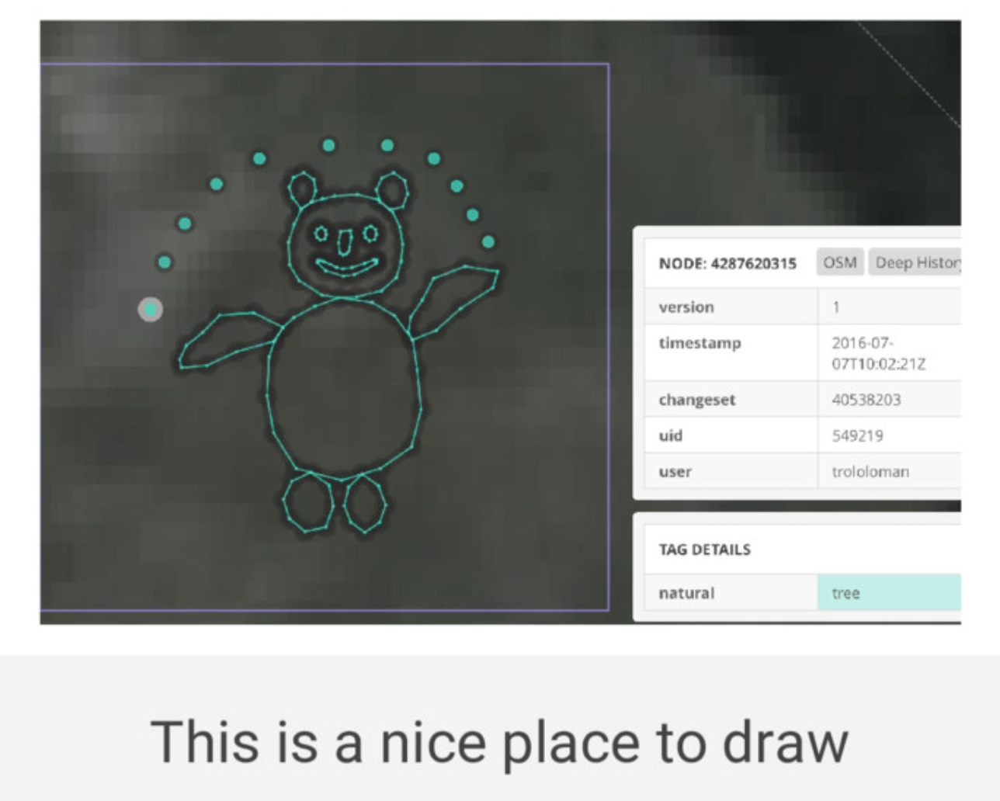
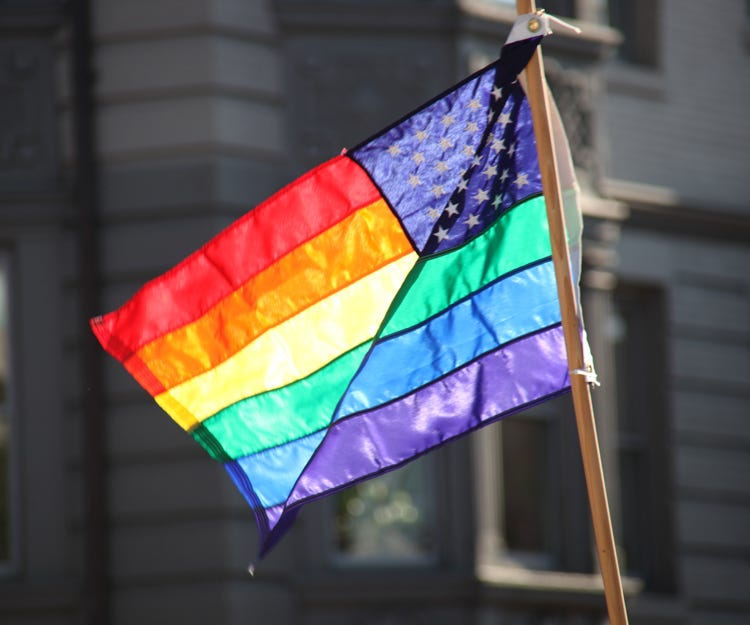

### Show the Niantic flag!

NianticはOSMコミュニティにその旗を見せるべきだ。

**【[この記事をきっかけに、Nianticの方々と前向きな議論が始まり、第一歩として State of the Map Japan 2022のPlatinumスポンサーに参画いただきました](https://x.com/mapconcierge/status/1582602426749968384)！その後、[Humanitarian OSM Team への寄付](https://scaniverse.com/news/missing-maps-challenge)や[OSMFのCorporate Memberへの加入](https://osmfoundation.org/wiki/Corporate_Members)など現在は多大なる支援をいただいています。Thanks, Niantic!!!】**

**[OpenStreetMap(OSM)**](https://ja.wikipedia.org/wiki/%E3%82%AA%E3%83%BC%E3%83%97%E3%83%B3%E3%82%B9%E3%83%88%E3%83%AA%E3%83%BC%E3%83%88%E3%83%9E%E3%83%83%E3%83%97)は、2004年から始まった、[Google Maps](https://ja.wikipedia.org/wiki/Google_%E3%83%9E%E3%83%83%E3%83%97) よりも歴史の長いクラウドソーシング型世界地図作成プロジェクトです。

[Wikipedia](https://ja.wikipedia.org/) のように誰でも編集権限を持つことができ、[延べ800万ユーザ以上が地図更新に参加](https://osmstats.neis-one.org/?item=members)した、世界最大の一般地図作成ボランティア(マッパー)コミュニティとなりました。[Google Local Guide](https://maps.google.com/localguides/) のような**[関心地点(POIs)**データ](https://ja.wikipedia.org/wiki/Point_of_interest)ではなく、マイマップのような**[主題図**](https://ja.wikipedia.org/wiki/%E4%B8%BB%E9%A1%8C%E5%9B%B3)としての地図でもなく、**[一般図(ベースマップ)**](https://ja.wikipedia.org/wiki/%E4%B8%80%E8%88%AC%E5%9B%B3_(%E5%9C%B0%E5%9B%B3))としての地図であることは、多くの人が気づいていませんが非常に重要なポイントなのです。

### # OSMは市民参加型のクラウドソーシングだから成功したのではない

よく OSM は成功した[ボランタリー地理情報 VGI(Volunteered Geographic Information) ](https://ja.wikipedia.org/wiki/%E3%83%9C%E3%83%A9%E3%83%B3%E3%82%BF%E3%83%AA%E3%83%BC%E5%9C%B0%E7%90%86%E6%83%85%E5%A0%B1)の一例と説明されますが、あくまでそれは一つの要素であって、世の中に定着した「**最大**」の理由はボランティア運営によるクラウドソーシング手法を採用したことではありません。作成した地図データそのものを商用利用可能なオープンデータライセンス(当初は [CC BY-SA](https://ja.wikipedia.org/wiki/%E7%B6%99%E6%89%BF_(%E3%82%AF%E3%83%AA%E3%82%A8%E3%82%A4%E3%83%86%E3%82%A3%E3%83%96%E3%83%BB%E3%82%B3%E3%83%A2%E3%83%B3%E3%82%BA)) を採用。2012年以降 [ODbL 1.0 ライセンス](https://ja.wikipedia.org/wiki/%E3%82%AA%E3%83%BC%E3%83%97%E3%83%B3%E3%83%87%E3%83%BC%E3%82%BF%E3%83%99%E3%83%BC%E3%82%B9%E3%83%A9%E3%82%A4%E3%82%BB%E3%83%B3%E3%82%B9)に変更)として公開したことが受け入れられたのだと思います。その結果、Google Maps のように商用利用時に制限のかかったウェブ地図よりも、より自由で、ある意味何でもできる OSM を採用する企業が増えたことで、OSM の認知度が向上するとともに、企業が OSM を用いたサービスで収益を生むことによる「**エコシステム**」がまわった。商用利用を許容することで民間企業による OSM のデータ更新と利用価値を更に高める**[正のフィードバック**](https://ja.wikipedia.org/wiki/%E3%83%9D%E3%82%B8%E3%83%86%E3%82%A3%E3%83%96%E3%83%95%E3%82%A3%E3%83%BC%E3%83%89%E3%83%90%E3%83%83%E3%82%AF)へとつながったのだと筆者は考えます。

つまり、現在の OSM は純粋なボランティアによる無償の地図更新がすべてではなく、１日あたり6,000人程度の地図編集者の内、少なくとも1/3である2,000人以上は、給料を得ながら OSM 地図編集に関わる**企業マッパー(Corporate Editors)**による貢献であることが [OSM Stats](https://osmstats.neis-one.org/?item=members) の統計値からも読み取れます。

### # OSMは地図データベースである

OSM を採用している企業と、そうでない企業には大きな違いがあります。前者は OSM をデータベースとして捉えています。そして後者は絵としての地図だと思っています。単なる絵地図としての利用であれば Google Maps API があれば十分でしょう。しかし OSM は Google Maps と異なり、地図データとしての形状(Geometry)から属性情報(Attribution)、編集履歴(Changeset)に至るまで、すべての情報にアクセス・再利用することが可能であり、そのデータベースとしての価値に気づいた企業は、Apple にしても、Microsoft にしても、Amazon にしても、Meta(旧Facebook)にしても、Mapbox にしても、Uber にしても、Niantic にしても、単なる絵としての地図ではない、地図データベースとしての OSM 活用法を模索し、文字通りそれぞれがうまい使い方をビジネスに活かしています。

[オープンデータベースライセンス - Wikipedia
Edit descriptionja.wikipedia.org](https://ja.wikipedia.org/wiki/%E3%82%AA%E3%83%BC%E3%83%97%E3%83%B3%E3%83%87%E3%83%BC%E3%82%BF%E3%83%99%E3%83%BC%E3%82%B9%E3%83%A9%E3%82%A4%E3%82%BB%E3%83%B3%E3%82%B9)

### # 企業マッパーとしての貢献

研究室の学生が Apple の直営店に買い物をしに行ったとき、Apple 店員との談笑した話題の中で、業務の空き時間に店舗で働いている Apple Shop 店員も OSM のマッピングに参加していることを教えてもらいました。つまり地図作成の専門家だけでなく、Apple 社員や店舗の店員が社会貢献できる CSR 活動の一環としても位置づけているのだと想像できます。

いずれにしても OSM への企業としての貢献は、企業マッパーによる直接的な地図データ更新や、OSM に関わる様々な金銭的スポンサリング、そして、OSM Foundation 及び SotM会議等の運営に人的リソースを提供するといった、いくつかの選択肢があり、それらを複合的に組み合わせながら、OSM コミュニティと協同することで成立している、ある意味バランスの取れたオープンデータコミュニティであると言えます。（ OSM データを使っていない Google も、金銭的なスポンサリング等で、コミュニティ支援していた実績もあります）

### # 現在のOSMデータ更新はIT大手企業が支えている

下の図を見てください。2017年までの期間で10社に所属する企業マッパー達がどのエリアの地図更新に関わったのかを分析した Jennings A.他(2019)による各企業の作業エリア地図です。

まず目に飛び込むのは、真ん中のピンク色で表現された Mapbox とその母体である NGO 団体 Development Seed です。2012年から[日本を含め](https://github.com/mapbox/mapping/issues/120)世界中くまなく OSM データを整備してきた実績がそのまま反映されており、ほぼ世界地図として識別できるほどに、地図作成エリアが多様な地域に広がっています。

次いで、作業エリアが広いのが右上に位置する Apple です。Apple の特徴は先進国ではなく、まだまだ地図が未整備な途上国・新興国を重点的にマッピングする戦略で、おそらく自社の Apple Maps では、先進国の地図データは商用地図ベンダーから購入し、途上国・新興国のように商用地図が入手できない地域を OSM データで補完する地図プラットフォームの性質から、このような戦略的分布になったのだろうと思われます。

他の会社は、Global 戦略ではなく Regional 戦略というべき作業エリアの棲み分けが行われています。北米ナビ大手の Telenav は文字通り北米のみ。Microsoft は北米とオーストラリア、Amazon は北米と欧州のみ、Uber はニュージーランドのマッピングに熱心に取り組み、Grab はインドネシアを中心とした東南アジアなど、それぞれの自社サービスに重要なエリアを選定した上で、そこに社員リソースを集中投下する賢いマッピング活動を行っています。

そして重要なことは、**これら10社の中に、OSMデータをGlobalでかつ大規模に利用しているはずの [Niantic](https://nianticlabs.com/) の名前がない**ということです。

必ずしも、直接的な地図更新支援でなくても、金銭的な支援を選択する企業は当然あります。しかし、[OSM Foundation の Corporate Members](https://wiki.osmfoundation.org/wiki/Corporate_Members) にも、[OSM国際会議 SotM のスポンサーリスト](https://2021.stateofthemap.org/)にも、Niantic の名前はありません。[2021年11月時点で評価額1兆円を超えている](https://jp.techcrunch.com/2021/11/23/2021-11-22-niantic-raises-300m-at-a-9b-valuation-to-build-the-real-world-metaverse/)にも関わらずです。

Gold Corprate Members だけではなく [Microsoft FOSS Fund 2021](https://github.com/microsoft/foss-fund) として OSM に $10,000 の追加支援を決めた Microsoft とは対象的ですね。

### # colors.js と faker.js の事件は起こるべくして起きた

2022年1月に、[オープンソースのライブラリ「colors.js」と「faker.js」の開発者であるマラック・スクワイアーズ氏が起こしたnpmパッケージの意図的破壊事件](https://gigazine.net/news/20220111-open-source-developer-corrupts-libraries/)が、オープンソースというコミュニティ文化を軽視し、大規模にフリーライドする大企業に対する報復的な出来事として多くの人々に注目されました。これは対岸の火事ではありません。

オープンソースやオープンデータに貢献している人々は、霞を食べて生活しているわけではありません。それぞれの哲学と収入のなかで自分たちの作るツールやデータが世の中をより良い方向にすすめる想いがオープンソースやオープンデータの文化を成熟させているのです。

まだまだビジネスモデルとしての収益化がうまくいかず、試行錯誤している企業からその利用料を強制的に徴収することはイノベーションの阻害になる可能性があります。誰でも自由に使える「オープン」思想はこういったイノベーションの芽を育て大きくする上でとても重要です。

資本主義の権化として使えるものをただ利用し、組織が大きくなっても、その収益は一切還元しないという姿勢はときに反発を生むことを企業は理解すべきです。

まずはOSMを使って自由にチャレンジしてもらい、うまくお金が回るようになったら出世払いとしてコミュニティに還元する。それが オープンソース・オープンデータコミュニティに対する企業としての責任ではないでしょうか。

### # そろそろ Niantic は、その旗をOSMコミュニティに掲げる時では？

Show the Flag! という言葉があります。1990年代に起きた湾岸戦争でも使われたフレーズですが、旗という言葉にはいろいろな意味があります。もちろん自分たちの**存在を明示する**ことは当然ですが、**先頭を歩く**という意味もあります。**新しいことにチャレンジする**という意味にも旗は使われます。

いずれにしても、2016年に Google Maps から OSM に移行した Ingress, PokémonGO, Pikmin Bloom は、我々OSMマッパーにとっても、普段から自分たちが作ってきたOSMデータの簡易ビューワとして位置情報ゲームを楽しむ以上に日々活用しています。

一方で、さまざまな**[悪意のある地図編集行為**](https://wiki.openstreetmap.org/wiki/JA:%E7%A0%B4%E5%A3%8A%E8%A1%8C%E7%82%BA)に対して我々[OSMコミュニティは闘ってきた](https://wiki.openstreetmap.org/wiki/Detect_Vandalism)ことも事実です。これらの闘いにも Niantic は2022年1月現在まで、旗を掲げて共闘していません。むしろPokémonGO ユーザーによる悪意ある地図編集のValidation作業を、OSM コミュニティや Mapbox を含めた他の企業がその肩代わりをしてきたと言えるでしょう。

5年以上 OSMコミュニティに対して静観し、フリーライドしてきた Niantic はそろそろその姿勢を明確にすべき時期だと思います。

Exploring the Effects of Pokémon Go Vandalism on OpenStreetMap, SotM 2019

The tangled story of Pokemon Go and OSM — Dennis Raylin Chen

Validating the map, SotM 2017

Watching for vandalism, SotM 2016

### # Google Maps Platform Gaming Services 終了に伴いOSMへ移行するすべての企業へ

Show the Flag! は Niantic だけに限られたことではありません。

2022年12月31日には [ドラゴンクエストウォーク](https://www.dragonquest.jp/walk/) や [Jurrasic World Alive!](https://ja.wikipedia.org/wiki/Jurassic_World_%E3%82%A2%E3%83%A9%E3%82%A4%E3%83%96!) などの人気位置情報ゲームが採用している [Google Maps Platform Gaming Services](https://developers.google.com/maps/documentation/gaming/transition-guide?hl=ja) がサービス終了になります。この１年で位置情報ゲームが用いる地図データの再編が行われることでしょう。

[ゲームサービス移行ガイド | Gaming Maps Platform のゲームサービス | Google Developers
2018 年にゲームサービスが導入されて以来、Google はゲーム開発に携わる皆様とともに革新的なゲーム体験をリリースしてまいりました。Google は引き続きデベロッパー…developers.google.com](https://developers.google.com/maps/documentation/gaming/transition-guide?hl=ja)

OSM以外にも選択肢はありますので、各社様々な検討がされていると思いますが、位置情報ゲームとしての地図利用は地図データベースが大前提になります。見かけだけの絵地図では、ゲーム要素を盛り上げるには不十分です。地図を構成している道路や建物、公園や河川、鉄道、店舗情報など、多様でセマンティックな地物データに自由にアクセスできてこそ、位置情報ゲームは盛り上がるのです。OSMは地図データベースとして自由に使えるオープンデータです。ぜひ多くの企業に使っていただきたいですし、その結果ビジネスモデルがうまく廻り始めたときには、その旗をかかげていただきたい。

### # 企業ができる７つのOSMコミュニティ貢献法

最後に、どんな旗の掲げ方があるのか、そのポイントをまとめました。

1. **地域の OSM会議 State of the Map にスポンサリングする**
_SotM Asia や SotM Japan といった地域性のあるイベントに旗を掲げることで、それぞれの地域で活躍するマッパーとの交流が生まれます。もちろん SotM Global へのスポンサリングも大歓迎です。_

1. **若者をはじめ多様な地図貢献者が活動するための旅費を支援する
_**OSM活動に取り組んでいる学生、多様なジェンダー、途上国マッパーなど、ともすれば先進国の壮年男性が中心となりがちなOSMコミュニティに多様な地図貢献者が参加できる Scholarship 支援は、最も重要な旗の掲げ方だと思います。_

1. **Mapping Party, Mapathon, Meetupを共催し、一緒にデータを更新する**
_戦略的にOSMデータを充実させたい特定なエリアや地物があれば、地図づくりイベントである Mapping Party や Mapathon、Meetup をOSMコミュニティと共催しましょう。我々古橋研究室は喜んでお手伝いします。_

1. **OSMへデータを寄付する**
_もし有用な地図データを保有していて、ODbLライセンスでの公開に同意いただけるのであれば、そのデータをぜひ OSM に寄付してみてください。寄付されたデータはOSMデータの中で生き続けます。ご相談ください。_

1. **便利なツールをつくる**
_OSM マッピングやデータ更新、品質向上に役に立つツールを開発することで、OSM データの充実が加速します。もちろんオープンソースライセンスで！_

1. **OSM Foundation や HOT 等、関連する組織に資金的な支援をする
_**OSM に関わる組織は、本家OSM財団(OSMF)の他、地域の支部、人道支援チームHOT、その他複数の組織が連携して行動するチームです。すべてとは言いませんが、それらのいずれかでも資金的に応援していただけるとうれしいです。_

1. **OSMで活躍している人を評価し、高い給料で雇う**
_いわゆる企業マッパー(Corporate Editors) としてOSM活動に貢献する人を雇うことも大事な貢献です。その企業と同じ方向を向いているマッパーを是非雇って、業務時間内でのOSM活動をぜひ認めていただきたい。colors.js 事件が二度と起こらないように。_

ぜひ、Niantic とまだ旗を掲げていない多くの企業へ。

**Show your flag!**

このブログ記事は、すっかり期日が過ぎてしまった [OpenStreetMap Advent Calendar 2021](https://qiita.com/advent-calendar/2021/osmjp) と [Furuhashi Lab. Advent Calendar 2021](https://qiita.com/advent-calendar/2021/furuhashilab) として投稿しました。
