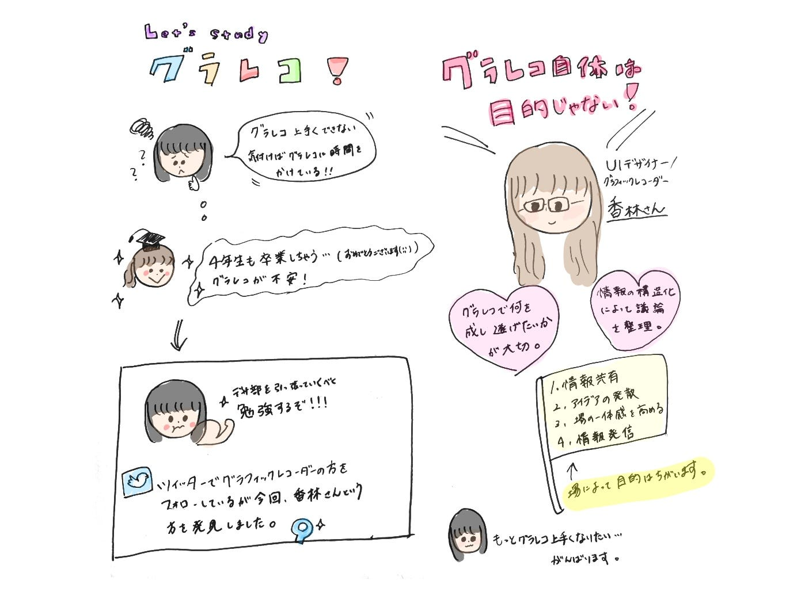

### グラレコの勉強

こんにちは！うららです。

いつも、デザイン部の先輩方はみんなグラレコがお上手で、なんであんなに上手いんだろう、と考えるばかりです。（やはり場数を踏んでいるからでしょうか？）

もう少しで先輩方が卒業してしまうので今のうちにグラレコのポイントなど吸収出来たらと思います。

というわけで今回はグラレコの勉強をしてみました。

Twitterなどでお気に入りのイラストやデザインのグラフィックレコーダーの方をフォローしていますが、今回取り上げるのはUIデザイナー/グラフィックレコーダーの香林さんという方です。

[1年3ヶ月描き続けて考えるグラフィックレコーディングのこと｜Goodpatch Blog グッドパッチブログ
こんにちは！UIデザイナー/グラフィックレコーダーの香林です。 グラフィックレコーディング（以下グラレコ）を始めて1年3ヶ月経ちました。 約60週間で、練習含めて描いた数は600枚以上。日で割ると1日1枚以上描いたことになります。 ...goodpatch.com](https://goodpatch.com/blog/think-about-graphic-recording)

私は最初にこんなデザインにしようと決めてから描いていましたが、内容が進むにつれてよくわからなくなってしまうということが多々あります。

升本先生の地球科目の英語講義でもグラレコでまとめていたのですが、デザインに気をとられて結局時間がかかってしまっていました。

さきほどのリンクで香林さんは「以前、描く形式を予め決めて描いた方がやりやすいのではないか、と考えたことがあります。しかし、全然思った通りにいきませんでした。議論もプレゼンテーションも、場の空気次第でどんどん形が変わるものです。それを予測する方が無理なので、今はきっちりとフォーマットを決めることをやめました。」と仰っています。

これを読み、なんだ～！デザインを決めてから描かなくてもその場その場で変更していいんだ！と思い、肩の力が抜けました。

香林さんはグラレコは目的達成の手段であり、グラレコを描くことを目的にしないと書かれています。

グラレコをしているといつしかそれが目的になってしまっていることに気づき、衝撃を受けました。

香林さん曰くグラレコには

#### 1.情報共有が目的の場合

#### 2.アイデアの発散が目的の場合

#### 3.場の一体感を高めることが目的の場合

#### 4.情報発信が目的の場合

があるそうです。

その場その場で目的が違うため、効果的なグラレコができたらいいなと思いました。

やはり場数を踏むのも重要そうです。

何事にもグラレコができたらいいなと感じます。

[絵が苦手でもどんな職種でも問題なし！社内で「グラフィックレコーディング勉強会 #基礎編」を開催しました！｜Goodpatch Blog グッドパッチブログ
先月末、Goodpatchの有志メンバーで「グラフィックレコーディング（以下グラレコ）社内勉強会」が開催されました。 本日はそのレポートをお届けします！ Goodpatchでは、UIデザイナー /…goodpatch.com](https://goodpatch.com/blog/graphic-recording-study-group)

また、この別のリンクではグラレコの練習法の他に、よく疑問に思う質問に答えていくださっています。

非常に勉強になりました。

デザイン部だけでなく、グラレコをする古橋ゼミの皆さんもぜひ読んでみてください。

本日のグラレコ

