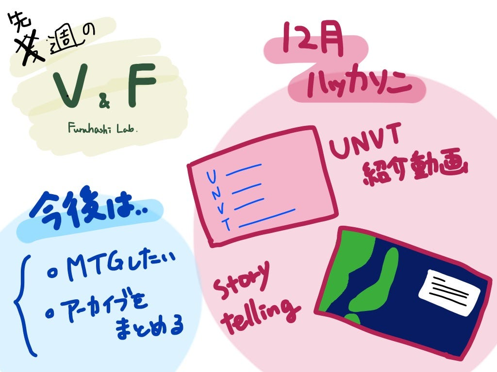

### V&F 先週の週報

こんにちは、V&Fです。

先週は珍しく週報の準備を失念していて、今週発表します。

まずは、12月にあったハッカソンを振り返ります。

今年度最も難しかったハッカソンですが、V&Fのタスクは

> ・UNVT紹介動画の作成

> ・Storytellingの作成

の２つでした。

どちらも発表までになんとか作品を作ることができました。

しかし、当日指摘された通り他のサークルと連携を取ることができなかったことが反省点です。

今後機会があれば、作品をブラッシュアップするのも良いなと思いました。

[https://docs.google.com/presentation/d/1CnjQFioKaDGfxANNo9YPOBLUzJX7AUXcnRLnGGPaE_E/edit#slide=id.p](https://docs.google.com/presentation/d/1CnjQFioKaDGfxANNo9YPOBLUzJX7AUXcnRLnGGPaE_E/edit#slide=id.p)

最近は個々が忙しく、V&Fらしい作業はあまりできていないのか課題です。。

ひとまず卒論・ゼミ論が落ち着いたら、

一年を振り返るMTGをしたり、作った動画のアーカイブをまとめたりしようと思います。

<グラレコ>

