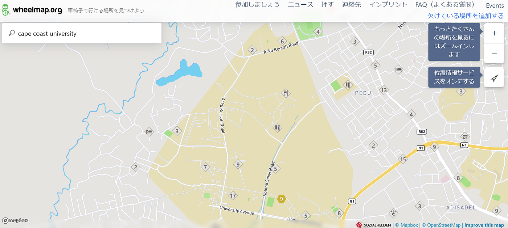
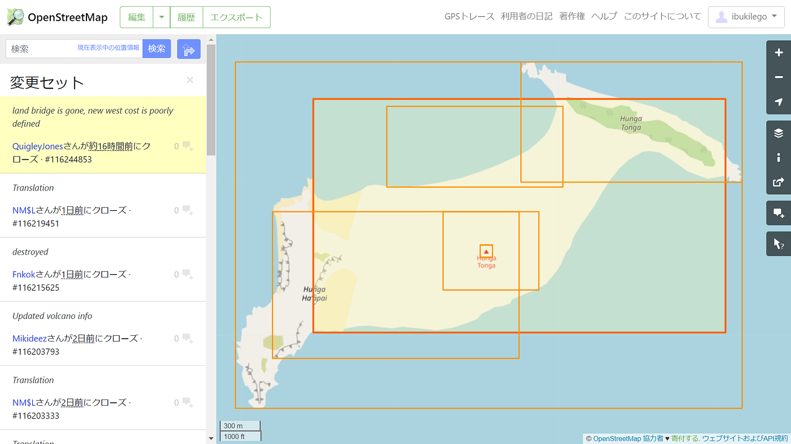
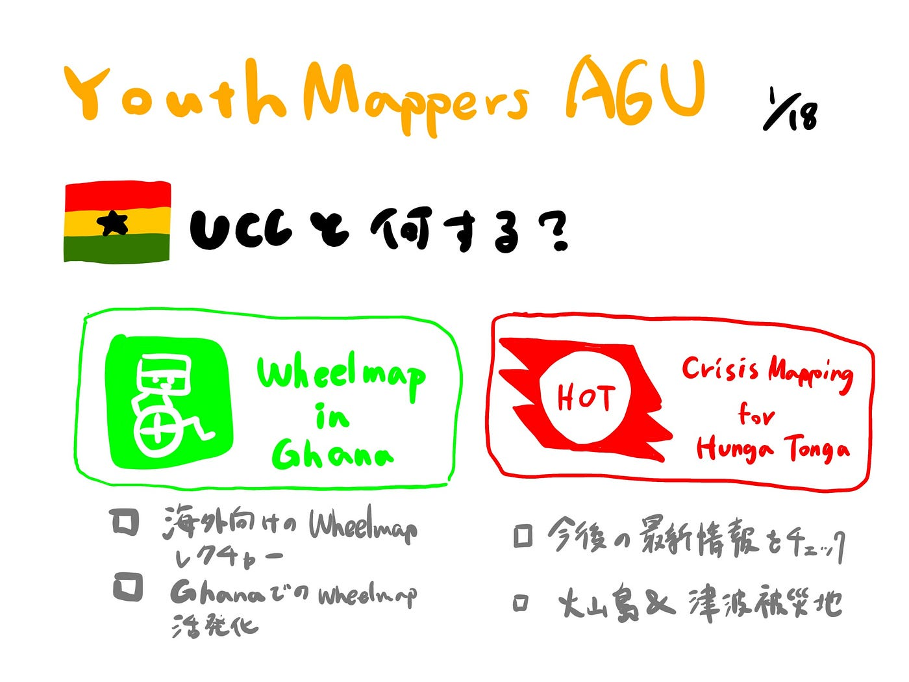

### YouthMappers AGU 2021ゼミ週報:||

こんにちは。3年の柴山です。

2021年度ゼミ最後の週報をお送りします！

[今年の方針](https://medium.com/furuhashilab/youthmappers-agu-2021-to-2022-9c1864f6e651?source=collection_home---1------3-----------------------)も定まり、海外との交流の一環としてガーナのUCCとのコラボに向けて準備を始めているところです。UCCのGideonさんに連絡を取り、以下の案を中心に企画していきたいです。

①Wheelmap in Ghana

②OSMマッピング（場所やプロジェクトは未定）

ガーナの車いす情報があまり登録されていないようなので、海外の人々へのWheelmapレクチャーの挑戦も兼ねて①を提案しました。昨年のパラリンピック開催に合わせて How To 動画を公開し、何度かボランティアイベントに参加してきましたが、今後も普及活動を積極的に行ってWeelmapの情報量を増やしていきたいです！

そして②の詳細に関しては先日噴火したフンガトンガ・フンガハアパイの噴火に関連したクライシスマッピングを考えています。現在はまだHOTのプロジェクトが公開されていないようなので随時情報をチェックしていきます。

OSMで火山周辺を見てみたところ、2日前から編集が活発に行われていることが確認できました。火山島には建物は無いので、津波の被害を受けた地域を中心にマッピングに貢献したいです。

> グラレコ

YouthMappers AGU , Furuhashi Lab, 2022

CC-BY-SA 3.0
