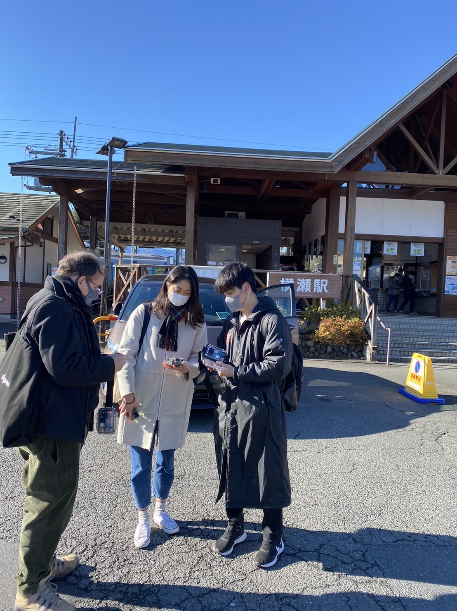
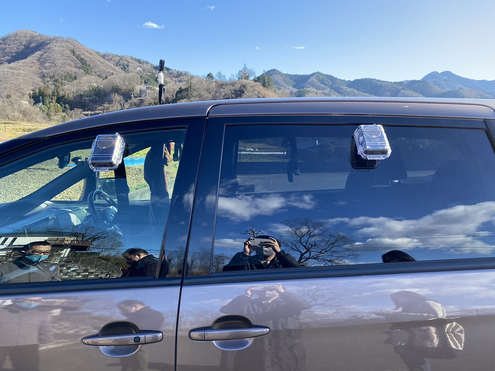
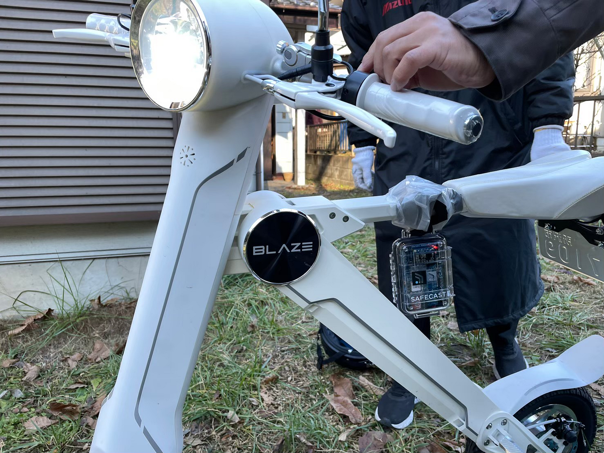
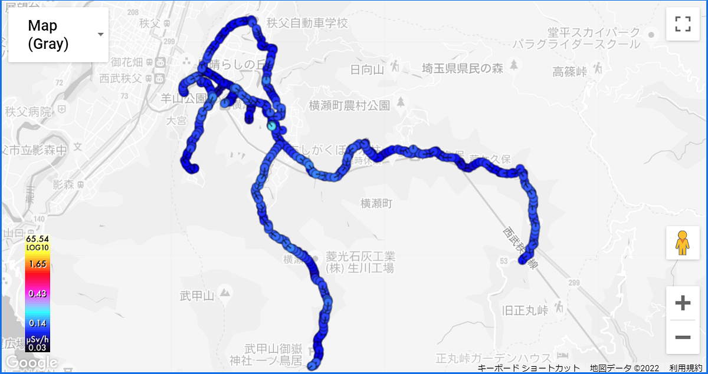
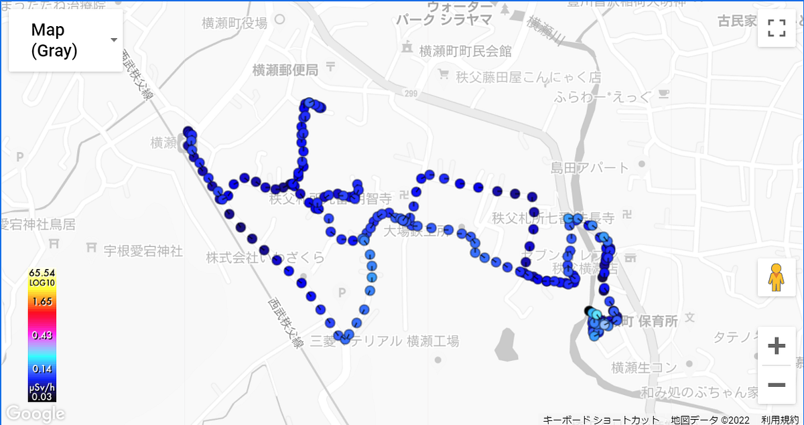
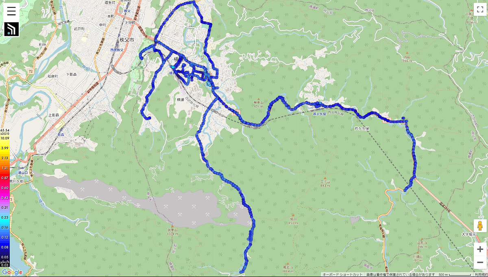
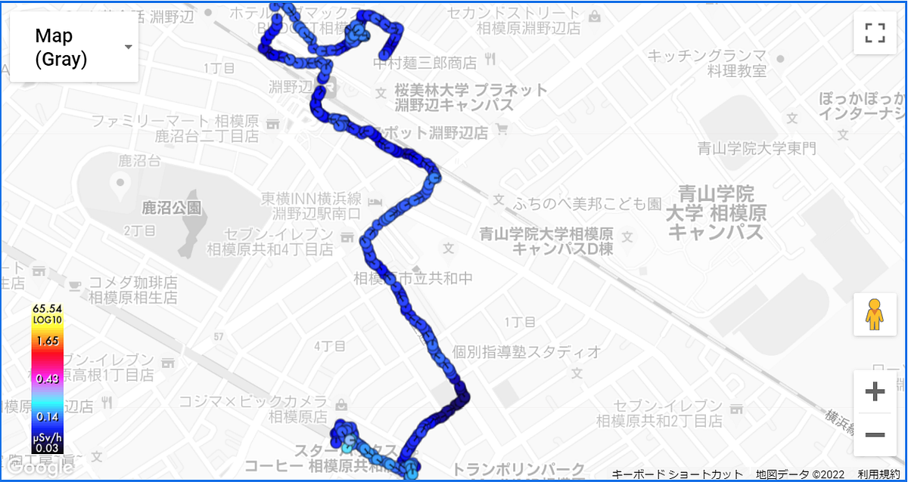
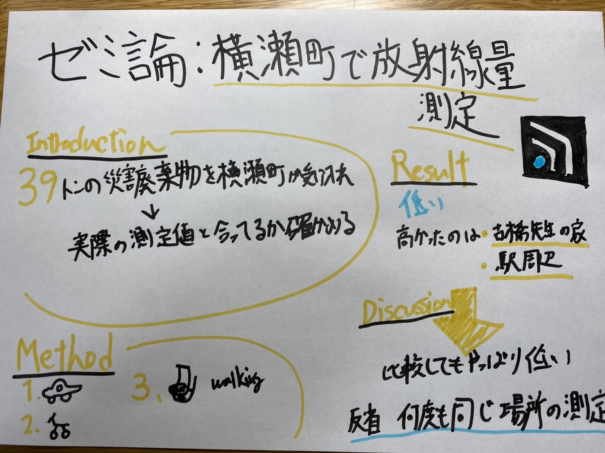

ゼミ論最終発表：横瀬町で放射線量の測定

Introduction

私はbGeigieを用いて横瀬町の放射線量の測定を行いました。

改めて、今回なぜ私が横瀬町で放射線量の測定をしたのか説明します。三菱マテリアル横瀬工場では岩手県からの災害廃棄物（木くず）39トンの受け入れ、セメント焼成を行っており、測定値と実際の測定値が合っているか確かめるために今回横瀬町で放射線量の測定を行いました。

2013年の1月31日時点では0.058µSv/hでした。

方法として工場付近と横瀬町の周辺で放射線量に差異があるかを測定することを目標にしました。

事前に[横瀬町の空間放射線量](https://www.town.yokoze.saitama.jp/kurashi/kankyo/1052)を調べてみると、2020年時点で一番高いものは町民会館駐車場で0.09µSv/hでした。

横瀬町全体の平均は、0.06µSv/hでした。

後期後半から「Advanced Resilient Communities against Disaster 」の授業を履修しSafecastのAzbyさんに放射線量について詳しく学びました。

また実際にbGeigieの作成をしました。はんだをするのが久しく緊張しましたが無事に完成して良かったです。

Method

放射線量を測定するに当たって3種類の測定を行いました。

まず注意点としてbGeigieを使っていないと位置情報の取得を行わなければいけないので数分かかります。

1. 車の窓にbGeigieを設置して測定

2. 電動バイクにbGeigieを設置して測定

3. 徒歩で測定

この3つで主に測定をしました。

3つの感想を簡単にまとめます。

車は、長距離に一番向いていると感じました。そして側面も多方向に測定をすることが出来たので差も発見しやすいと感じました。

電動バイクは細かな道の走行に向いていると感じました。

歩きはあまりおすすめはしません。なぜなら歩きだと時間がかかってしまい、長距離を測定することが難しいからです。しかしデータをかなり正確に測定したいのであれば、利用することもありかもしれません。

Result

結果としては、横瀬町の工場一帯、そして町全体の放射線量も低く安全であると言えます。唯一高かったのは古橋先生の家の近く、横瀬駅近辺でありましたがが危険なレベルではありませんでした。（0.29µSv/h）

この図は[こちら](https://map.safecast.org/?y=35.9725&x=139.109&z=14&l=1&m=9&logids=54560,54563,54562,54561)から閲覧することが可能です。

Discussion

計測を始めた場所で測定値が高かったのでもしかしたら、初めは不安定であるかもしれないという事を考えました。

そしてこれらの少し高い値が他の地域だとないことを推測しました。そして実際に淵野辺周辺で徒歩で計測をしました。

計測を始めた場所は関係なく、淵野辺の放射線量も横瀬町の放射線量と大差はなく、横瀬町が改めて安全であるという事を確認することが出来ました。

反省点として、Safecastの新年会でお話をしたときに、1回だけではなく何度も計測を行い、異常が毎回出ればその場所は異常があるかもしれないとお話を頂いたので、同じ場所を何度も計測し、本当にこの数値であるか確認をしなければいけませんでした。

そのため淵野辺周辺を卒業するまでに何回か測定し、高い数値が本当に高いか確認したいと思います。

スライドはこちら

グラレコはこちら

Githubのレポジトリはこちら

[GitHub - furuhashilab/2021gsc_NaokiIto
Contribute to furuhashilab/2021gsc_NaokiIto development by creating an account on GitHub.github.com](https://github.com/furuhashilab/2021gsc_NaokiIto)

プロジェクトはこちら

[NaokiIto · furuhashilab/sotsuron2021
You can't perform that action at this time. You signed in with another tab or window. You signed out in another tab or…github.com](https://github.com/furuhashilab/sotsuron2021/projects/24)

参考文献はこちら

[古橋ゼミ卒論2021参考文献・参考資料リストテンプレート
Templete ID,大分類,中分類,小分類,著者,発行年,最終更新日,タイトル,雑誌名,雑誌号数,該当ページ,出版社,ISBN,URL,URL4archives,閲覧日,MEMO1,MEMO2 論文,査読つき 論文,査読なし 書籍…docs.google.com](https://docs.google.com/spreadsheets/d/1C3ZDC9UUvsCMds6NQ4X8lB6X73fcz5gu-jCiJESdlHw/edit#gid=0)
