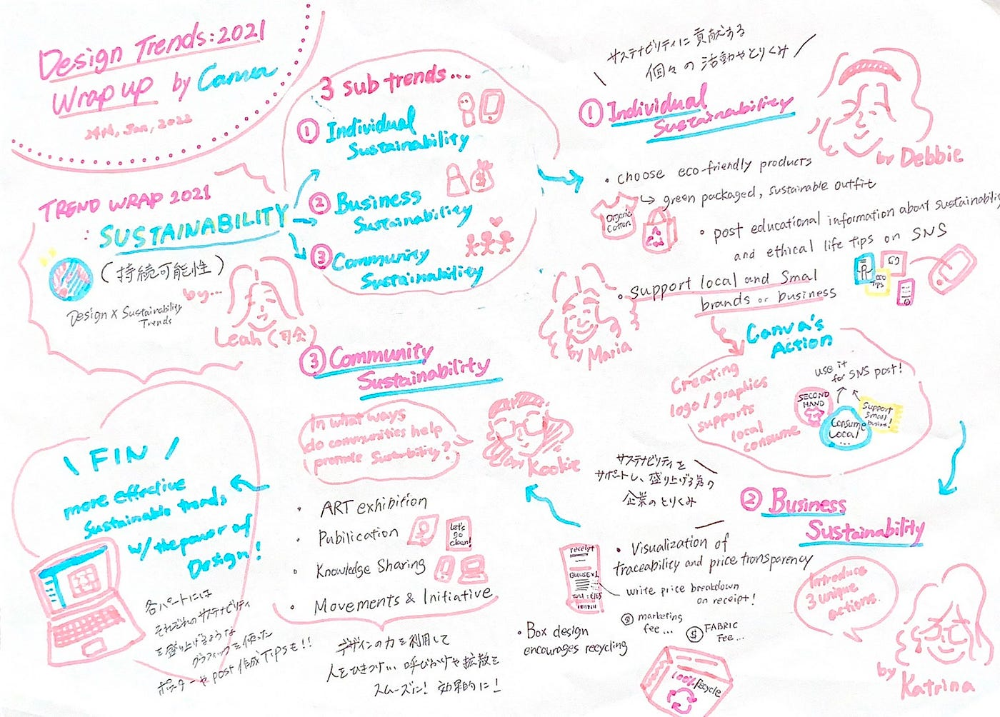
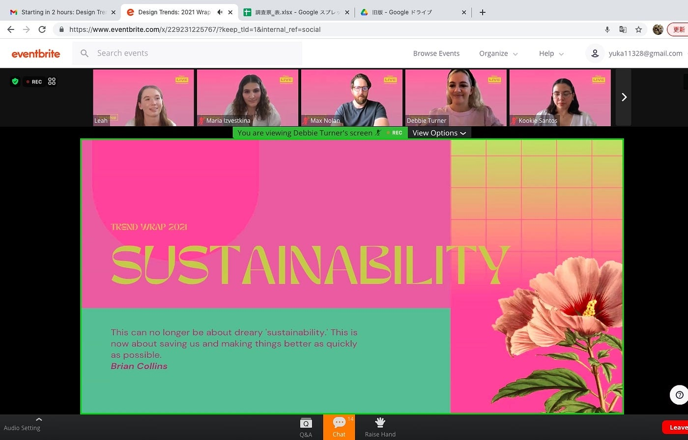

### 国際会議レポ -Design Trends:2021 Wrap up by Canva -

国際会議のトピックが大好物のサステナ関連で優勝！
こんにちは、斎藤祐花です。

先日1月24日にCanva主催で行われた、
[Design Trends:2021 Wrap up](https://designschool.canva.com/events/design-trends-2021-wrap-up-229231225767/) 国際会議のレポートをしていきます！

> メインテーマ: SUSTAINABILITY

Trend Wrap 2021…
2021年の気になるトレンドは **SUSTAINABILITY 
**日本語に訳すと**”持続可能性”**のことです！

2021年におけるSustainabilityというワードは特に、
自然環境・社会環境・経済発展の持続可能性を表すものでした。

確かに日本でも、昨年は頻繁に街中やメディア、SNSで
”サステイナブル”,”エシカル”,”SDGs”というワードを目にしましたよね。
（言わずもかな？私はサステナヲタクなので余計それらの盛り上がりを肌で感じまくっていました。）

> SUSTAINABILITY × Design

さて、この2021度のトレンドであったSustainabilityが
Designとどう関わっていくかについてです。

そもそもトレンドというものは、紙やデジタル問わずあらゆるメディア媒体を介して拡散されていくものです。

詳しくは後述しますが、トレンドとしてのサステイナビリティも
SNSポストやサステイナブル商品、雑誌、ネット記事…などなどの
”デザインされたもの”通して盛り上がっていきました。

その為今回のイベントでは、
昨年トレンドであるSUSTAINABILITYが

・どんなDesignを通して広まったか
・Designがそれらの盛り上がりにどう貢献したか
・どんなDesignがそれらを拡散するのに有効であるか

の上記３点のポイントを押さえながら
次の３つのサブテーマに分けて紹介されていきます。
どれもかなりさっぱりした説明だったのでオタク知識を活用し、
補足を入れながらレポートしていきます！

> ３つのサブテーマ

昨年のトレンドであるSustainabilityに関する動きや盛り上がり方は
個人・ビジネス・コミュニティの３つの種類に分けて説明されました。

① Individual Sustainability; サステイナビリティに関する個々の取り組み

② Business Sustainability;サステイナビリティに貢献する企業の取り組み

③ Community Sustainability; コミュニティが貢献するサステイナブルな取り組み

ここからはサブトレンドである３つを順番に紹介していきます。

> Sub Trends① ; Individual Sustainability

[サステイナビリティに関する個々の取り組み] by Ms. Debbie and Ms. Maria

サブタイトルの通り、個人間で見られたサステイナビリティに関するアクションがいくつか紹介されていました。

**・eco-friendly(環境に優しい)商品を選ぶ**
 →過剰梱包がなく、環境負荷の少ない素材のパッケージや製品。エシカルファッションについての言及もあり、2nd Hand（リユース/古着）の洋服を選んだり、オーガニックの素材で作られた服を選ぶということが地球に優しいアクションでもあり一つのトレンドになっていたようです。

**・SNSでサステイナビリティや社会課題に関する教育系ポスト＆シェア**
 →ゴミの分別方法やエコな素材を見分けるポイントなどエシカル生活を送るためのtips.

**・ローカルなブランドやスモールビジネスをサポートする**
→日本でいう地産地消のような概念を伴うアクション

上記で紹介されたトレンドに対して主催者であるCanvaも
”Second Hand is Cool”や”Support LOCAL”等のメッセージロゴやグラフィック（Canvaでいうelement）を作成し公開したり、
 Canva上の制作テンプレートにサステイナブル系のトピックを登場させるなどのアクションをしていたようです。

> Sub Trends②; Business Sustainability

[サステイナビリティに貢献する企業の取り組み] by Ms.Katrina

サステイナビリティトレンドは個人単位だけでなく、
企業の動きからもさらなる盛り上がりを見せていました。

１つめのサブトレンドほどのボリューム感はないものの、
ユニークな３つの事例が挙げられていたので特に興味深かった内１つを丁寧に紹介します。

・レシートで見せる商品の価格透明性
 →レシート上に商品の単価設定内訳が記載されているのです。

例えば、１つのブラウスを購入したレシートではそのブラウスの販売価格の内訳としてマーケティング、素材、商品開発、PR、流通などそれぞれにどのくらいのコストがかかっているかが明記されています。
こうすることで生産工程の透明性が消費者に伝わりやすくなり消費者との信頼関係を構築できる！

さらに、各工程にかける予算のバランスから
ブランドが労働搾取をしていないか適切な素材調達をおこなっているかなどの公平性をアピールをすることができます。

このアイディアは、サステイナビリティ界隈でも少し前から有名な動きとして多くのブランドが同じような取り組みを行っていました。
デザインをすることでサステイナブルを可視化できるところがさらなるサステイナブルの関心やアクションを生みそうでとっても良いアイディアだと思います。

> Sub Trends③; Community Sustainability

[コミュニティが貢献するサステイナブルな取り組み] by Ms. Kookie

冒頭でこのサブテーマをさらに４つのトピックに分けられ、
コミュニティが行うサステイナビリティ向上に対する貢献活動を紹介がされていきました。

・ART exhibition;アートの展示会を開催しコミュニティの連携や多様な価値観を発信し受容する機会を作る
・publication; 公共スペースに呼びかけポスターを貼るなど…
・Knowledge Sharing; オンラインコミュニティ等で行うディベートやWS
・Movements & Initiative; いわゆるデモなどのアクティビティ参加

各トピックの説明の後は、サステイナビリティへの取り組みをどのようにデザインできるかの紹介がありました。

例えば、

環境保全の重要度を強く訴え緊急性を訴求したい場合
→強い色味やコントラストをつけた色使いを意識し、フォントもヘビーなものを使い全体的にBoldな感じに仕上げる。

逆に、

共生や思いやり、豊かな自然といった優しい印象や共感性を煽りたい場合→柔らかく丸みを帯びたフォントを使い、淡いカラーを使い、大自然を連想される素材や写真を起用する。

最後には実際にCanva上でのデザインデモンストレーションがありました。映像やアニメーションを加えることで目を惹きやすくなるといったことを趣旨に一つのクリエイティブを制作している様子を５分ほど見せていただきました。（by Mr.Max）

> まとめと感想

面白かった！
サステイナビリティの中でもどんな動きが特にトレンドになっていたか、それらのトレンドがどんなデザインにより広められていったかを実際のケースを通して知ることができデザイン×サステイナビリティの切り離せない関係により興味を持つことができました。
どっちも勉強している私にとっては最高でしかない国際会議でした！

> グラレコとスクショ

グラレコ

スクショ

