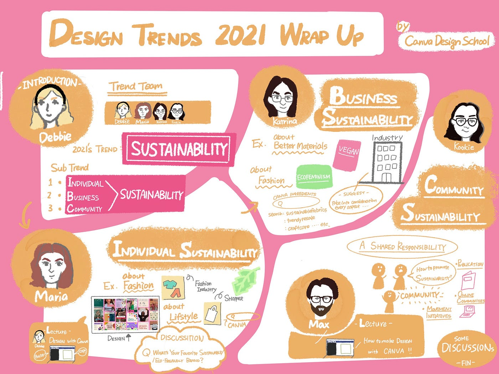
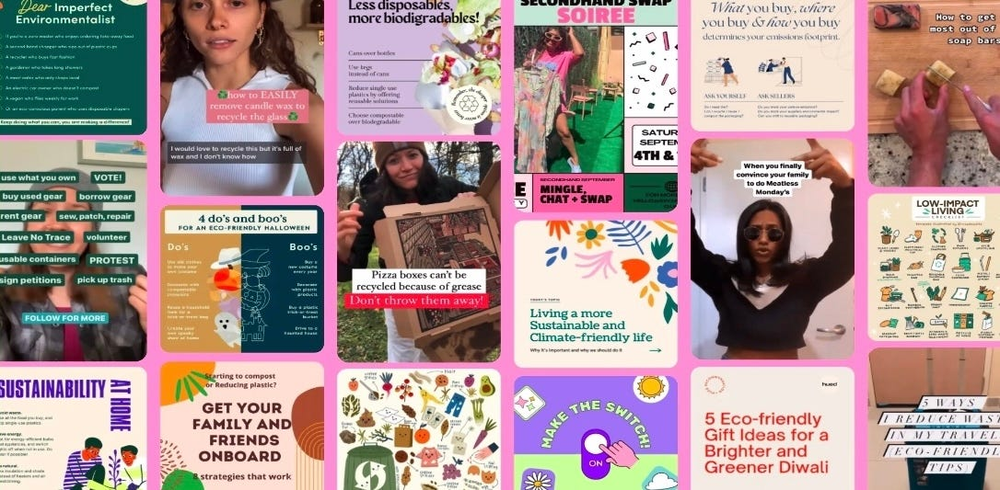
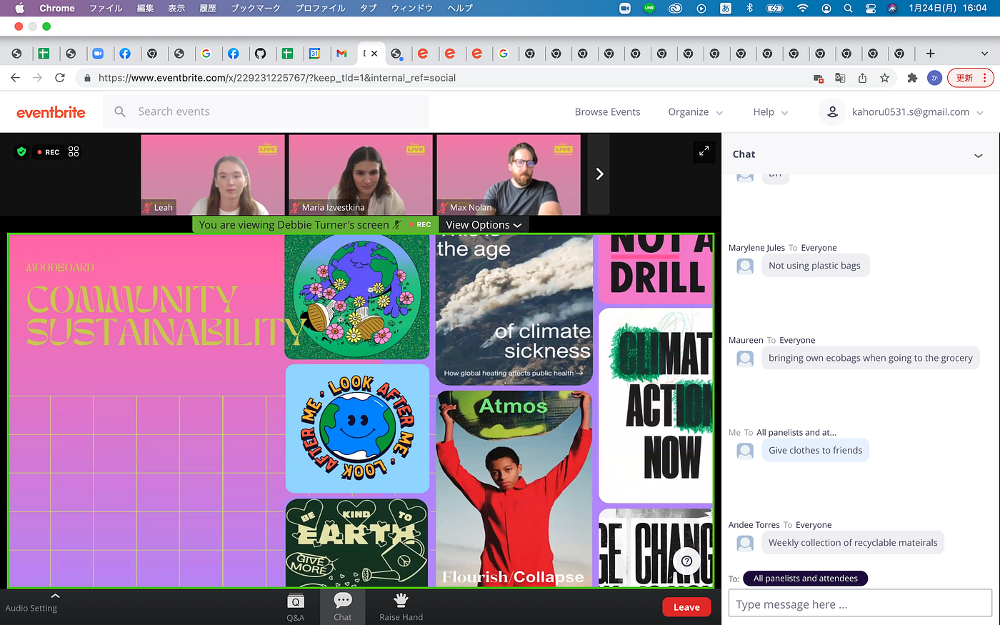
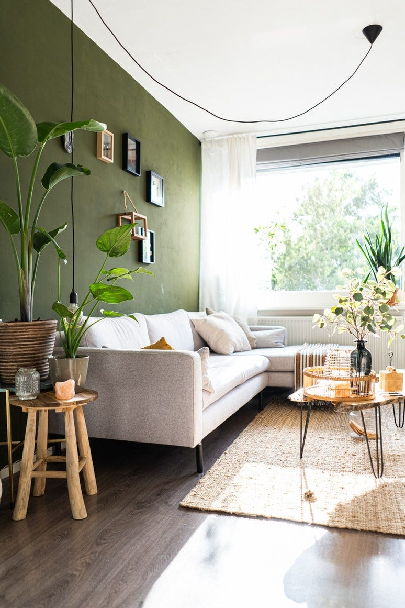

### DESIGN TRENDS 2021 WARAP UP （国際会議参加報告）

こんにちは！4年の佐藤かほるです。

2022年1月24日に、[CANVA Design School](https://designschool.canva.com/) が主催するwebinar、
[DESIGN TRENDS 2021 WARAP UP](https://designschool.canva.com/events/design-trends-2021-wrap-up-229231225767/) に参加しました。

お先にこちらがグラレコです！
とてもカラフルなプレゼンテーション資料だったので、その雰囲気も表現したいと思い、少し派手目な背景に。。笑

全体の構成は以下の通りです。
・Introduction-メンバーとトレンドの紹介
・3つのサブトレンドのプレゼン
・ディスカッション兼、終わりの挨拶

なかなか聞き取れずに苦労しましたが、ざっくり報告していきます。。！

> Introduction：by Debbie

-メンバー紹介-

今回のwebinarでは、CANVA Design School のtrends teamの５人が登壇しました。

Debbie：Creative Lead （Templates, Trends）
Maria：Art Director （Graphics, Trends）
Kat : Art Director （Photos, Trends）
Kookie : Craft Lead （Templates, Team）
Max : Creative Lead （Templates, Trends）

-2021 デザイントレンドの紹介-

CANVAが紹介する2021年のデザイントレンドは、

### “SUSTAINABILITY”

です。2021年は世界的にサスティナビリティ（持続可能性）が呼び掛けられましたし、デザインがその動きに大きく関わっていました。

そして、以下の3つのサブトレンドが紹介されました。

#### ・INDIVIDUAL SUSTAINABILITY

#### ・BUSINESS SUSTAINABILITY

#### ・COMMUNITY SUSTAINABILITY

以降は、この3つのサブトレンドの説明がそれぞれデザインの紹介とともに行われました。

> INDIVIDUAL SUSTAINABILITY ： by Maria

日本語訳すると、個々の持続可能性ですが、個人のサスティナビリティへの取り組みと意訳します。

個人の取り組みとしては、ファッションや、ショッパー（ショップでもらう包装）リサイクルなどが取り上げられていました。

紹介されているデザインは、Instagramのストーリーで上げているのかな？と感じるような画像で、主にSNSでアップされているのではないかと思います。↓

プレゼンの最後には、Debbieによる[CANVA](https://www.canva.com/ja_jp/q/pro/?utm_source=google_sem&utm_medium=cpc&utm_campaign=REV_JP_JA_CanvaPro_Branded_Tier1_Core_EM&utm_term=REV_JP_JA_CanvaPro_Branded_Tier1_Canva_EM&gclid=Cj0KCQiAosmPBhCPARIsAHOen-NTGerK2GsBDb0vhs3ZsEqIUmWoYmfnYTqUvZLsGZ46ZUyHJl8Z0F8aAiAMEALw_wcB&gclsrc=aw.ds)で作るサスティナビリティを表現するデザインのレクチャーがありました。

> BUSINESS SUSTAINABILITY ： by Katrina

ここでは、企業のサスティナビリティへの取り組みを紹介していました。

主にファッション産業や、食品産業（ヴィーガン食材など）についてが取り上げられていました。

> COMMUNITY SUSTAINABILITY ： by Kookie

ここでは、コミュニティー（社会）のサスティナビリティへの取り組みを紹介していました。

コミュニティーがサスティナビリティを促進する方法として以下のものが取り上げられていました。
・出版物
・オンラインコミュニティー
・運動やイニシアチブ

プレゼンの最後には再び、Maxによる[CANVA](https://www.canva.com/ja_jp/q/pro/?utm_source=google_sem&utm_medium=cpc&utm_campaign=REV_JP_JA_CanvaPro_Branded_Tier1_Core_EM&utm_term=REV_JP_JA_CanvaPro_Branded_Tier1_Canva_EM&gclid=Cj0KCQiAosmPBhCPARIsAHOen-NTGerK2GsBDb0vhs3ZsEqIUmWoYmfnYTqUvZLsGZ46ZUyHJl8Z0F8aAiAMEALw_wcB&gclsrc=aw.ds)で作るサスティナビリティを表現するデザインのレクチャーがありました。

> discussion

プレゼンの間にも何度か、

What’s your favorite sustainable/eco-friendly brand?

や

What are the ecological actions you are taking?（正確には違うかも。。）

などのディスカッションが行われ、Chat機能を使って参加者が回答する形がとられました。

私も回答したので参加記録スクショとして載せておきます。

### 感想

このwebinarに参加して、感じたことをまとめます。

**感想①**
まずは、サスティナブルというトレンドのデザインについて、CANVAで紹介されたデザインと、私が知っている日本の（日本だけじゃないかもですが）デザインとは少し雰囲気が異なるな、と感じました。

日本でサスティナビリティというと、淡色の背景や植物の画像の様なナチュラルな風合いのデザインが多い気がします。フォントに関してもシンプルなものがこのテーマに使われていると考えます。

雰囲気こんな感じ↓（フリー画像）

しかし、CANVAで紹介されたデザインは、背景も彩度が高くフォントも派手だなと感じました。
なんとなくですが、若い年代や、サスティナブルを難しく考えてしまいそうな人にも接しやすいデザインだと感じました。

サスティナビリティと聞くと、頭にある程度デザインやビジュアルもイメージが湧くと思います。
サスティナビリティに関するテーマで色々なデザインが作られることで、サスティナブルという概念が偏見なく様々な年代、趣向の方に親しみやすいものになるのではないかと考えました。

**感想②**

続いては、感想というよりも反省です。英語の聞き取り力が衰えすぎてほとんど詳細な内容が分かりませんでした😭
悲しかったので英語力精進したいなと思いました。。。

以上です！
