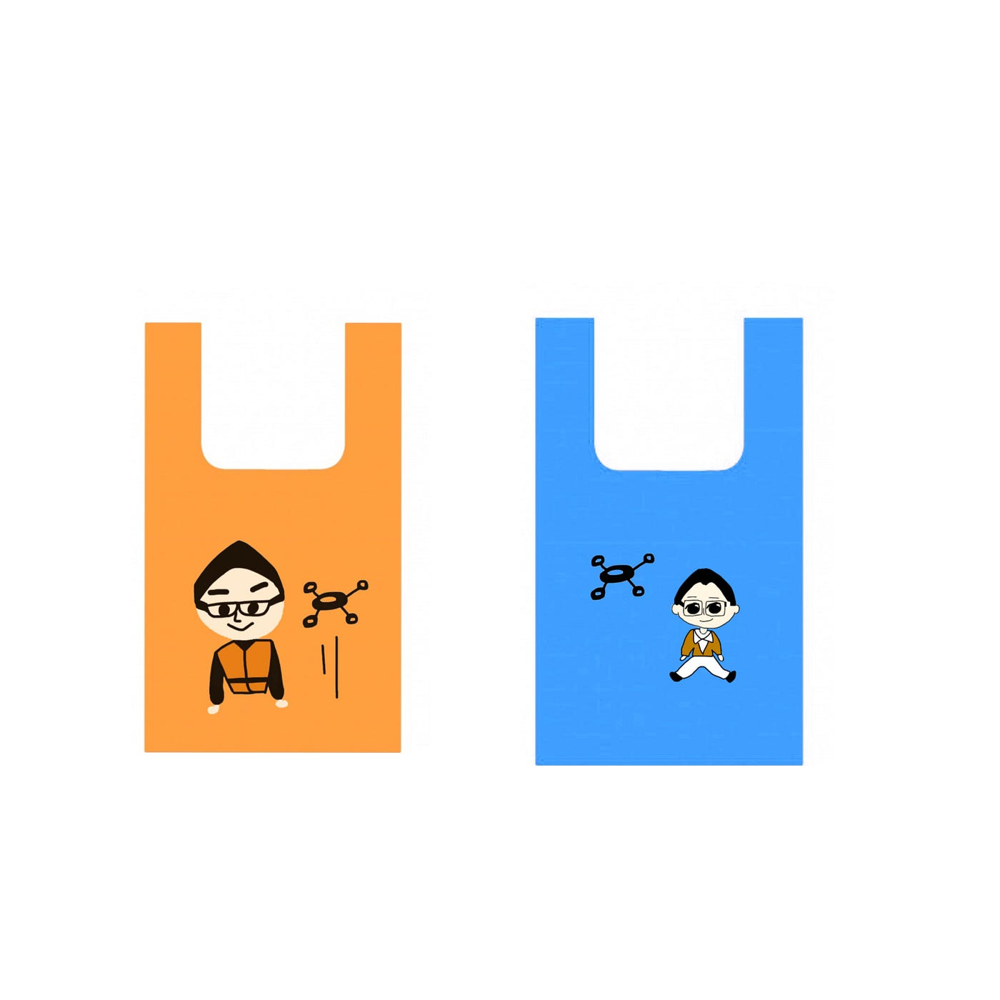
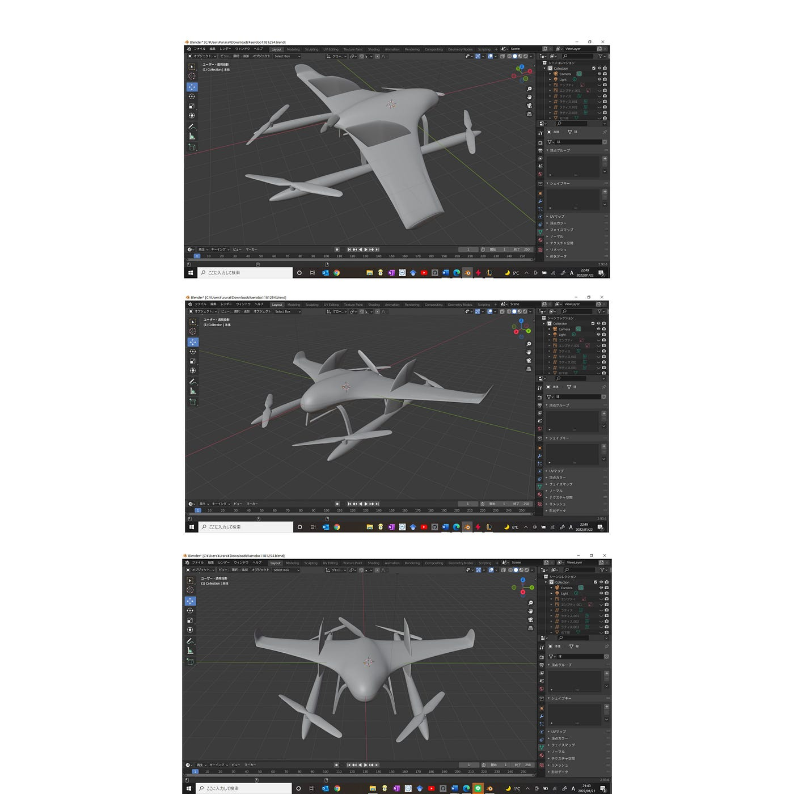
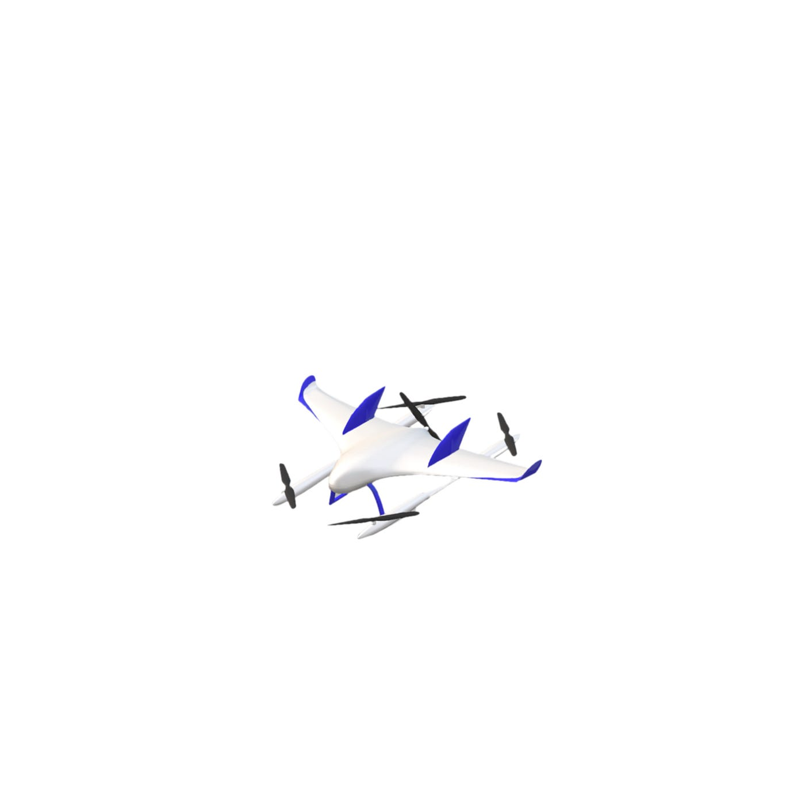
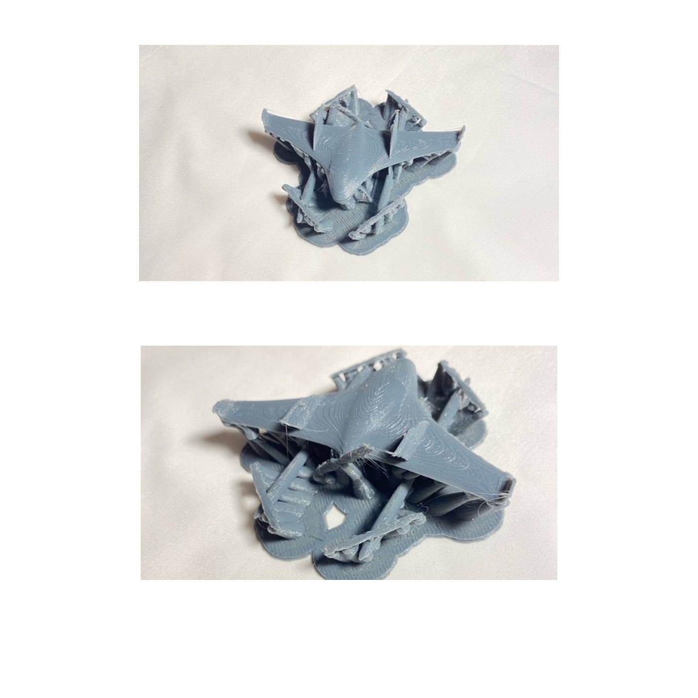
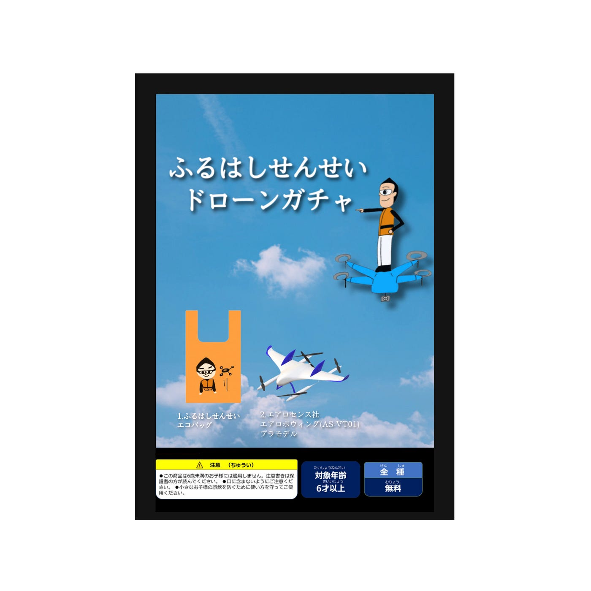
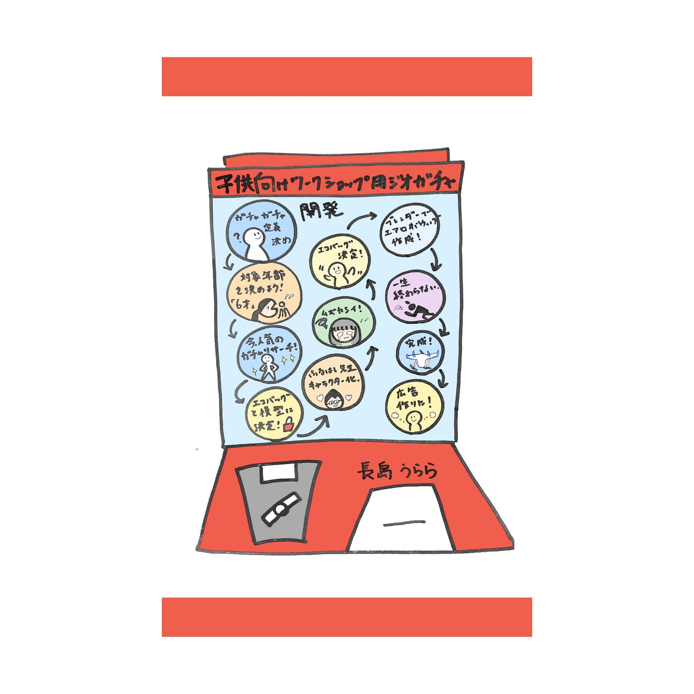

### ゼミ論 ガチャ開発！

こんにちは！3年の長島うららです。

ゼミ論の最終発表メディウムを書いていこうと思います。

私のテーマは「子供向けワークショップ用ジオガチャ開発」ということで進めてきました。

### Introduction

まず、ジオガチャとはなにかと考えても位置的に関連したガチャガチャなのかな…などいろいろ考えまして、調べたのですがあまり良い検索結果は得られず…いまだに定義はされていないようでした。

そのため私のゼミ論では、土地の名産・名所など限定されたテーマにちなんだカプセル自動販売機によるミニ玩具のことを「ジオガチャ」と定義します。

また、指導教員の古橋先生が所持する48mmのカプセルに限定して開発することにしました。

カプセルトイは多くの企業から事業展開されており一般的に客寄せや収益を生み出すための商業であるが、本論文では利益を生むことを目的とせず、ワークショップに参加した子どもへのお土産やワークショップのPRや情報ツールを目的として設置します。

尚、ワークショップのテーマは古橋ゼミに関係するものにしました。今回は過去に古橋先生が主催された子供向けのドローンのワークショップを参考に作成しました。

### Method

あくまでも利益を目的としない個人的なカプセルトイの開発ではありますが、幼児がトイを誤飲することによって発生する気道閉塞事故防止のため対象年齢の記載を行うにします。対象年齢の設定は一般社団法人日本玩具協会による[「子どもの発育段階において与えるに相応しいとされる玩具の年齢別、種類別対応表 、種類別対応表 」](https://www.toys.or.jp/st/pdf/st_kodomo_hatsuiku_nenrei_toy.pdf)を参考に、6才にすることと決定しました。

現在流行しているガチャガチャの企業秘話などのコラムを読みリサーチしました。

そして今回はエコバッグ（この場合カプセルに収まらなそうなので引き換え券などになる？）と模型を作成します。

ドローンを細かく描くことも考えましたが、子供向けということでかわいらしさをテーマに古橋先生とドローンのイラストにしました。

いろいろ描き、試しましたが没になりました。

また、[エアロセンス株式会社](https://aerosense.co.jp/#top) のエアロボウィング (AS-VT01)をガチャガチャ用模型とするため３Ｄモデリングを行いました。使用したアプリは本格的な3次元CGを作成するための無料ソフトウェア「Blender」です。

ブレンダーの使用はほとんど初めてで、初期のUV球とラティスを追加後に挫折し、モデリング制作に本当に長い時間がかかりました。（かけすぎました…）

以下おおまかな作成方法

メッシュのUV球「ラティス」と「球」を追加する。 ラティス追加の後に伸ばしたい（主翼の先の）ところを伸ばす。 球にモディファイヤ→ミラーを追加する。 翼を折り曲げる部分→ナイフで頂点を追加（追加しないと主翼全部が曲がる） Cを押して裏面も切る。 トランスフォームで動かす。 プロペラを曲げる モディファイヤの中のシンプル変形を追加する。 下の足の部分以外はUV球で制作。 足は立方体から作成。 ナイフで頂点追加→切り離せていない。 分割して頂点を削除すると中身が消える。 ナイフで頂点をたくさん加える。 トランスフォームで少しずつ動かす。 辺をベベルして角をとる。

本体の部分の他に部品が分かれているため一つのオブジェクトにしたい。 部品一つ一つにモディファイヤを追加して合体。 ブーリアンの合成を押す 適応してという作業を繰り返す。

以下はエアロボウィングの３Dモデルのデータです。

[aerobo1181254.zip
Edit descriptiondrive.google.com](https://drive.google.com/file/d/1pNiGfvYV-Tw-pKQC6nOkVPNMpPB6cxc2/view?usp=sharing)

自宅の３Dプリンターで試しにカプセルよりも大きい5㎝ほどのサイズで印刷しましたがエアロボウィングの足が細かく細いため一回目は形にならないほどに印刷され失敗しました。

2回目に土台をつけて印刷したがそれも失敗しました。

ガチャガチャの広告を制作

### Result

多くの種類のガチャガチャを作成することを目標としていたのですが、納得のいく出来のものはできなかったです。

３Dモデリングに時間をかけすぎてしまいました。

それが原因で、３～5種類作成する目標であったが2種類しか作成できなかった。

多くのガチャガチャについてのコラムを読み、現在どのようなガチャガチャが流行っているかを知ることができた。しかし、子どもが喜ぶものが何か考えることはかつて子どもであったはずの私でも難しいことであった。

### Discussion

Ipadが欲しいと思い、お金がたまったら購入しようと決意しました。小さなiPhoneの画面でイラストを描くのには無理があった。

3Dモデリングを始めるには基礎から学ぶべきです。何も分からない状態からいきなりモデリングをやるには時間が足りませんでした。

メーカーならともかく、個人で実際にガチャガチャの中身を３Dプリンターで制作し、48㎜のカプセルに収めるのには細かすぎるものには向いていない可能性が高かったです。

こちら参考文献リストです。

[Google Sheets - create and edit spreadsheets online, for free.
Create a new spreadsheet and edit with others at the same time -- from your computer, phone or tablet. Get stuff done…docs.google.com](https://docs.google.com/spreadsheets/d/1eERcJoA46zhxX6ZHBOXZkkfA8NIYnEtLiJvolGrFSmw/edit?usp=sharing)

こちらはgithubのリポジトリです。

[furuhashilab/2021gsc_UraraNagashima: 2021年度ゼミ論 (github.com)](https://github.com/furuhashilab/2021gsc_UraraNagashima)

こちらがプロジェクト管理用です。

[UraraNagashima · furuhashilab/sotsuron2021
You can't perform that action at this time. You signed in with another tab or window. You signed out in another tab or…github.com](https://github.com/furuhashilab/sotsuron2021/projects/23)

これから卒業までの1年間、グラレコの本を読んだり、絵をかいたり、モデリングをしたりと様々なことに挑戦したいです。

今回の失敗と反省を生かし、より成長します…

最終グラレコ

