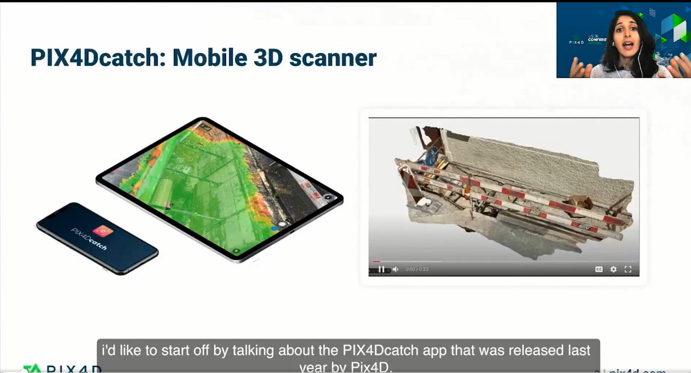
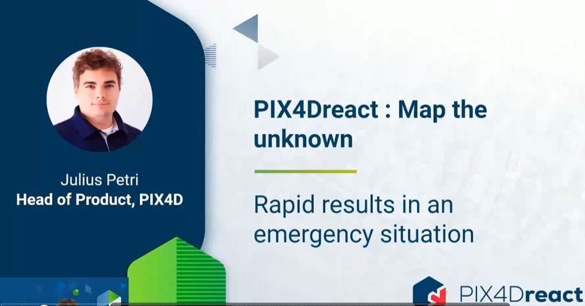
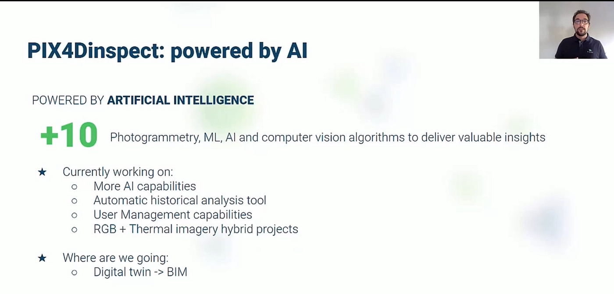
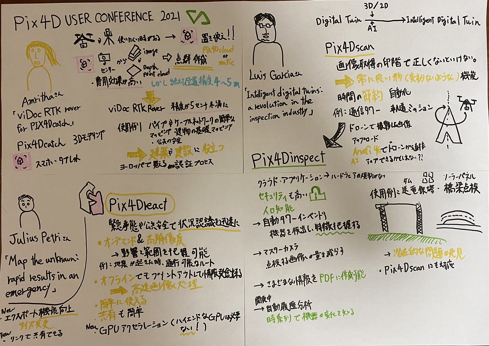

### Pix4D USER CONFERENCE2021

今回はPix4Dが主催している、「Pix4D USER CONFERENCE2021」に参加してみました。

オンデマンド方式で視聴可能だったのでこちらの国際会議に参加しました。

視聴方法として[こちら](https://www.pix4d.com/user-conference#register)のURLから登録することで視聴することが出来ます。

今回はその中で3名の方講演を視聴しました。

最初の方はAmritha Narayananさんです。

「viDoc RTK rover for PIX4Dcatch — Survey-grade 3D models in your hands」の公演をしてくださいました。

レーザースキャナーやローバーのような地上測量機器は高価で購入できない場合や、ドローンなどでも規制や飛行禁止区域によって都市部での飛行が難しい場合があります。

そういった場合にPix4Dcatchが役に立ちます。携帯やタブレットのカメラ等を使用することによって画像や深さ等をベースに点群を生成することが出来ます。Pix4dcloudやPix4Dmaticを使うことによって、高品質な3Dの画像を生成することが出来ます。

メリットとして使いやすく、費用対高価が高いです。そのため高品質なデジタルツインを作成することが出来ます。

しかし問題点があります、絶対位置精度が携帯等のGPSとセンサーで約4-5ｍくらいになってしまうことです。

そこでVigramのviDoc RTK roverとコラボレーションしました。5cm以内の絶対精度での測定が可能になりました。現場の地上調査の未来として期待されています。

使用例としてパイプやケーブルネットワークの簡単なマッピングや建物の基礎マッピング・公共の安全に使用されています。

建築や建設に役立ちます。

ヨーロッパではすでに購入可能で、それ以外の地域ではほとんどが最終認証プロセスに入っているとのことで発売するのが楽しみです。

次にJulius Petriさんの「Map the unknown: rapid results in an emergency」を視聴しました。

この講演では、Pix4Dreactの機能や実用例と最近追加された機能について主に説明されていました。

主にこのアプリは緊急事態や公共安全で状況認識を迅速にするためのソリューションとして利用されています。

特徴をいくつか説明します。

1つ目は、オンデマンドで高解像度であることです。そのため影響と範囲を把握可能となります。例えば地震が発生した際に、通行可能なルートを即座に導き出すことが出います。

2つ目に電波がなかったとしてもオフラインで高速画像処理を行うことが出来る点です。プリントアウトをすることによって情報の発信をすることが出来ます。

3つ目に簡単に使用、共有することが出来る点です。

次に新しく追加された機能について説明したいと思います。

まずGPUのアクセラレーションが追加されました。これまでよりもさらに早く処理をすることが出来ます。ここでポイントとしてハイエンドなGPUは必要ではないということです。

次にエクスポートの機能が向上しました。出力するサイズの変更が可能になりました。

最後にリンクを共有することで誰でも見ることが出来ることです。このソフトウェアがなかったとしても確認が出来るので、これまで以上法の発信が可能になったかと思います。

最後にLwis Garciaさんの「Intelligent digital twins: a revolution in the inspection industry 」を拝見しました。

こちらの講演では主に点検についてお話しされていました。

これまでの3D/2Dのデータを生成するだけではなく、更にAIを組み入れることによってIntelligent Digital Twinを実現することが出来ます。

まずPix4Dscanについて説明してくださいました。

正確な3Dを生成する際に重要なことは、画像取得の段階で正しくしなければいけません。そのため常に良い形で提供可能な機能が重要になります。

Pix4Dscanは自動化を搭載しているため時間の節約、画像の均一化を図ることが可能です。

使用例として、通信タワーの軌道ミッションの動画を見ました。

中心の軸を捉え、距離を保って一周していました。このように誰でも使えるために自動化が非常に重要になります。

そしてドローンで撮影した画像をPix4Dinspectにアップロードします。Anafi AIの4Gを今後使用することが出来たらドローンから直接アップロードが可能になります。

このソフトウェアは、クラウドアプリケーションでハードウェア規制がありません。またセキュリティも高く様々な企業が利用できます。

このアプリケーションには人工知能が搭載されています。ここでいくつかの機能の紹介をします。

まず自動タワーインベントリです。危機を検出し、特徴は悪をすることが出来ます。

次にマスターカメラです。点検する画像の量を減らすことが出来ます。

最後に、このような様々な情報を自動的にPDFに書き出すことが出来ます。

開発中ではありますが、今後自動履歴分析が追加され、時系列で機器の移り変わりを把握することが出来るようになります。

使用例として、ダムや送電鉄塔、橋梁、ソーラーパネル等に使用されていました。

いずれも潜在的な問題を人工知能が発見することが出来るため時間の節約をすることが出来ると感じました。

これまでドローン部でPix4Dcaptureを使用し、ドローンの自動操縦をしてきましたが、今回こちらの国際会議に参加して、もっと様々な利用方法、また活用方法があることを学びました。

この知識を今後生かしていきたいと思います。

グラレコはこちらになります。

