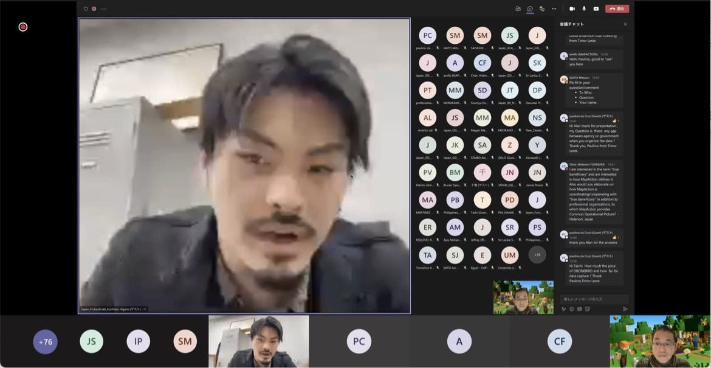
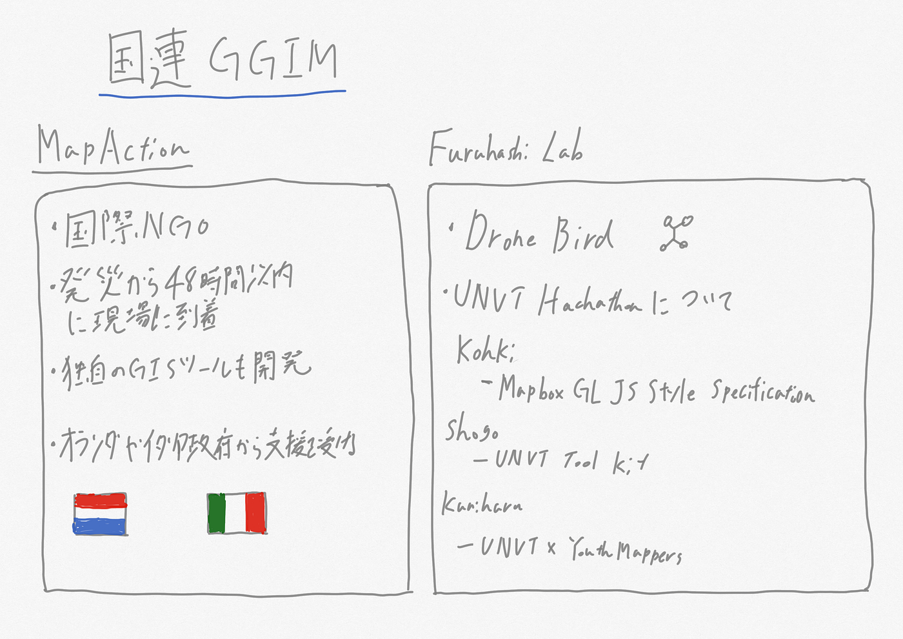

### 国連GGIMに登壇

4年の日向野邦春です。

先日、12月に行ったUNVTハッカソンの成果発表として国連のGGIMに少しだけ登壇させていただきました。

今回は藤村さんが司会として登壇されて発表者はMapActionからAlan Millsさんそして古橋先生です。

今回はMapActionの発表内容をまとめたいと思います。

#### MapAction

国際NGOであり、大規模災害や紛争が発生した際に24–48時間以内に現場にスタッフを派遣し地理空間情報の更新に努めている組織です。地図の更新に関してはESRIや独自で開発したMapActionGISというソフトを使用しており国連とも関係が深いようです。これまでの活動ではロヒンギャ難民やイラク難民への対応そしてハリケーンへの対応も行っています。

彼らには米国国際開発庁(USAID)やオランダ政府も資金提供を行っています。彼らの発表を聞いて、日本でのマッピングへの関心がまだまだ低いことに気付かされました。これだけの資金提供がされているのは知名度の高さが必ず関与しています。そして、既存のシステムを使うだけでなく自らで新しいGISソフトを作り上げているのにも非常に関心させられました。

久しぶりの国際会議でかなり緊張しましたが、なんとか発表することができました。このまま8月のフィレンツェまで突き進んでいきたいと思います。

