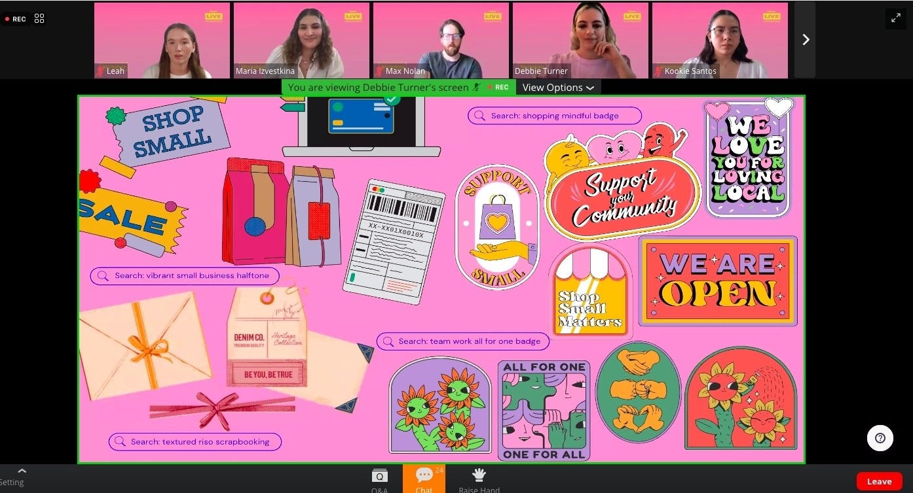
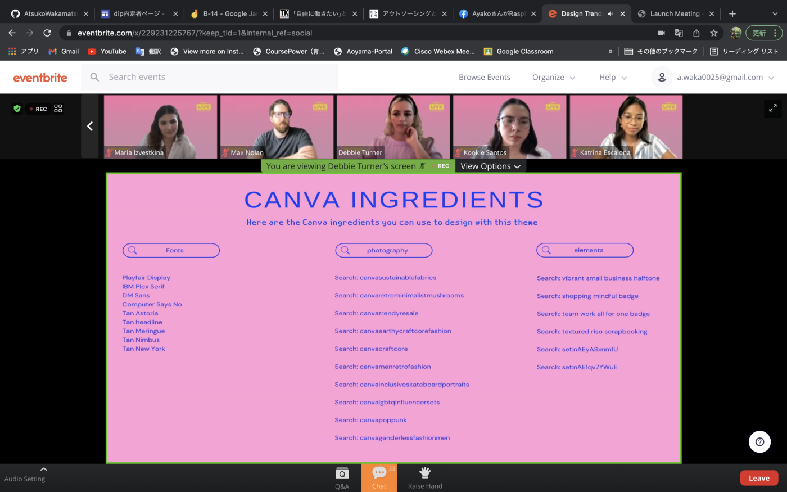
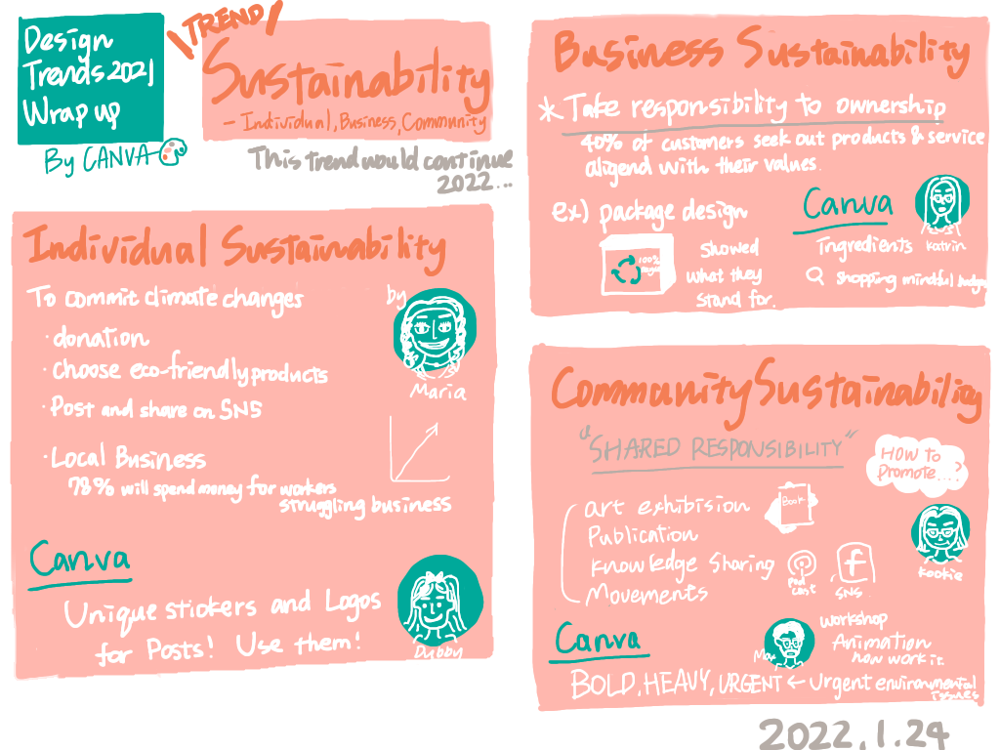

### Design Trend 2021 Wrap Up (国際会議参加)

こんにちは。４年の若松です。

先日 CANVA主催のDesign Trend WrapUpに参加してきました！
そこでのレポートを書いていきたいと思います！！

この会議はwebinar形式で事前にEvertbriteを通じて予約をし、登録したメールアドレスに送られてきたzoomのURLリンクから参加しました。

2021年のデザイントレンド、CANVA活用法、最後にディスカッションという流れでした。

> _2021年のトレンドテーマは…SUSTAINABILITY_

withコロナの生活が始まり、アフターコロナを見据えながら地球の持続可能性への考え方が変化してきたのではないでしょうか。

SDGsの言葉もより身近になり、日本においてもレジ袋の有料化などかなり生活に直結するような話題になってきたように感じます。

デザインとsustainabilityがどのように関係しているのかを説明していきたいと思います。サステナビリティのサブトレンドとして大きく３つにわけて説明されました。

> _１. INDIVIDUAL SUSTAINABILITY_

> _２. BUSINESS SUSTAINABILITY_

> _３. COMMUNITY SUSTAINABILITY_

個人、企業、コミュニティそれぞれでの取り組みを紹介します。

**1 Individual Sustainability**

個人レベルの持続可能性への取り組みとしては寄付、気候変動に対応した行動の変化が挙げられました。

▶︎eco-frindlyの商品を選ぶ
Secondhandのもの、古着などをおしゃれとして取り込む人が増えた

▶︎SNSによる共有、投稿
SNSを通して自分がサステナビリティに対してどのような選択をしているのか、インフルエンサー関係なくストーリーやポストを通して呼びかけている。

▶︎ローカルビジネスの応援
オーストラリアの調査によると、今後78％の人が労働者や苦境にある企業を支援するために、普段は使わないお金を使い続けると言われているそうです。
あまり実感は湧かないですが、そうなっていくのでしょうか。。。

_＃canvaの利用法_

ステッカーやロゴはユニークなものが多くあり、SNSの投稿にぴったりなものが多い！！これをぜひ活用してほしいとのことでした。

**2Business Sustainability**

「40%の顧客が、自分の価値観に合った製品・サービスを求めるようになってきている」という調査結果があげられました。
過去のようにファストファッション大量生産、大量消費ではなく、エシカルな視点を持って、企業に始まり、個人、コミュニティも商品の所有に対して責任を持つことが求められているとのことでした。

そのため、デザインにおいてもサービスや商品がどのような方針で、具体的にどのように行動しているのかを示すものが増えている。

パッケージにリサイクルの表示を明確にしたり、商品の何にお金が使われているのかを詳細に書いたレシートを使用している企業もあるそうです。

_＃canvaの利用法_

elements,photographyなどからビジネス向けの素材が用意されているのでぜひ利用してとのことでした。

**3 Community Sustainability**

▶︎SHARED RESPONSIBILITY

> _The plan is not neat or co-ordinated, or authored, or a single campaign or brand, or spearheaded by a single creative person or organization, or completed in a single burst or schedule. it can’t be. It’s as wide-scale and messy and vibrant and imaginative and ongoing as life is.（この計画は、きちんとしたものでも、調整されたものでも、単一のキャンペーンやブランドが作成したものでも、単一のクリエイターや組織が先導したものでも、一回の破裂やスケジュールで完了するものでもありません。それは、人生と同じようにスケールが大きく、雑多で、活気に満ちていて、想像力に富み、現在進行形なのです。）_

↑印象に残ったのでそのまま引用させていただきます。

コミュニティに責任共有をしていこうという流れがあるとのことでした！

では、実際にそれを行っていくための方法として

▶︎広告
▶︎知識の共有
▶︎オンラインコミュニティ
▶︎ムーブメントやイニシアティブ

が挙げられていました。

＃CANVA活用法

例えば、緊急性を要す問題などのデザインをするときは大胆、重く、色使いを意識することが大事とのことでした。

最後にCANVA上でアニメーションを利用したもののデモンストレーションが行われ、視覚的に訴えることでより見やすくなることを学びました。

**グラレコ**

**感想と反省**

canvaの方のスライドがピンクやオレンジ、緑など派手な色を多用していたのが印象的でした。サステナビリティに対しての意識や考え方がとてもフランクで身近にあるように感じました。（日本は意識高い系のイメージがまだ少しあるように感じる）特に企業のサステナビリティの意識をデザインに反映していくところが非常に勉強になりました。
また、「言葉」に対してのイメージの掴み方（例えば、activismだったらBOLD、HEAVYなど）は言葉を連想しがちだったのですが、もっと映像やイラストなど二次元や三次元化していくことがデザインをする上で重要なのではないかと感じました。
英語のリスニング能力が低下していて、書いたメモを何度も見返しながらレポートしました。もっと勉強したいと思います。。。
