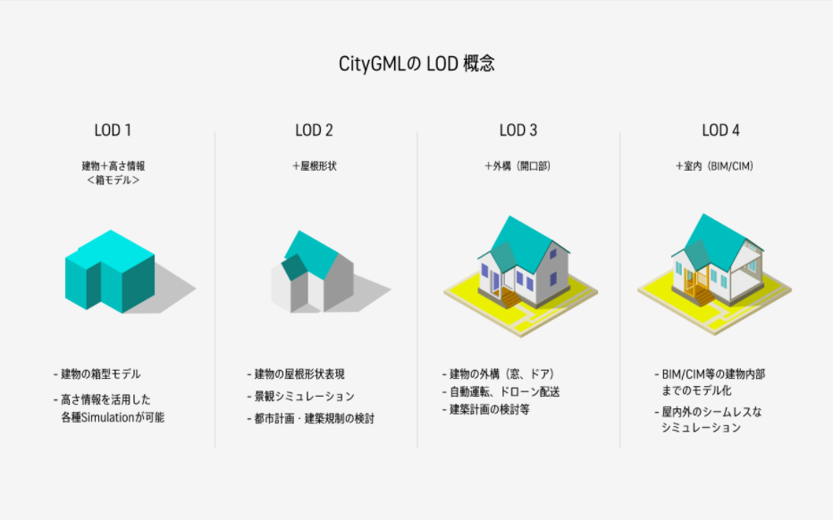
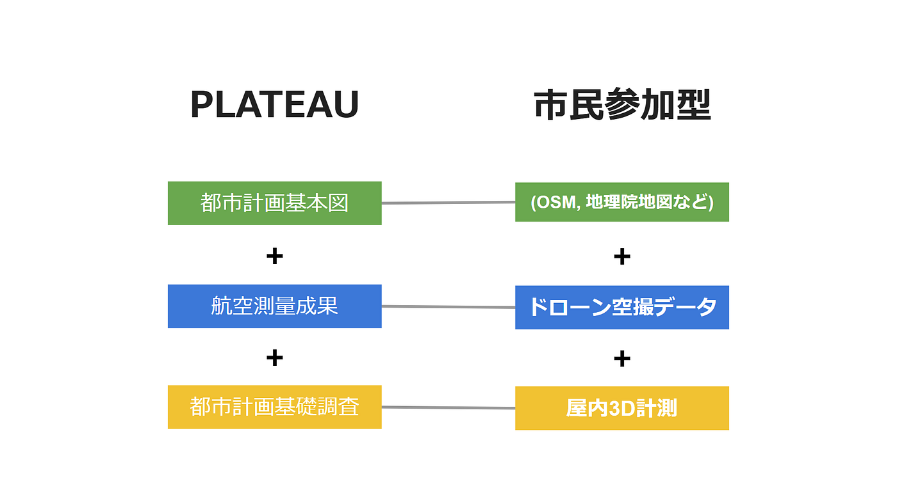
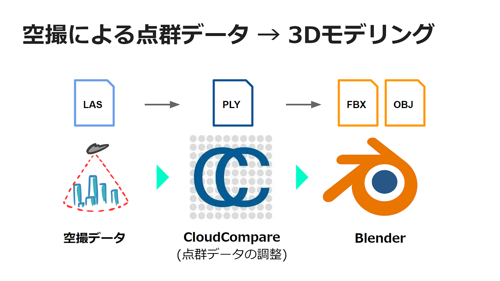
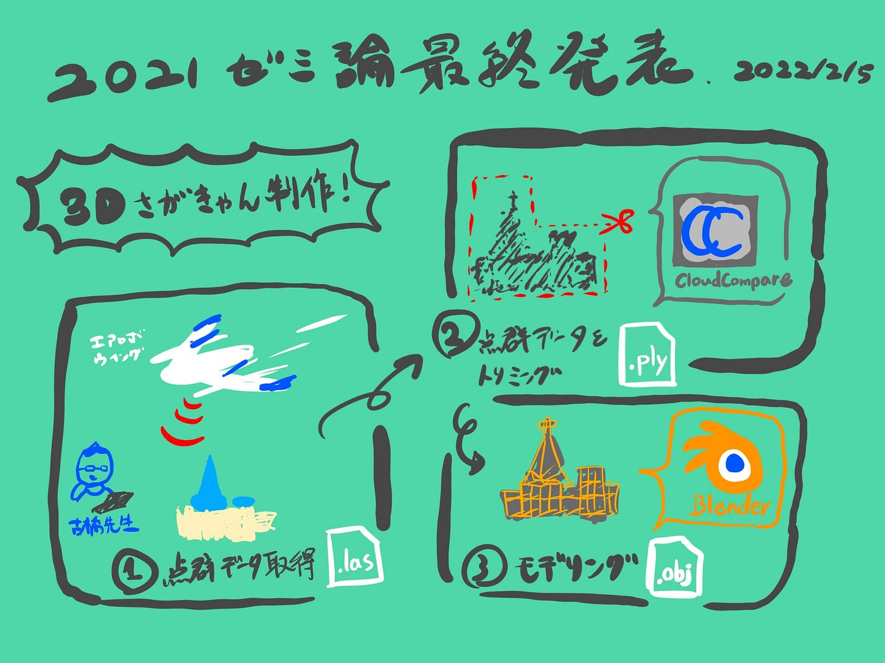

### さがきゃん3Dモデル【ゼミ論】

2021年ゼミ論最終発表

こんにちは。3年の柴山です。ゼミ論発表用記事を書きました！

論文本文は[こちら](https://github.com/furuhashilab/2021gsc_IbukiShibayama)からどうぞ！

> Introduction

日本全国の3D都市モデルデータを整備し、オープンデータとして流通させる「Project PLATEAU」は国土交通省の主導で2020年度から開始されました。PLATEAUのデータ整備は規模が大きくてもコストを低減させることが可能で、2021年8月に整備対象の56都市分の3D都市モデルのオープン化が完了しています。しかし、LOD1と呼ばれる、建物と高さの情報（PLATEAU Learning）のみが登録されているものが多く、さらに詳細なLOD2以上のデータ整備が課題となっています。そこで今回は、PLATEAUの整備フローを参考に、市民が参加できるような3D都市データの整備方法を検証し、成果物をオープンデータ化していきます。

> Methods

PLATEAUの整備フローを参考に、市民が貢献できるフローを以下のように考案しました。

今回の研究では、ドローンによる点群データの取得、そのデータを基にしたモデリング、モデルのオープンデータ化の工程を実践しました。

> Results

C棟ウェスレーチャペルのLOD3相当のモデルが完成し、GitHubとSketchfabでCC-BY-4.0のライセンスで公開した。

また、Glitchを利用してA-frameをコーディングし、マーカーベースARで表示できるようにした。

> Discussion

以下、それぞれの工程で発見した課題です。

**①データの取得について**

エアロボウイング以外のドローンでもモデリングに必要最低限な点群データを取得できるのか検証する必要がある。

**②データの調整について**

データが大きすぎると保存やエクスポートでエラーが出てしまう。

**③モデリングについて**

想定していた以上に時間がかかった。早期から作業を進めるようなスケジューリングが必要だった。

Blenderは無料だが、使いやすさという点で市民参加型の整備方法として適切かどうか、第三者の視点からも検証が必要である。

> Conclusion

今回は市民参加型の3D都市モデルの整備フローを考案し、まずは自ら実践するというスタンスで臨みましたが、今後は他の手法やツールとの比較、他者による試験的な実践が必要だと感じました。また、データを作るだけでなく、オープンデータとして公開し、どのように応用していくかについても構想を練っていきたいです。特に、VR東大やバーチャル渋谷のような仮想空間の共有や、キャンパスのモデルを利用したハッカソンの開催などを計画していく予定です。

> スライド

> グラレコ

> Github レポジトリ

[GitHub - furuhashilab/2021gsc_IbukiShibayama: 2021年度古橋ゼミ論用レポジトリ
2021年度古橋ゼミ論用レポジトリ 2021年度 ゼミ論文 青山学院大学 地球社会共生学部 地球社会共生学科 柴山息吹/IBUKI SHIBAYAMA 学生番号 1A119084 指導教員 古橋大地 教授 © Furuhashi…github.com](https://github.com/furuhashilab/2021gsc_IbukiShibayama)
