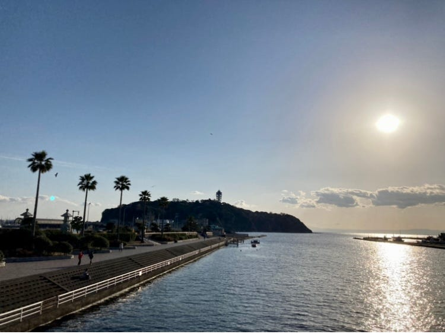
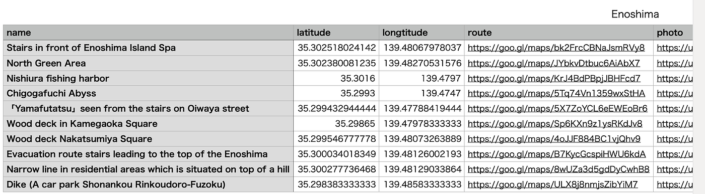
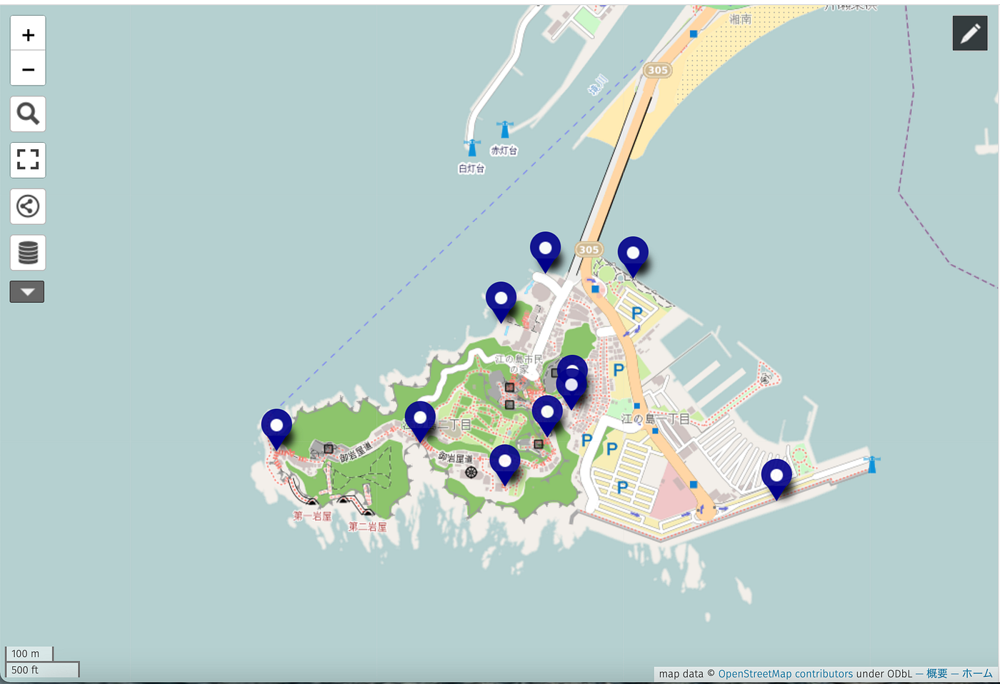
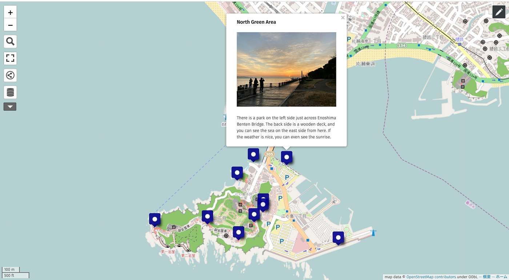
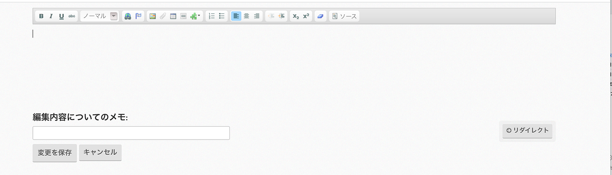
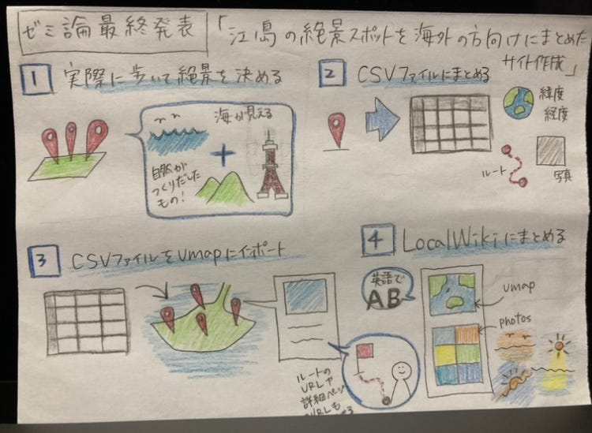

### ゼミ論 Enoshima

こんにちは、4年の八尋舞美です。

ゼミ論の最終発表の記事を書かせていただきます。

**Introduction**

今回の私のゼミ論のテーマは「江の島の絶景スポットを海外の方向けにまとめたサイト作成」です。

基本方針

・テーマを絶景に絞る。

- 英語でまとめる。対象は江ノ島に訪れた海外の方、実際には来れないけど江ノ島の絶景を見たい海外の方とする。

- 各スポットの場所、写真が一目で見える地図を載せる。江ノ島に訪れた海外の方が自力で各スポットに行けるように、PDFの地図ではなく正確な距離や現在地が把握しやすいWEB地図で作成する。

- 江ノ島に来たことがない人にもどんな眺めなのか伝わるように写真を多く載せていく

**Methods**

１）江ノ島を実際に歩いて絶景スポットをピックアップ

今回10ヶ所ピックアップ

２）各スポットの情報をCSVファイルにまとめる

３）CSVファイルをumapにインポートする

各スポットをクリックすると、名称、写真が出てくるようにする。写真は、{{写真のURL}}で表示することができる。詳細ページへのURL、ルートのURLも概要のところに書き込む。

４）LocalWikiにまとめていく

**Result**

[The beautiful scenery of Enoshima
This page introduces the beautiful scenery of Enoshimaja.localwiki.org](https://ja.localwiki.org/fujisawa/The_beautiful_scenery_of_Enoshima)

**Discussion**

今回の作成結果として、各スポットをデジタル地図に写真と共にまとめたことで、PDFのイラストマップと比較して、より正確な位置やその場の様子を把握しやすくなったと考える。しかし今回の課題として挙げられるのは、天気や時間帯によってそこから見える景色は大きく変わってしまうという不確定な部分である。必ずしも写真のような景色が見えるとは限らない。違う時間帯ごとにどんな景色が見えるのか調査し、写真のような景色が見える時間帯を特定すれば、より分かりやすくなったのではないかと考える。

**Conclusion**

今回のゼミ論を通じて、同じ海の景色でも場所によって見え方が全然違うことに気がついた。また去年は立ち入り禁止だった場所が行けるようになっていたり、去年行けた場所が立ち入り禁止になっていたりしてるところが何ヶ所かあった。今後さらに海外の方に江ノ島の絶景を伝えるためにもこまめに更新し、こういった変化にも対応できるようにしていきたい。

**発表用スライド**

**ゼミ論リポジトリ**

[GitHub - furuhashilab/2021gsc_MamiYahiro
2021年度古橋ゼミ論用リポジトリ 八尋舞美 青山学院大学 地球社会共生学部 地球社会共生学科 八尋舞美/Mami Yahiro 学籍番号 1A118170 指導教員 古橋 大地 教授 © Furuhashi…github.com](https://github.com/furuhashilab/2021gsc_MamiYahiro)

**参考文献**

[古橋ゼミ卒論2019-2021参考文献・参考資料リスト（八尋舞美）
Templete ID,大分類,中分類,小分類,著者,発行年,最終更新日,タイトル,雑誌名,雑誌号数,該当ページ,出版社,ISBN,URL,URL4archives,閲覧日,MEMO1,MEMO2 論文,査読つき 論文,査読なし 書籍…docs.google.com](https://docs.google.com/spreadsheets/d/1MxDfNtNdVV5fGdWIDxwt9DxHjt-asm9imttNbXWchT8/edit#gid=0)

グラレコ

