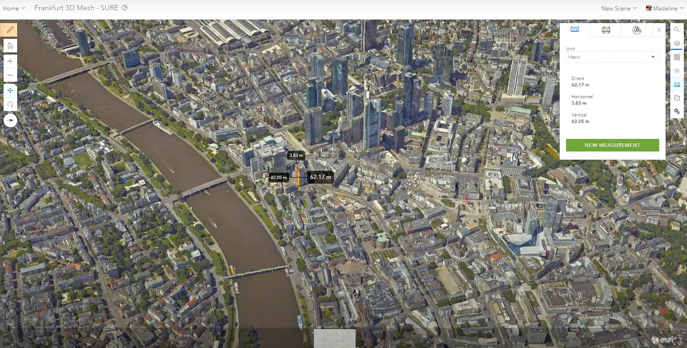
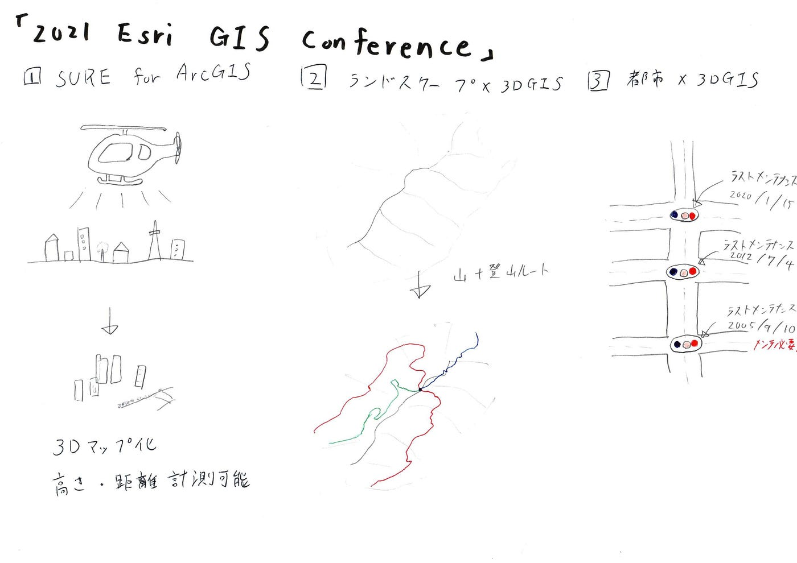

### 国際会議（2021 Esri Federal GIS Conference）

こんにちは、四年の木多祐太です。

今年もコロナウイルスの影響で、対面の国際会議に参加することはできず、Esriが主催するオンデマンド方式の「[2021 Esri Federal GIS Conference](https://www.youtube.com/watch?v=P0EhlvvEPMo)」に参加してきました。

その中から、今回の国際会議の中で最も興味を惹かれたMadeline Schuerenさんの「3D Raelity GIS」というセクションについてお話ししようと思います。

このセクションでは、都市・建物・ランドスケープにおいて3D GISがどのように役に立つのかを説明しています。

まず、新しい処理技術である「SURE for ArcGIS」を使った[フランクフルトの3D地図](https://www.arcgis.com/apps/instant/3dviewer/index.html?appid=2d25155c46dc4361887118885b747894)が出てきました。

これらは、航空機が撮影した800枚以上の二次元航空写真から作成されたもので、ズームをしてもとても繊細で、これらの点群データから建物の高さなども図ることが可能だそうです。

次にランドスケープについてです。ここからは山の3Dキャプチャについての説明が始まりました。まず剥き出しの地表や斜面を表示した後に、雪が覆い被さった冬場に撮影されたオルソモザイクをオーバーラップします。そして最後に登山道とスキーコースを表示させます。

おそらくですが、ここで強調したかったのは標高データからポイント、ライン、ポリゴンなど、ありとあらゆるGISデータを融合させることが出来るということでしょう。

最後に出てきたのはデンバーの3Dメッシュです。先程のフランクフルトと同じようにとても解像度の高い3D地図が出てきたと思えば、街中にある信号機をクリックすると、最後にいつ点検されたかの日にちが出てきました。

このように、3DGISは様々な情報を重ね合わせることで、それら単体よりも何倍の価値もある情報に生まれ変わらせることが出来るというものでした。

今回感じた事としては、現在国土交通省と東京都が共同で進めているプラトーなどにおいて、3DGISとリアルタイムのデータの融合がもっと進んでいけば、今までとは比べ物にならないほどの情報量を得ることが出来ると感じました。

### グラレコ

