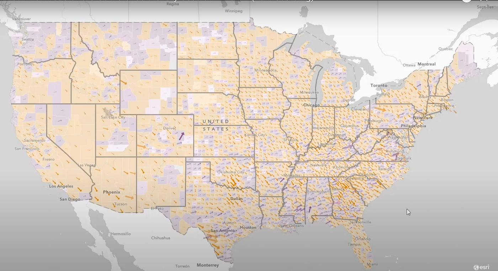
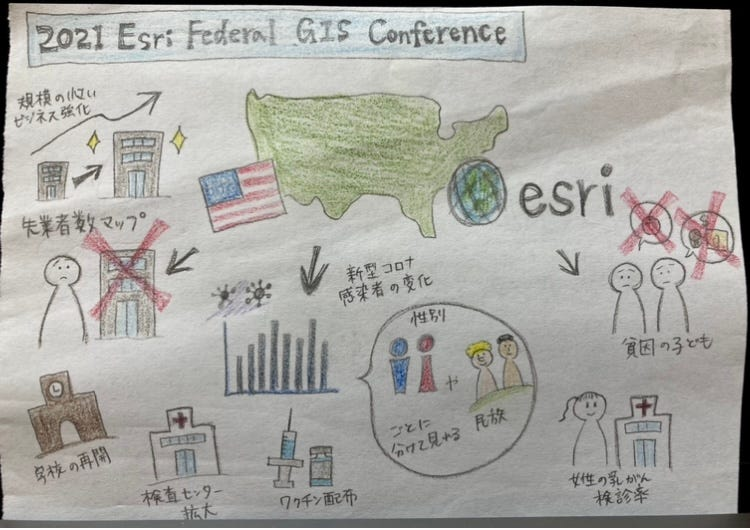

### 国際会議参加報告

こんにちは、4年の八尋舞美です。

オンデマンド形式で参加したEsri主催の「2021 Esri Federal GIS Conference」の参加報告をさせていただきます。

今回の話の中で特に印象的だった、様々な場面におけるマップの活用 について書かせていただきます。

今回お話ししてくださったのはカリフォルニアで公共政策マップチームに携わっているDianaさんです。Esriの公共政策マップのコンテンツは数百と増え続けています。そしてこれらのデータはArcGIS Onlineのスマートマッピングによってより明確に、効果的に伝えられています。

現在アメリカでは気候変動、人種、経済回復、新型コロナウイルスなど様々な問題を抱えており、それらの問題の解決にこれらのマップが活用されています。一つ例として、新型コロナウイルス感染者数の変化の大きさを示したマップが挙げられます。これらの情報はワクチン配布、検査センターの拡大、学校の再開など様々なところで重要な役割を果たしています。そしてこれらのデータは年齢や性別、民族ごとに分類して表示することもできます。これにより人種や性別などによる偏った評価を防ぎ、公平な評価を促します。

もう一つの例は、労働統計局から出される失業者数を示したマップです。これは、規模の小さいビジネスや労働力をどう強化していけば良いか考える上で重要な情報になります。

このほかにも貧困層の子供の割合を示したマップや、女性の乳がん検診率を示したマップなど様々な情報が共有されています。今回話されていたEsri Maps for Pubric Poricyを実際に自分でも見て、自分が知らなかったところでのマップの活用を知ることができました。

グラレコ

