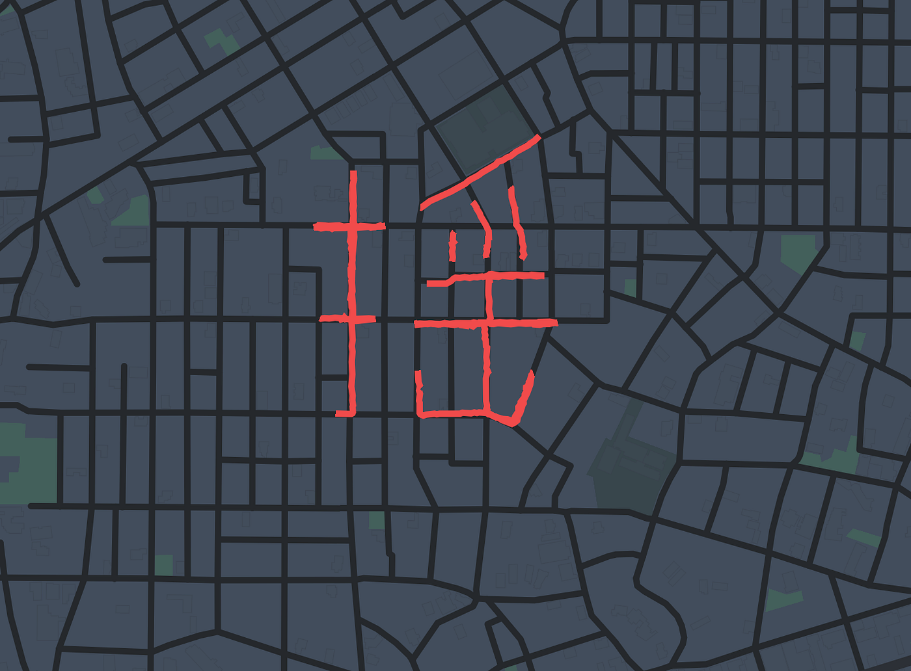

### 「新宝島」ついに完成

4年の日向野邦春です。

今回はゼミ論の最終発表をさせていただきます。

もう何度も書いているのでみなさんご存知だと思いますが、私のゼミ論は「GPS Drawingで新宝島を表現」です。プロジェクトの概要についてはこちらのブログをお読みください。

結論から言いますと、動画で使用する全ての文字を書き終えることができました。。。本当に長かったです。私だけでなく、ゼミ生の同期や後輩、海外のサカナクションファンにも協力してもらいました。そして何より、GPS Drawingを指南してくださったYassanへの感謝は尽きません。

現時点では動画はまだ完成しておりませんが、発表までに必ず完成させます。

この１年を通して自分のGPS Drawingスキルが非常に上がったのを感じました。最初はYassanに数文字プランニングしてもらっていましたが今では公園でフリーハンドで描けるようになりました。

#### 最終的に使用したツール

なんだかんだで今回はMapbox Studio,GL JS,を使ってStorytellingを使いました。そしてオープニングとエンディングに関してはAfterEffectsのGeolayers3というプラグインを使用して動画を作成しました（現在進行中）
