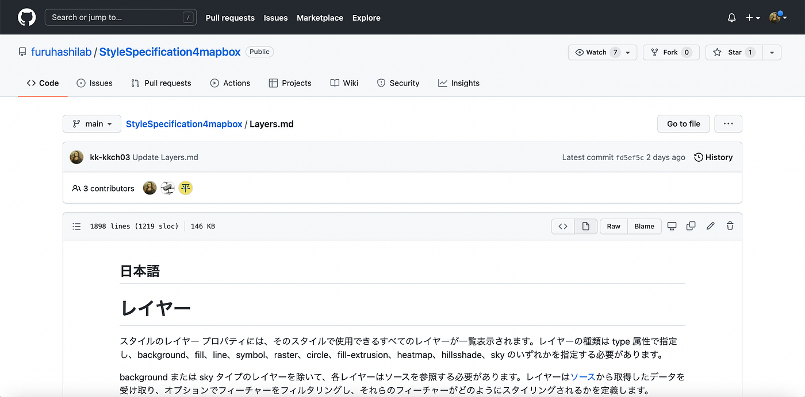
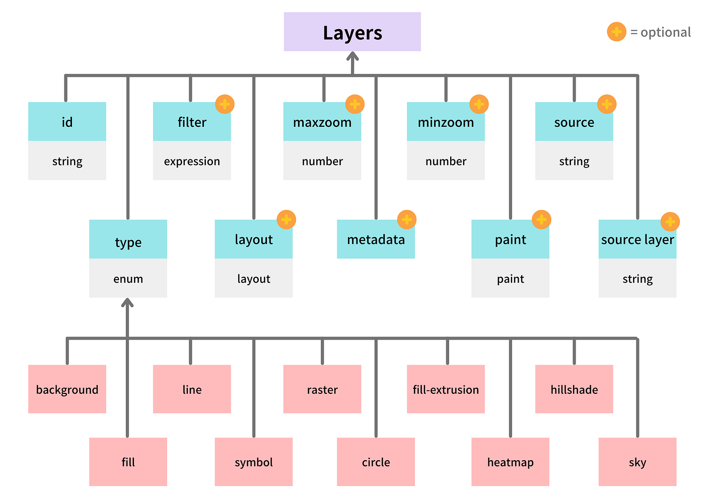
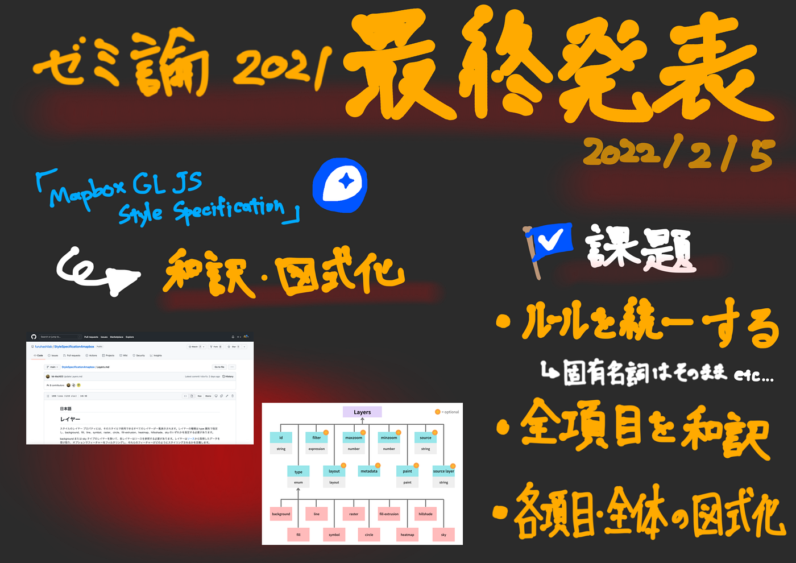

### 【2021年度ゼミ論】「Mapbox GL JS」Style Specificationの日本語訳作成と図式化

3年の菊池です。2021年度のゼミ論の概要をお話しさせていただきます！

### 初めに

1970年代、四分木（Quadtree)というデータ構造が生まれてから今日に至るまでデジタルマップは進化を続けてきました。2005年にラスターピラミッドの機能を持ったラスタータイルマップの決定版であるGoogleマップがリリースされると、2006年にOpenLayers、2011年にLeafletが開発されます。これらはオープンソースのウェブ地図ライブラリです。さらに、Leafletを開発したVladimir Agafonkin氏がMapboxに加入し、2014年、ベクタータイルマップに対応したオープンソースライブラリである「Mapbox GL JS」がリリースされました。これは、2020年のv2.0への移行に伴って独自ライセンス化しますが、そのフォークとしてMapLibreが開始しました。

デジタル地図は進化を続け、現在では非常に速く、軽量で、自由な地図開発が可能になりました。ですが、地図開発において重要なドキュメントの多くは日本語対応していません。私は、日本でより多くの人が地図開発を行えるようにこれらのドキュメントを日本語に翻訳していく必要があると思い、本研究に至りました。

また、ドキュメントの構造は分かりにくいです。先に全体像を図で見ることができれば非常に楽だと思います。

今回、私はタイトルにある通り、「Mapbox GL JS」のStyle Specificationで特に重要な項目であるLayersの日本語訳を作成し、その概要を図式化しました。

### 成果物

### 今後の課題

翻訳の結果はまだまだ完成とは言えず、ルールが曖昧です。今後他のドキュメントを作成する上でも、Markdown形式日本語訳作成ルールを整備していけたらと思います。

そして、まだ残りの項目も完成していないので随時更新していきます！

#### グラレコ

#### スライド

#### Githubレポジトリ

[GitHub - furuhashilab/2021gsc_Kohki_Kikuchi
菊池洸希の2020年度ゼミ論用レポジトリ 地球社会共生学部 地球社会共生学科 3年A組63番 学籍番号：1A119059 氏名：菊池洸希 指導教員：古橋 大地教授 ©︎Furuhashi Laboratory/Kikuchi…github.com](https://github.com/furuhashilab/2021gsc_Kohki_Kikuchi)
