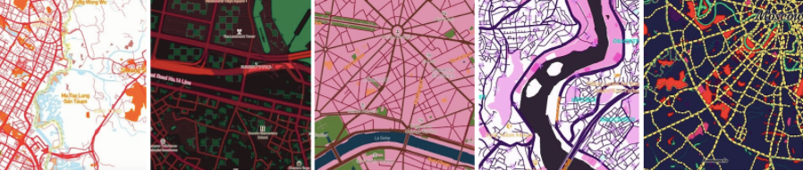
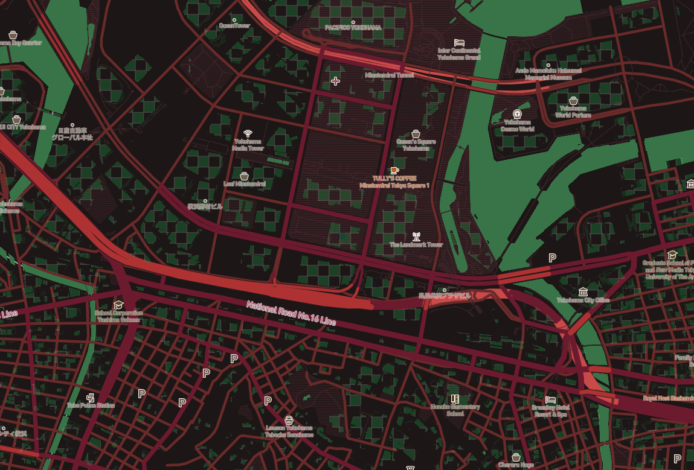
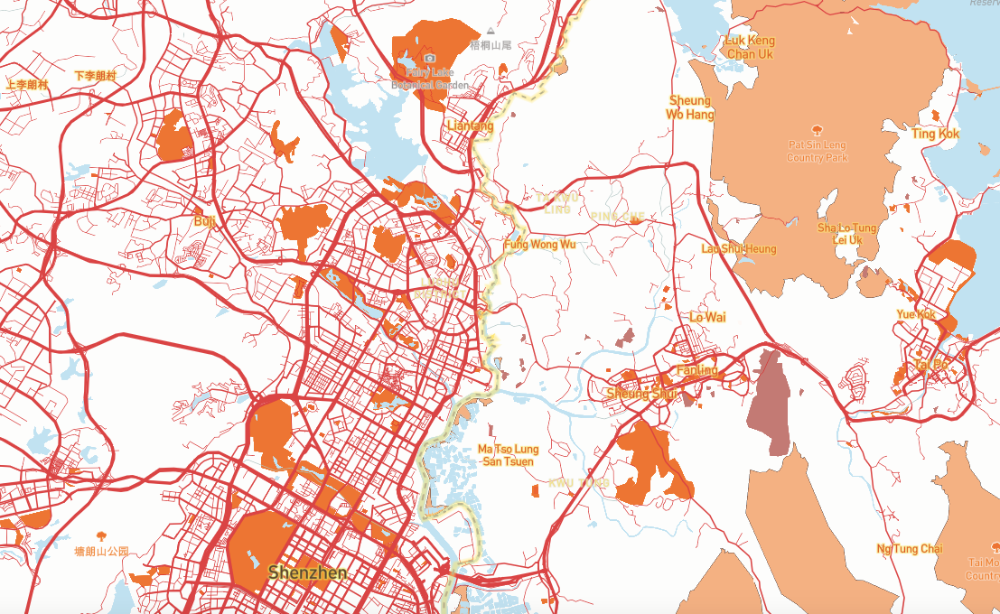
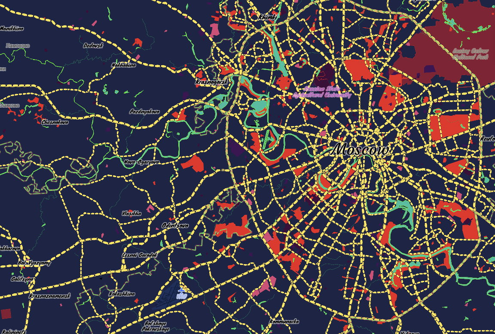
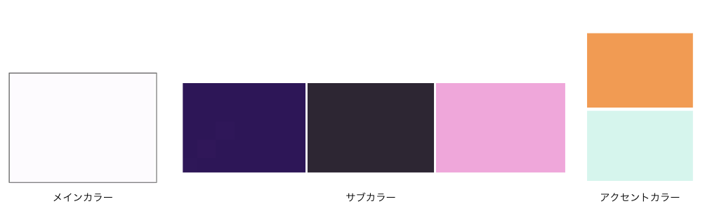
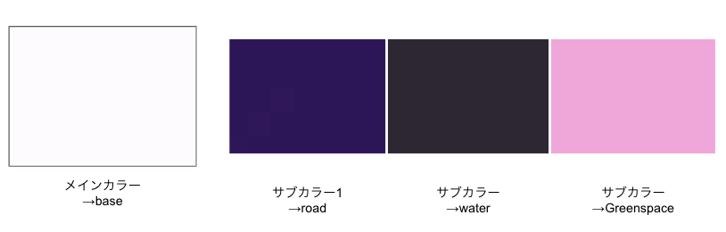
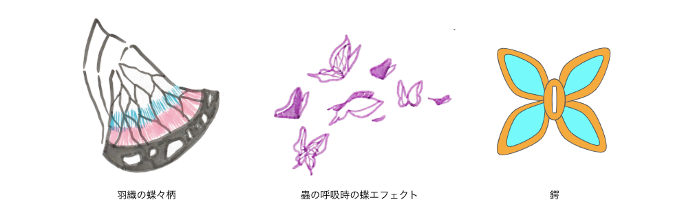
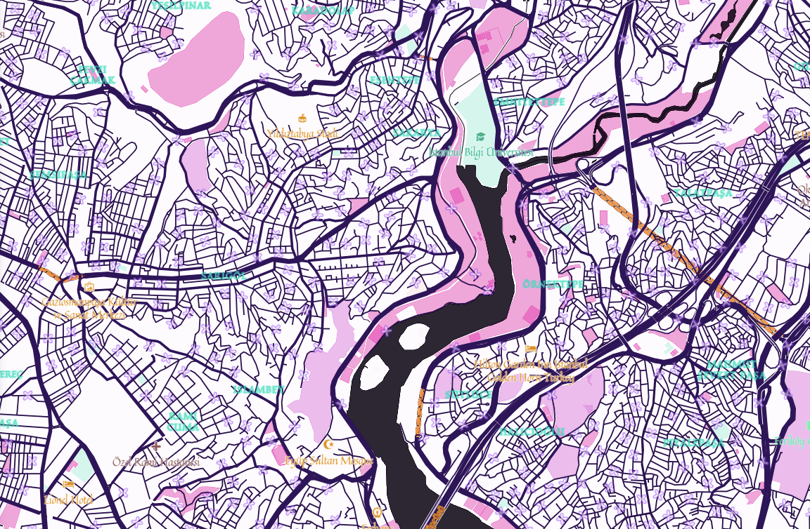
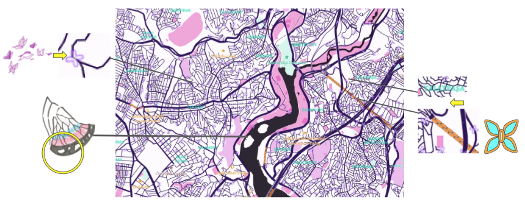
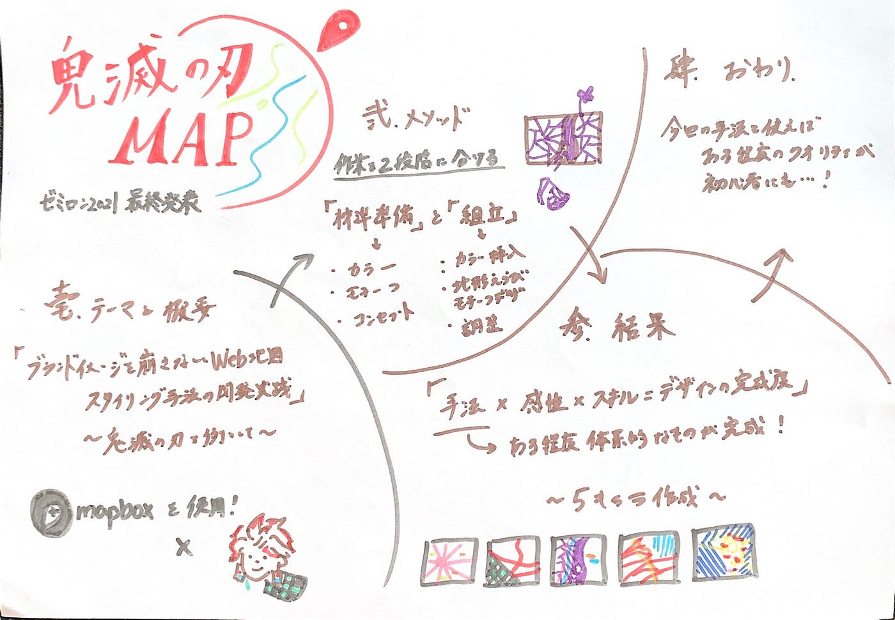

### 【完】鬼滅の刃風MAP

遂に…鬼滅の刃風MAPとそのスタイリング手法開発が終了しました！

こんにちは、３年の斎藤 祐花です。
今回は2020年度より行なっているゼミ論「 ブランドイメージを崩さないウェブ地図スタイリング手法の開発と実践 ～鬼滅の刃を例として～」の最終報告をしたいと思います。

ゼミ論のテーマを軽く説明すると、
企業イメージや作品のブランドイメージを崩さないweb地図の制作・スタイリング手法を、地図デザインツール[Mapbox Studio](https://www.mapbox.jp/mapbox-studio)を使用して鬼滅の刃のキャラクターぽい地図を実際に作成しながら開発しよう！というものです。

まずお先に成果物である鬼滅の刃風MAPを一挙公開させてください！

> 成果物

[竈門禰豆子デザイン](https://api.mapbox.com/styles/v1/yukasaito/ckk2nghbv3mq917lewdd4eyut.html?fresh=true&title=view&access_token=pk.eyJ1IjoieXVrYXNhaXRvIiwiYSI6ImNrZDYxdjRzcTFrN2wycW8zNnBvZndwcGEifQ.rblEBet0xcsjyEvxDI1SzQ)

[竈門炭治郎デザイン](https://api.mapbox.com/styles/v1/yukasaito/ckw0wlstu980c14pl5nwn4uyo.html?title=view&access_token=pk.eyJ1IjoieXVrYXNhaXRvIiwiYSI6ImNrZDYxdjRzcTFrN2wycW8zNnBvZndwcGEifQ.rblEBet0xcsjyEvxDI1SzQ&zoomwheel=true&fresh=true#15.32/35.454896/139.631341/44.8)

[胡蝶しのぶデザイン](https://api.mapbox.com/styles/v1/yukasaito/ckk2i5son0cv017p3t034mk0m.html?fresh=true&title=view&access_token=pk.eyJ1IjoieXVrYXNhaXRvIiwiYSI6ImNrZDYxdjRzcTFrN2wycW8zNnBvZndwcGEifQ.rblEBet0xcsjyEvxDI1SzQ)

[煉獄杏寿郎デザイン](https://api.mapbox.com/styles/v1/yukasaito/ckk2p8f233odv17nzpgpn4hzz.html?fresh=true&title=view&access_token=pk.eyJ1IjoieXVrYXNhaXRvIiwiYSI6ImNrZDYxdjRzcTFrN2wycW8zNnBvZndwcGEifQ.rblEBet0xcsjyEvxDI1SzQ)

[宇髄天元デザイン](https://api.mapbox.com/styles/v1/yukasaito/ckyy075a8007a15ldalvo56q9.html?title=view&access_token=pk.eyJ1IjoieXVrYXNhaXRvIiwiYSI6ImNrZDYxdjRzcTFrN2wycW8zNnBvZndwcGEifQ.rblEBet0xcsjyEvxDI1SzQ&zoomwheel=true&fresh=true#9.93/55.7684/37.5012/20/52)

ゼミ論を始めた当初はとりあえず完成形は１キャラでいいかな。なんて思っていたのですがとにかく作るのが楽しくて…アニメ２期もはじまって世間的にも盛り上がりが再熱してるので夢中になり天元含む５キャラも作成しちゃいました。
ちなみに自信作はネズコとシノブです。
再現度も自分的には高く、華やかなので…。

> 制作方法（ざっくりと）

#### 詳しく制作方法を知りたい！
ってかたは[コチラ](https://github.com/furuhashilab/2021gsc_Yuka-Saito)にまとめましたので是非ご覧ください。

合わせてMapbox Studioの使い方がざっくり知れる[コチラの記事](https://blog.mapbox.jp/n/nb2fabcd3b43e)も読んでいただくと分かりやすいと思います！

もし鬼滅のキャラこんなの私も作りましたみたいなことがあれば是非私のtwitterにDMください。笑（@yuka_s_jpn）

— — — — — — — — — — — — —

お料理ぽく制作方法を考えて見ました。（私は料理できません。）

まず材料は以下の３つです。

#### 「材料の準備」-要素や素材あつめなどの下準備-

① イメージカラー (メインカラー 1個 サブカラー2,3個 アクセントカラー 2,3個 )
② モチーフ; そのキャラクターを代表するような柄やアイテムなど ( 2,3個 )
③ その他の要素; 性格や雰囲気などを形容詞化したコンセプト

そのままレシピも下記に載せます。

#### 「組立」 — 材料を地図デザインに落とし込む方法と手順 -

STEP1: カラー挿入 （①を地図に反映させる）
STEP2: 地形選びとモチーフデザイン （②を地図上に落とし込む）
STEP3: 細かな調整（③をもとにフォントや色を調整）

— — — — — — — — — — — — —

１つづつみていくと本文の長さがものすごいことになるのでざっくりご説明すると、①は公式キャラ設定集と公式グッズを参考にキャラの服や瞳の色や髪の毛からそれぞれ色を抽出します。しのぶさんを例にするとこんな感じ↓

それを地図上にあるカテゴリ別で振り分けていきます。割り当ての方法としては左のメインカラーから順に使用範囲が広いところに使っていく感じです。

とりあえずメイン→base, サブ→road/waterが安定です。アクセントカラーは初めの段階では割り当てず、地形選びが終わった時くらいにモチーフデザインとの相性を考えながら入れていきます。

次に、モチーフの収集方法と地図上でのデザイン方法です。モチーフはとりえずキャラのシンボル的なアイテムや特徴的な装飾やエフェクト（戦う系の作品であれば）から何個かまとめておきます。しのぶさんだと、

なんと言っても「蝶々」。ただ同じ蝶でも種類もあって、白ベースに桜色とエメラルドグリーンのグラデが特徴的な羽織とエフェクトの藤色の蝶々とかなり簡略化された蝶の形をした鍔の３つがあります。（髪飾りは羽織と構成要素が似てるのと他の蝶モチーフのデザインと喧嘩しそうなので省きました）
中でも印象の７割くらいを占める（感覚）羽織の蝶々感を表現する為に
複雑な線が入り組んだところ且つカラフルに仕立てたいのでいろんなカテゴリが集約しているエリアを選びました。その結果がトルコのイスタンブル 。ポイントは羽織の裾の深い紫色部分の感じが皮で表現できたこと。

他のモチーフがどうやって地図デザインに組み込まれているかは下の画像をご覧ください！モチーフが何で色や線などどんな要素で構成されているかをしっかり観察し、地図のこれに見立てよう！という意識でやります。

そして最後フォントや色味の調整ですが、これは③のコンセプトに添いながら行います。コンセプトはそんな壮大なものでなくて大丈夫です。そのキャラを知らない人に「どんなキャラクター？」聞かれた時に返すその言葉がコンセプトにあたります。しのぶさんだったら華奢で華やかでミステリアスで、、とかそんな感じです。
それをもとに繊細さを表現できるような細い線で曲線が華やかなフォントを選んだり、カラフルでありながらもミステリアスな印象を作る為に紫を基調としたグラデを意識して統一感をだしたり、、と最終調整します。

これで完成！

> 最後に

やっぱりどのデザインも結局、これに沿ったら絶対いいものができる！的なマニュアルのようなものは作れません。

今回地図デザインをしてみてデザインは「手法×感性・感覚×スキル」で作られるものだなと思いました。

なので今回確立させたある程度のハウツーである手法がみなさんの役に立ち、完成やスキルに自信がなくても地図デザに取り組みやすくなればいいなと思います。

ここまでいろんなアドバイスを下ったゼミ生の皆様とご指導とアイディアをくださった古橋先生、本当にありがとうございました。

> 関連資料

2021年度レポジトリ（制作マニュアルにもなってます）：
[https://github.com/furuhashilab/2021gsc_Yuka-Saito](https://github.com/furuhashilab/2021gsc_Yuka-Saito)

旧版2020年度レポジトリ：[https://github.com/furuhashilab/2020gsc_YukaSaito](https://github.com/furuhashilab/2020gsc_YukaSaito)

参考資料：[https://docs.google.com/spreadsheets/d/1AQOKlf3PrHLxROyGEIvP08MMFDqMS1xr7-e97pEbLLE/edit?usp=sharing](https://docs.google.com/spreadsheets/d/1AQOKlf3PrHLxROyGEIvP08MMFDqMS1xr7-e97pEbLLE/edit?usp=sharing)

グラレコ

