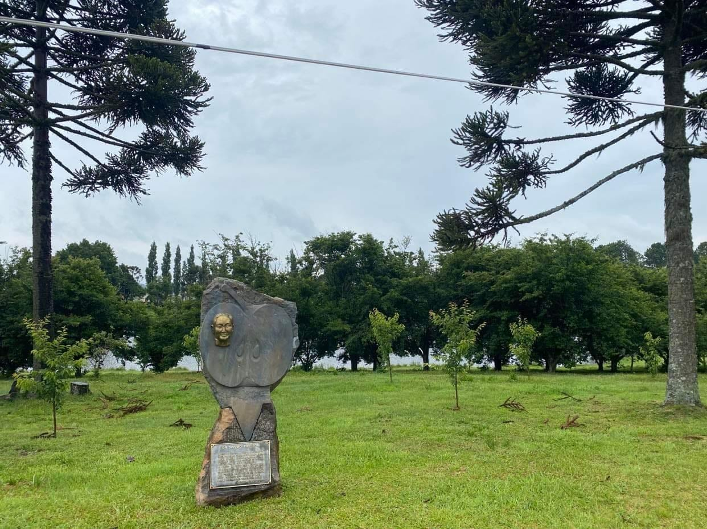
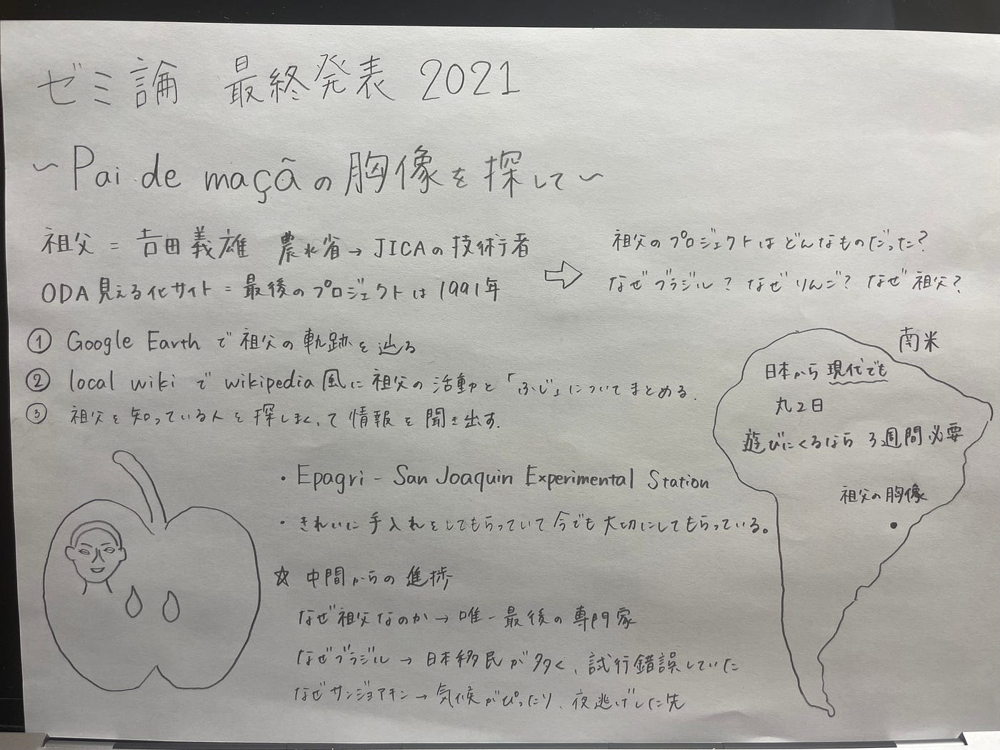

### 2021年度 ゼミ論 最終発表

**テーマ：祖父の胸像の位置を特定する**

### Introduction

今回のゼミ論では祖父の胸像の位置を特定し、祖父がどのような背景でブラジルに渡航することになったのかを調べる。 当時、ブラジルという異国の地になぜ祖父がなぜブラジルに行くことになったのか、現地でどのような暮らしをしていたのかが知りたい。 自分が生まれる前に現地で肺炎に罹り亡くなっているため、防ぐことはできなかったのか、会って話を聞いてみたいと感じた。 途上国支援がしたいと思い、地球社会共生学部に進学した。その理由は祖父の存在があったからだ。AO受験で入学した私はかなり祖父にお世話になった。その経緯を知りたい。 自分の原点である祖父の存在を追いかけたいと感じ、3年生の時から継続でこのテーマに決定した。

### JICAやODA見える化サイトの現状

ODA見える化サイトに書いてあるプロジェクトは全てはないことが判明。 一番昔のプロジェクト報告inブラジル→1991年 1991年から1999年にかけて報告されている件数は8件→ほとんどが川の灌漑事業 祖父が残したものを可視化させたい

### Methods

作業は大きく分けて４つ

#### ①祖父について調べまくる

JICAの報告書を読む

歴史的背景を探る

#### ②Google Earthで軌跡を辿る

#### ③local wikiで活動をまとめる

#### ④祖父のことを知っている人に話を聞きまくる

・Mario Sato様

・Olga Sekiguchi様

・Manaka Otani様

・葛山様

後ほどResultで

### Result

① ・JICAの報告書 [https://libopac.jica.go.jp/images/report/11281524_01.pdf](https://libopac.jica.go.jp/images/report/11281524_01.pdf) [https://libopac.jica.go.jp/images/report/11285400_01.pdf](https://libopac.jica.go.jp/images/report/11285400_01.pdf) [https://libopac.jica.go.jp/images/report/11340338_01.pdf](https://libopac.jica.go.jp/images/report/11340338_01.pdf)

・歴史的背景 1888年にブラジルの奴隷制度が廃止→労働者不足に 日露戦争に勝利した日本は賠償金を得ることができず経済的に国が困窮→政府が国民を突き放す ⇨需要と供給の一致→サンパウロと契約を締結し多くの移民を日本から送り出した 移民は自分の農地が持てる、少しの期間働けばお金持ちになって帰って来れると唆される 1908年から移住を開始 当時は１ヶ月半もの間の船旅 6月18日「日本移民の日」日本移民史料館 最初はとても苦労をした→荒れ果てた農地 全て１から 挫折や夜逃げも経験 by Sekiguchi様 最後にたどり着いたのがサンジョアキン そこも荒れ果てた農地だったがリンゴ農家が増えていく 試行錯誤していた日本人を助けたのが祖父→日本語は通じる人は多く勤勉でとても楽しそうだった

とても温厚で優しい人。しかし白黒ハッキリさせたい人でもある。
22年続くプロジェクトで最後の専門家

②
 [https://earth.google.com/earth/d/1pmJ8GG5qnlr76OEAlGPNSfOds-wLafIY?usp=sharing](https://earth.google.com/earth/d/1pmJ8GG5qnlr76OEAlGPNSfOds-wLafIY?usp=sharing)

③ [https://ja.localwiki.org/agu/Pai_de_ma%C3%A7%C3%A3%E3%81%AE%E3%83%97%E3%83%AD%E3%82%B8%E3%82%A7%E3%82%AF%E3%83%88](https://ja.localwiki.org/agu/Pai_de_ma%C3%A7%C3%A3%E3%81%AE%E3%83%97%E3%83%AD%E3%82%B8%E3%82%A7%E3%82%AF%E3%83%88)

④

（①）Mario Sato様

・今も胸像は無事 手入れもされている ・佐藤さまは当時とても幼かったため、記憶が少し曖昧 ・現地に祖父と活動していた方がまだご存命 ・リンゴの栽培は本当に多くのブラジル人とブラジルを救った

（②）Olga Sekiguchi様 父「大きく何かを作ってみたい、大きな農園を持ちたい」→父母がブラジルに移民として渡航 農地は荒れ放題→全て１からやることに→挫折や夜逃げも経験 自分たちの世代（二世まで）は大学に通うことすらできなかった。 小学生の時からアルバイトをし、学費含めて生活費は自分で工面していた。 少しずつ裕福な家庭が増え、盗みなどの犯罪がなくなり、当初よりかなり治安が良くなった。 日本人一世の人たちはリンゴ農園がどれだけ大変なのかを理解している。 祖父は現地の人たちにとって神様のような存在 りんごに対してとても一生懸命 今となってはブラジル人が多いが当時はほとんど日本人で日本語も通じていた。

(③)Manaka Otani様
1963年にブラジルに移住 日本では考えられないような1日14時間の労働を強いられていた。

94年、97年~98年に祖父がブラジルへ

祖父の育成チームとOtani様の栽培チームとはあまり接点がなかったが週末などみんなでゲートボールをして楽しんだ。→リンゴの話はもちろん、日本のことなど雑談をした覚えがある。祖父のチームはブラジルについてとても知りたがっていた印象

94~00年に隣の州に出張していたため、亡くなる瞬間や記念碑の建立の時期にあまり関わることができなかったが、病気になり2度入院している間に「一度日本にお帰りになったらどうかと声をかけた」→残念に思っていること。早々に日本に帰っていれば亡くなることはなかったのではないか。→帰らなかった理由は不明

本当に優しい人だったという印象

(④)葛山様
同じ試験場で働いていた。

葛山さまが日本に研修に行っている間に祖父は亡くなった。

ものすごく小さな街のため、一緒に旅行をしたこともある。

祖父の部屋によく奥様と遊びに行って一緒にご飯を食べたこともある。

葛山さまの弟様の面倒をよくみていた。

一緒にいた研究員もまだかなりご存命。近々ブラジルに遊びにきてね。

### Discussion

・日系第一世の方々から代替わりしている →二世の方々がほとんど →日本語がほとんど通じなくなってきた。 ・関口様が5年後くらいにまたブラジルを訪れる予定 →自分の仕事が落ち着いたら一緒に行く約束をしました！ ・リンゴ農家が繁栄したおかげで大学に行くことができる子どもたちが増えたそうです。 →日本にもたくさんの留学生がサンジョアキンから訪れているみたい →どこかでお会いできたらいいなあ

### Conclusion

・祖父はサンジョアキンにとってなくてはならない存在

・ブラジル人相手かと思いきやまさかの日系人に向けての指導

・楽しい毎日を過ごしていたみたい

### 参考文献

[https://libopac.jica.go.jp/images/report/11281524_01.pdf](https://libopac.jica.go.jp/images/report/11281524_01.pdf) [https://libopac.jica.go.jp/images/report/11285400_01.pdf](https://libopac.jica.go.jp/images/report/11285400_01.pdf) [https://libopac.jica.go.jp/images/report/11340338_01.pdf](https://libopac.jica.go.jp/images/report/11340338_01.pdf) [http://malus.my.coocan.jp/mitearuku/daigi/daigi.htm](http://malus.my.coocan.jp/mitearuku/daigi/daigi.htm)

[果樹研究所 - Wikipedia
果樹研究所（かじゅけんきゅうじょ）は、かつて 茨城県 つくば市 藤本にあった 農業・食品産業技術総合研究機構（農研機構）の研究所の一つ。英語表記は National Institute of Fruit Tree Science (…ja.wikipedia.org](https://ja.wikipedia.org/wiki/%E6%9E%9C%E6%A8%B9%E7%A0%94%E7%A9%B6%E6%89%80)

[https://ja.wikipedia.org/wiki/%E6%9E%9C%E6%A8%B9%E8%A9%A6%E9%A8%93%E5%A0%B4](https://ja.wikipedia.org/wiki/%E6%9E%9C%E6%A8%B9%E8%A9%A6%E9%A8%93%E5%A0%B4) [https://theryugaku.jp/2938/amp/](https://theryugaku.jp/2938/amp/)

[https://brasiltips.com/japanese-brasil-museum/#toc3](https://brasiltips.com/japanese-brasil-museum/#toc3)

### 先行事例

### 発表スライド

### グラレコ

### プロジェクト管理

[GitHub - furuhashilab/2020gsc_SuzukaYoshida: 2020年度 古橋ゼミ論用レポジトリ
2020年度 古橋ゼミ論用レポジトリ ２０２０年度 卒業論文/ゼミ論文 ２０２０年1月25日 青山学院大学 地球社会共生学部 地球社会共生学科 吉田涼香/Suzuka Yoshida 学生番号 1A118179 指導教員 古橋 大地 教授…github.com](https://github.com/furuhashilab/2020gsc_SuzukaYoshida)
