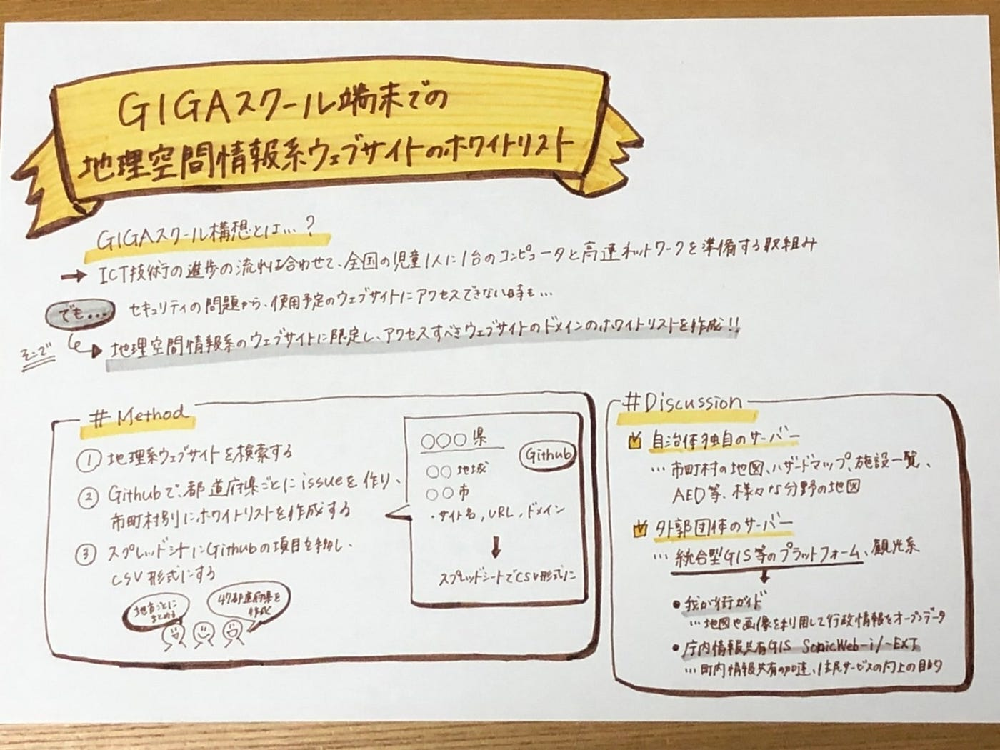

### GIGAスクール端末での地理空間情報系ウェブサイトアクセス可否とホワイトリスト作り

### Introduce

### 概要

### 本研究の内容

本研究ではGIGAスクール端末での地理空間情報系ウェブサイトアクセス可否とホワイトリスト作りを行います。 GIGAスクール構想とは全国の児童1人に1台のコンピュータと高速ネットワークを準備する文部科学省の取り組みであり、ICT技術の進歩による社会変化の流れに合わせて、小中高等学校などの教育現場で生徒がタブレット端末やパソコンを活用できるようにすることが目的です。 構想当初は、2019年度から5年間かけて整備していく予定でした。しかし、現在の整備状況は新型コロナウイルスによる影響でその必要性が高まったことによって、文部科学省の調査では全国の自治体の約95％以上で整備が完了している状況です。 しかし、前倒しになったことも一つの原因として、ICT教育の新たな課題というのも発見されています。例えば、機器整備や、教員の指導力、学習場面において、自治体ごとに異なるため、全国で格差が生まれる懸念があります。また、各自治体によるセキュリティやインターネットの容量と速度等の通信の安定性への課題についても指摘されています。このような課題がGIGAスクール構想にあることを背景として、本研究ではICT端末の格差について行います。先行事例等今までの解決策としては、機器の整備の拡充、負担を軽減しながら教員の指導力向上、柔軟なセキュリティの構築などを結論としており、一方で本研究では、地理空間のウェブサイトに限定し、アクセス可能であるべきものをまとめることが目的になっているからです。

### Method

①地理系ウェブサイトを検索する。 ②Githubで都道県ごとにissueを作り、市町村別にホワイトリストを作成する。その際、サイト名, リンク, ドメインをリスト化する。 ③スプレッドシートにGithubの項目を移し、csv形式にする。

### Result

- [Githubの47都道府県ごとのissue](https://github.com/furuhashilab/2021gsc_YunaHomma/issues)

- [全国共通のホワイトリスト](https://docs.google.com/spreadsheets/d/1tPKtBxXqiHYD1FEQbFhxBzPGzsmQOLBUE_s7ujy0gBI/edit?usp=sharing)

- [東北地方のホワイトリスト](https://docs.google.com/spreadsheets/d/1YPIrOgq48yOxapQbGBysyn8jrRr4Pb3vHvyUTb5SNrY/edit?usp=sharing)

- [関東地方のホワイトリスト](https://docs.google.com/spreadsheets/d/1zd6fYG4H_mtJaJIlpgnsrxzaJfIMTlbl10hJ6vHImWI/edit?usp=sharing)

- [中部地方のホワイトリスト](https://docs.google.com/spreadsheets/d/1nxfYpK2U7ehzR2eqKGmK1S9PT-JF1fwPGSpZEX6zbB4/edit?usp=sharing)

- [関西地方のホワイトリスト](https://docs.google.com/spreadsheets/d/1xkz8ThZncPsf8nfqdsKyf567ORbZLSWUX7BmJChrRWo/edit?usp=sharing)

- [中国地方のホワイトリスト](https://docs.google.com/spreadsheets/d/1YiR_smOQS3qCc95tFbS6g2L79wGBe1Jt-6VsPP4ZkoM/edit?usp=sharing)

- [四国地方のホワイトリスト](https://docs.google.com/spreadsheets/d/1YiR_smOQS3qCc95tFbS6g2L79wGBe1Jt-6VsPP4ZkoM/edit?usp=sharing)

- [九州地方のホワイトリスト](https://docs.google.com/spreadsheets/d/1YNUwRX9Xkz1n_tO-sz84LQBmuJpqb1qsAmLZQhdwzNk/edit?usp=sharing)

### Discussion

今回のドメインのホワイトリストを作成してみて、地図情報系のウェブサイトには、自治体独自のドメインのものと、外郭団体が運営するドメインもの、主にこの2種類がありました。 自治体のウェブサイトのサーバーを使用しているのは、市区町村の地図、ハザードマップ、施設一覧、AED等、様々な分野の地図が挙げられます。そのため、自治体独自のドメインをもつ地図が多くあり、それらの様々な分野の地図の中で、小中高生に最も見てもらいたいと思ったハザードマップを、ホワイトリストとして主にまとめています。 外郭団体が運営する地理系ウェブサイトは、統合型GISなどのプラットフォーム、観光系の2つが多く見られます。統合型GISで多くの自治体が利用しているのが、我が街ガイドのドメインが挙げられます。我が街ガイドとは地図や画像を利用して行政情報や地域情報をインターネットを通じて、公開・提供するサイトで、公開されている情報はオープンデータとなっています。 また、庁内情報共有GIS SonicWeb-i/-EXTもドメインとして多く利用されていました。町内情報共有の加速、住民サービスの向上、業務の効率化を目的としたプラットフォームです。 さらに、パスコの統合型GISのものや、自治体のウェブサイトの中でGoogle Mapを活用している場合も多数みられました。

### Conclusion

47都道府県のホワイトリストを作ってみて、自治体が確アクセス可否を確認すべき地理系ウェブサイトは、自治体独自のドメインと統合型GIS、全国共通のホワイトリストの主に3種類になると思いました。それに加えて、学習に必要な場合は、旅行系の外郭団体のウェブサイトを追加する必要があります。今回のホワイトリストで旅行マップは補えていない場合がありますので、今後追加を出来たらと思います。
最後に、作成したこれらのホワイトリストを更新するためには、個人の規模ではなく、自治体や教員の方々、地理に詳しい専門家の方々など多くの人のご協力が必要になってきます。そのため、地理系ウェブサイトに近いコミュニティに所属することが今後必要になってくると思いました。

グラレコ

