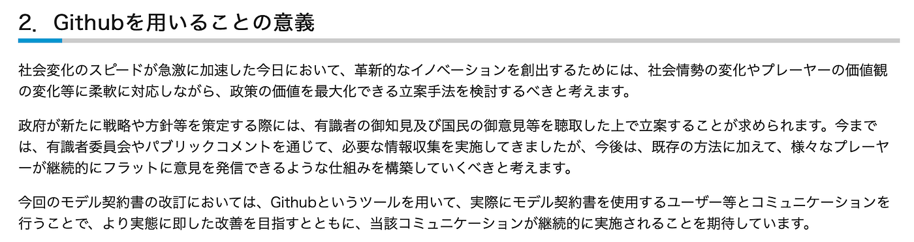
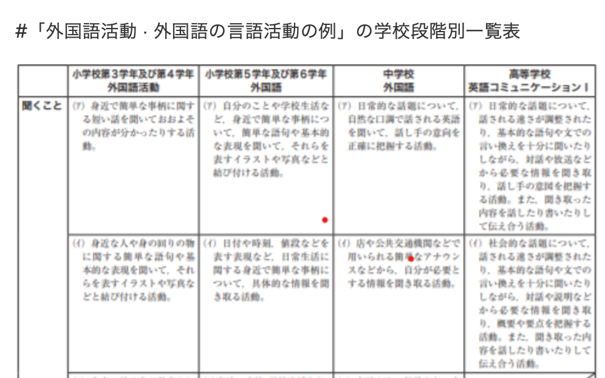
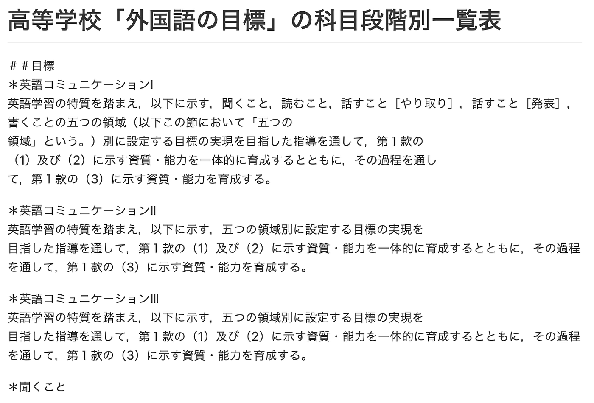
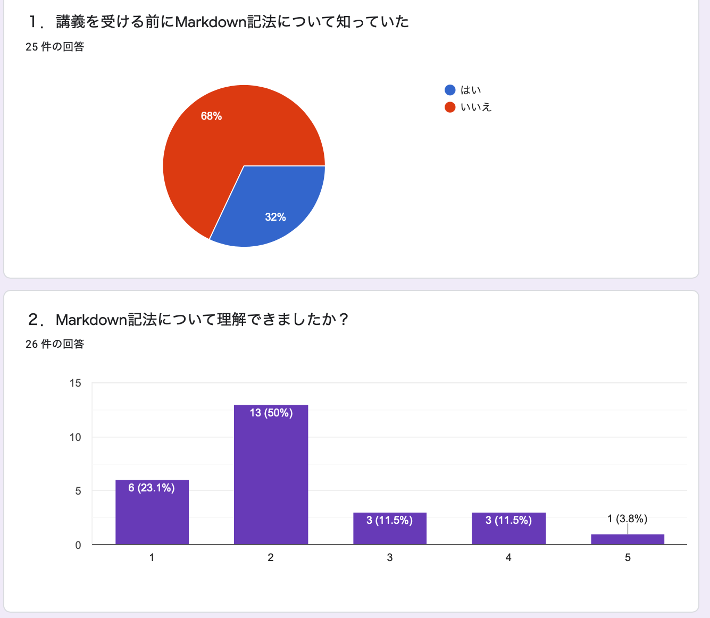
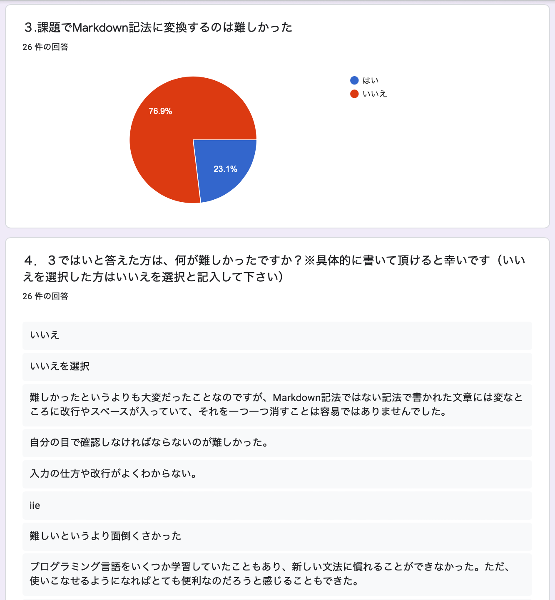
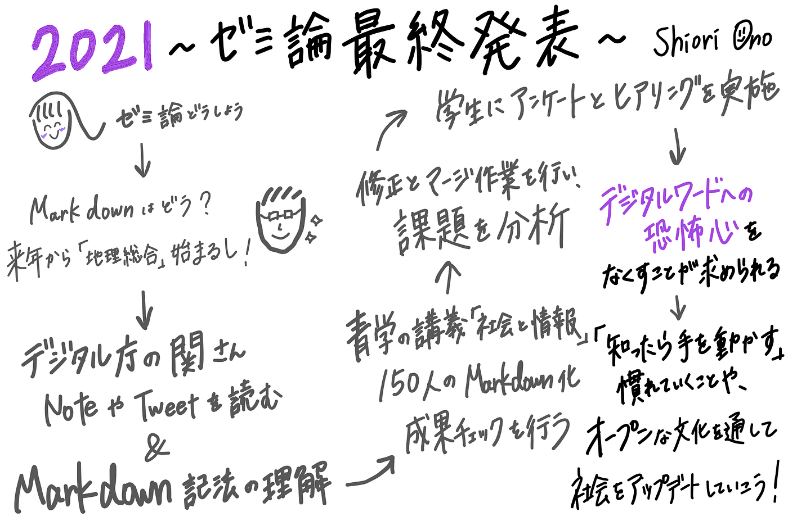

### Markdown化で社会のアップデートを。

### 2021年ゼミ論 最終発表

> テーマ:高校地理必修化に向けた学習指導要領のオープンレポジトリ化

### 始めに

Markdown（マークダウン）とは、文書を記述するための軽量マークアップ言語のひとつである。本来はプレーンテキスト形式で手軽に書いた文書からHTMLを生成するために開発されたものだ。「書きやすくて読みやすいプレーンテキストとして記述した文書を、妥当なXHTML（もしくはHTML）文書へと変換できるフォーマット」として、ジョン・グルーバーにより作成された。簡単にまとめると、最低限のスタイリングだけは残した、書きやすくて読みやすい文章の書き方である。

来年度からはじまる必修科目「地理総合」スタートに向けて、文部科学省から​​2022年度スタート予定の高等学校新学習指導要領が PDF で公開された。PDFで公開された行政文書は、編集が不可能であるため再利用しにくい。 以下は経済産業省のHPに掲載されている「GitHubを用いることの意義」だ。

当の行政官は行政の情報を受け取った側は次の発信者になってくれることを想像して発信手段を選びたいと主張している。そこで、共同編集可能で誰もが再利用しやすいフォーマットとして置き換えたいと感じた。文部科学省から公開された PDF を Markdown記法 に変換し、誰もが使いやすいオープンデータに整理する作業を可能な限り行いたい。

### 方法

1. 行政文書をMarkdown記法で管理する意義は、先行研究で取り上げた関さんのNoteと関連する Twitterでの議論を読んで、整理する。

1. 青山学院大学の講義「社会と情報」で行った150名のMarkdown化の成果をチェックし、修正箇所を見つける。

1. 修正とマージ作業を行い、管理可能とするために克服すべき課題を分析する。

1. 「社会と情報」を受講している学生にアンケートを実施。

### 結果

### 1. Twitterでの議論から分かったこと。

Markdown記法にこだわる理由を探している人が多くいる現状。 Wordを使って文章作ってる人をターゲットにしたMarkdownエディタを作ってみたいという関さんのツイートに対して、一番いいのは見たものを見たまま編集出来て見たものをそのままMarkdownやHTMLに変換できるエディタの開発かもという声が挙げられていたことから感じた。

### 2. 本大学の講義「社会と情報」で行った150名のMarkdown化の成果をチェックし、見つけた修正箇所。

１つ目。スクリーンショットができていない

２つ目。＃などの文字がそのままになっている。つまり、スペースを開けられていない。

### 3. 修正とマージ作業を行い、分析した管理可能とするために克服すべき課題。

・古橋先生の講義を聞いて、一発で理解した学生もいれば、そうでない学生もいた。そこから、インプットからアウトプットにかかる時間が人それぞれであることが分かった。

・Markdown以前にパソコンのスキルがバラバラであることが分かった。

### 4. 「社会と情報」を受講している学生に実施したアンケートの調査結果。

### 議論

「社会と情報」でMarkdown化が上手くいかなかった学生にヒアリングを実施した。すると、学生からは、Markdownって何？からのスタートだったため追い付くのに必死だったという声や、文系の私には無理かもという感情を抱いていたことが分かった。

→デジタルワードへの恐怖心が今後の課題になると痛感させられた。

### 結論

「社会と情報」で課題となった文章は50ページ程あったため、大量の文章を処理しきれなかったこともMarkdown化を面倒だと要因であると感じた。そこで、Markdown初心者への課題は、最初は2ページ分にするなど、範囲を狭めるという対策を取るべきだと考える。そして、「知る→手を動かす」を繰り返しすことで慣れていくことが大切であると感じた。オープンな文化を通して社会をアップデートしていくためにはまず「知る」そして「手を動かす」ところから始めていく。そして、自分が良いと思ったものを進めていく。そうすることで正のサイクルが成り立つと考える。また、デジタルワードへの恐怖心を無くすためには、文字に見慣れる必要があると感じた。そこで、Twitterなどのツールを用いて、自身も発することでできるだけ目につく機会を増やしたいと考える。本研究を通して、PDFをMarkdown記法に書き換えていくことは労力がかかる作業だと痛感した。二次利用しやすいフォーマットに置き換える手間を省くためにも、最初に公開するデータはPDFではなく、必要最低限の読みやすいフォーマットMarkdownで公開しませんか？

### [参考文献リスト]

[Google Sheets - create and edit spreadsheets online, for free.
Create a new spreadsheet and edit with others at the same time -- from your computer, phone or tablet. Get stuff done…docs.google.com](https://docs.google.com/spreadsheets/d/1-Szgzto-OSchk3K4-7QGuvwWY_zkJWc150O0qoTAhrg/edit#gid=0)

### [グラレコ]

### [最終発表スライド]

[https://docs.google.com/presentation/d/1WUNLvuxUK2IOrlYOxTdbF8h4oNLbWbUOtM0n-deJsT4/edit?usp=sharing](https://docs.google.com/presentation/d/1WUNLvuxUK2IOrlYOxTdbF8h4oNLbWbUOtM0n-deJsT4/edit?usp=sharing)

### [GitHubレポジトリ]

[2022年度スタート予定の【地理・歴史】高等学校新学習要領リポジトリ](https://github.com/furuhashilab/courseofstudy4highschool2022japan)

### [プロジェクト管理]

[2021gsc_ShioriOnoプロジェクト](https://github.com/furuhashilab/sotsuron2021/projects/25)
