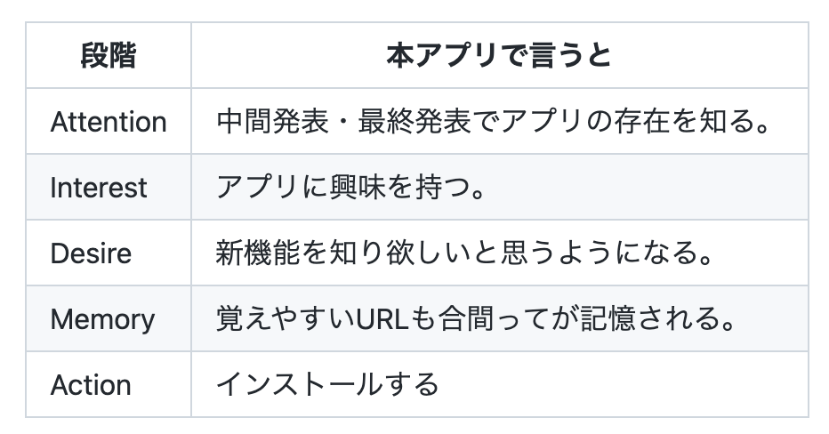
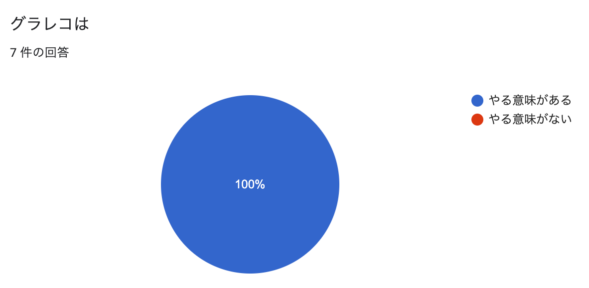
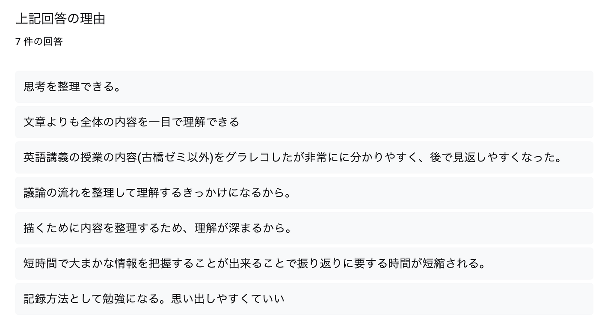
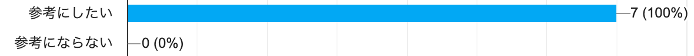
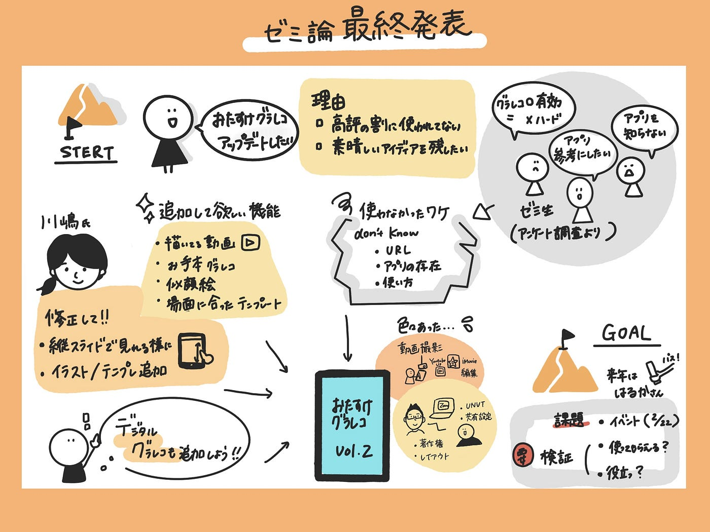

### 【おたすけグラレコ v2】完成！〜ゼミ論〜

こんにちは！4年の佐藤です。
ゼミ論の最終発表についてお話しします！

### ❶Introduction

私は[「おたすけグラレコ」](https://spacial-harmony-4996.glideapp.io/)のアップデートをしました！

理由はざっくり
**好評だったのに使われてなくてもったいないから。**

なぜ使われてないか、使われるためにはどうするか、を調べていきます！

### ❷Method

まず、ゼミ生にアンケートを取りました！

[結果はこちら](https://docs.google.com/spreadsheets/d/12wZKnddUm3eTR7aqETrj6w9F-NqVCYk8GsYbUJiAJO8/edit?usp=sharing)

この結果により「おたすけグラレコ」は需要はあれど改善の余地があることが推測されました。。。

そして、開発者川嶋さんにも、アップデートして欲しい部分を聞いたので
実行していきます！

使ったのは、お馴染みのノーコードでアプリ制作できる[Glide](http://Glide – Create apps & websites without code.https://www.glideapps.com)。

### ❸Result

_成果物_

[おたすけグラレコ v2
青学 古橋研究室 謹製 グラレコ支援アプリ © FuruhashiLab., CC BY 4.0otasukegrareco.glideapp.io](https://otasukegrareco.glideapp.io/)

【比較用 旧アプリ】

[おたすけグラレコ
Edit descriptionspacial-harmony-4996.glideapp.io](https://spacial-harmony-4996.glideapp.io/)

デジタルグラレコのHow to動画も作りました！

### ❹Discussion

### 「おたすけグラレコ v2」について

2つの調査で希望された機能を多数追加し、アプリのアップデートが行われた。また、アプリを使ってもらうための施策が行われた。 本研究の一連の過程で、ADEMAというモデルを使って購買決定プロセスを説明できると考えました。

このような理想的な購買決定プロセスを経るか否かは解明されていないため、今後の課題としたいです。 また、追加したかったが、未だ実行できていない機能もあるので、今後の課題としたいです。

### - 旧アプリのアップデートの必要性について

本研究を行う上で、グラレコ時の補助はアプリ「おたすけグラレコ」が本当に適切なツールなのか、そして旧アプリアップデートの必要性の有無を理解する必要があります。ゼミ生を対象に行った、グラレコについてのアンケート調査の結果を見ると、以下の回答が得られました。

上記の結果から、ゼミ生はグラレコの有用性を理解しており、グラレコ補助アプリを参考にしたいと考えていることが明らかになりました。 また、旧アプリの課題点も回答していることを踏まえると、旧アプリアップデートの必要性は有ると推測できます。 しかし、アプリ制作という手段が本当にゼミ生に役立つのかは現在もなお不明であるため、今後の課題としたいです。

今回のアップデートにより、アプリの利便性が高まったと考える。今後使った人からのアンケートを集計し、アップデートの有効性を確かめていきたい。また、Glide、Googleスプレッドシートを共同編集可能にしたので、この研究が受け継がれていくことが期待されます。

### ❺まとめ

本アプリを制作する過程で、「おたすけグラレコ」がゼミ生にとって需要のあるアプリであることが認められました。また、アプリコンテンツに関して多くのアイディアが出るほど、開発の余地があることも判明しました。「おたすけグラレコ v2」ではゼミ生の意見を取り入れ、複数のアップデートがされたため、少しでもグラレコ難民の快適なグラレコライフに貢献出来たと考えます。 次に引き継ぐべき課題はイベントの実施・①機能のアップデートが役立ち、グラレコ難民を救えたか②使ってもらうための施策によって、ユーザーが増えたかの検証です。 この研究を通じて、グラレコに関する新たな知見を得れただけではなく、ノーコードでアプリを制作するノウハウが身に付きました。また、アプリ内のコンテンツを増やしていく上で、グラレコスキルが上がり、さらに動画制作まで経験することができたので、個人としても多方面で学びを深める機会となりました。

### ❻最後に・・・

GitHub リポジトリ

[GitHub - furuhashilab/2021gsc_Kahoru-Sato: 2021年度 ゼミ論用レポジトリ
2021年度 ゼミ論用レポジトリ 地球社会共生学部 地球社会共生学科 4年 学籍番号：1A118082 氏名：佐藤かほる 指導教員：古橋 大地教授 © Kikuchi&Furuhashi Laboratory/KahoruSato, CC…github.com](https://github.com/furuhashilab/2021gsc_Kahoru-Sato)

グラレコ

発表スライド
